-----

| Title         | Media Image Color Model                               |
| ------------- | ----------------------------------------------------- |
| Created @     | `2021-10-25T03:08:34Z`                                |
| Last Modify @ | `2022-12-23T13:32:22Z`                                |
| Labels        | \`\`                                                  |
| Edit @        | [here](https://github.com/junxnone/aiwiki/issues/125) |

-----

# Color Model 色彩模型

## Reference

  - [Color model - wikipedia](https://en.wikipedia.org/wiki/Color_model)
  - [Color Models - Intel
    IPP](https://www.intel.com/content/www/us/en/develop/documentation/ipp-dev-reference/top/volume-2-image-processing/image-color-conversion/color-models.html)

## Brief

  - Color Model - 色彩模型 - 抽象数学模型分解色彩分量, 描述颜色
      - RGB - 用于计算机图形学 - 基于人眼感光细胞
      - CMYK - 用于彩色打印
      - [YUV](/YUV) - 用于视频
      - LAB - 基于人眼视觉神经
      - HSV/HSB
      - HSL
      - RYB

## RGB & CMYK

  - 人眼对于 `RGB` 三种颜色分量的敏感程度不同 `R<G<B`
  - 均匀性较差, 使用 `欧氏距离` 度量相似性结果会合人眼视觉有较大偏差
  - 光三原色 - 红/绿/蓝 - Red/Green/Blue
  - 颜料三原色 - 青/洋红/黄 -Cyan/Magenta/Yellow

> 通过混合颜料无法得出纯粹的黑色，因此在印刷品中又加入了黑色（Black）得到 `CMYK`

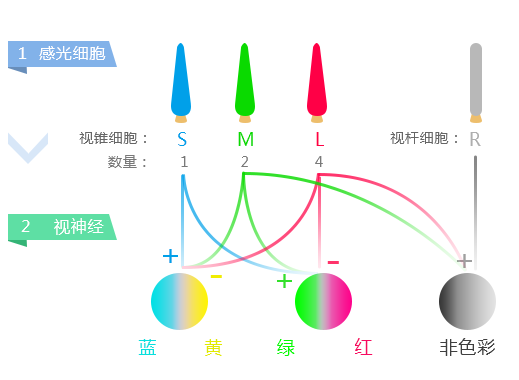

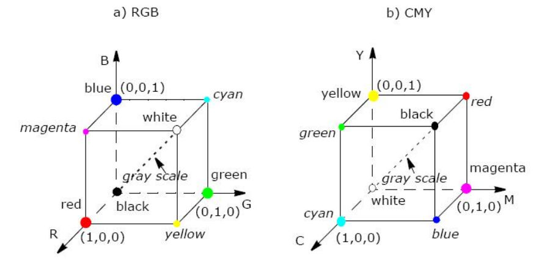
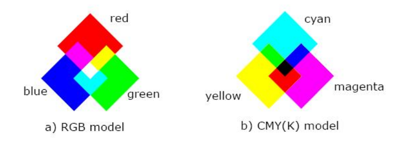

## HSV/HSB

  - HSV - Hue/Saturation/Value(Brightness)
  - Hue - 色调/色相 - 是什么颜色 - 取决于主波长
  - Saturation - 饱和度 - 色彩浓淡/纯度 `颜色+白色` `饱和=纯色`
      - 饱和度越高(低), 颜色越纯正(淡)
  - Brightness - 明亮度 --\> 黑色

| 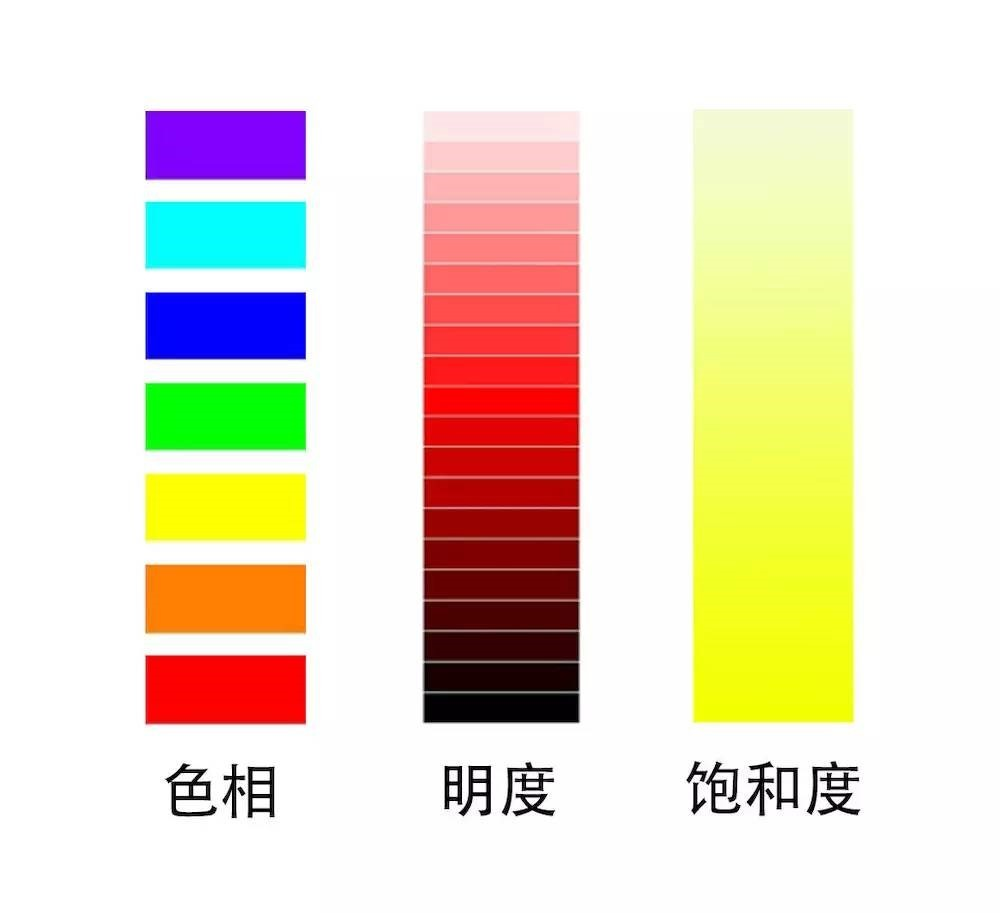 | 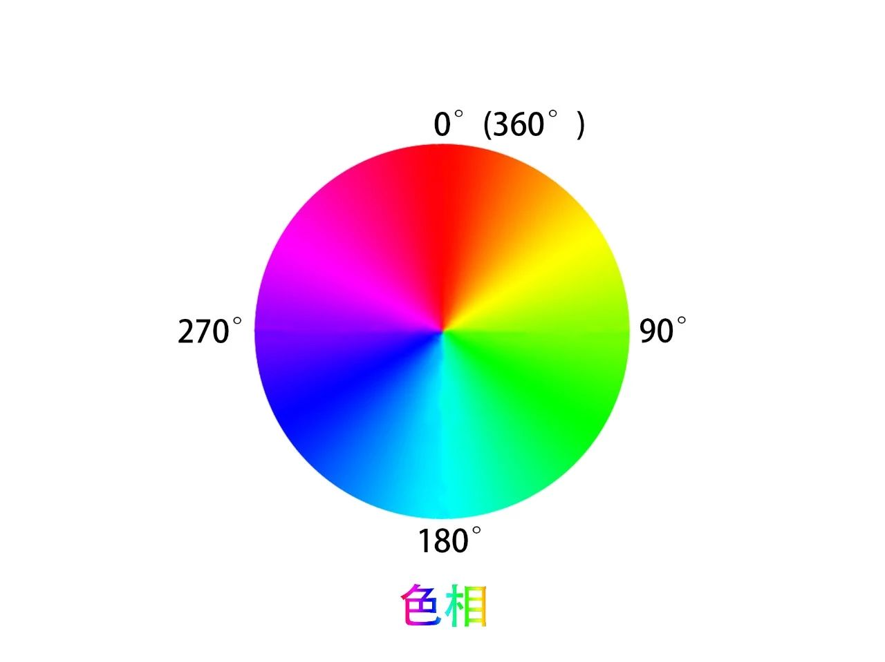 |
| ------------------------------------------------------------ | ------------------------------------------------------------ |
| 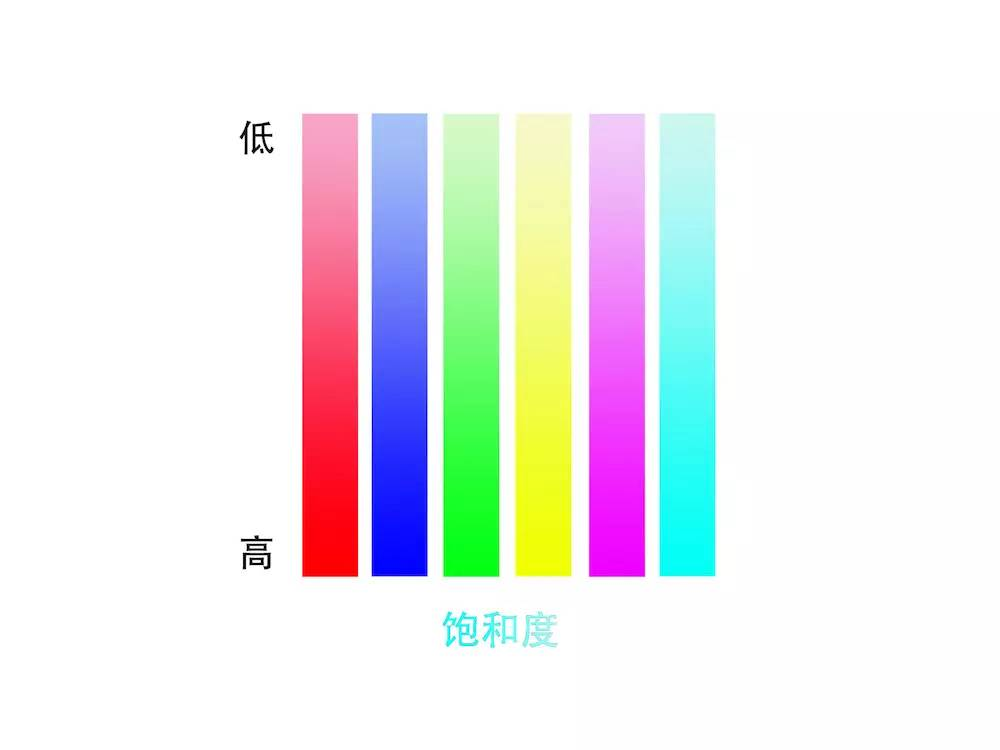 | 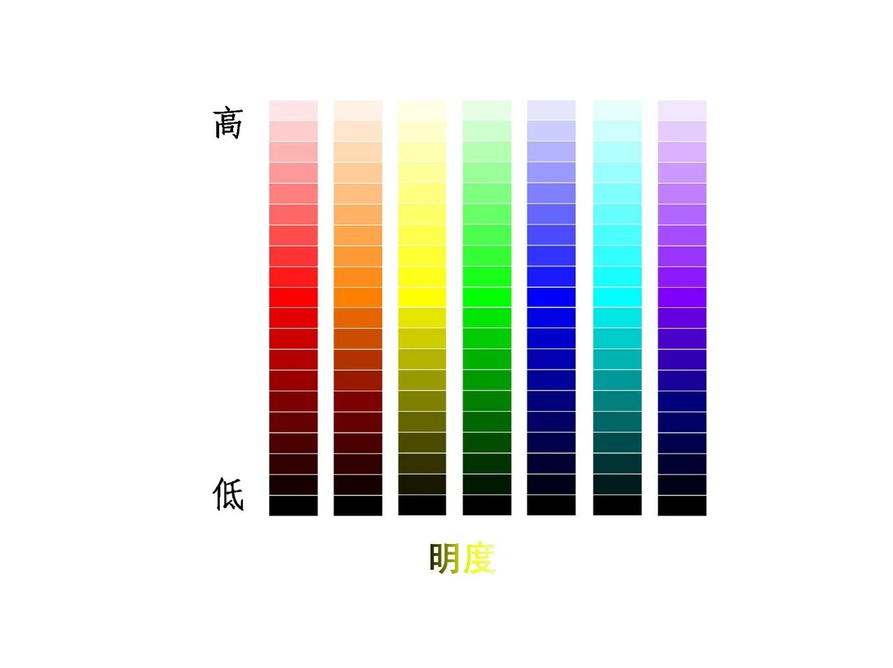 |

| 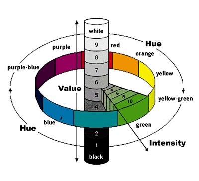 | 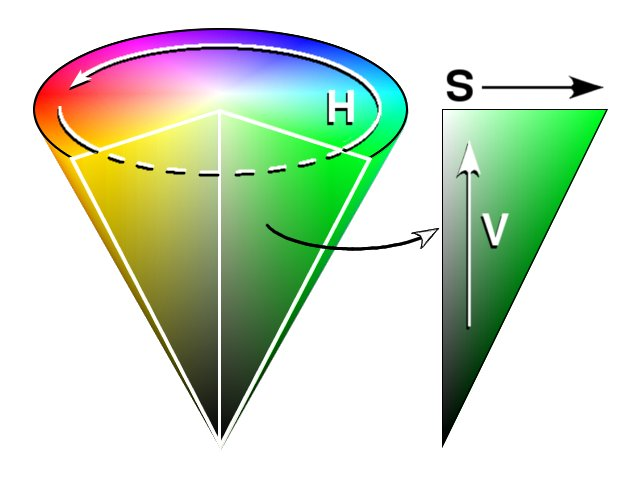 | 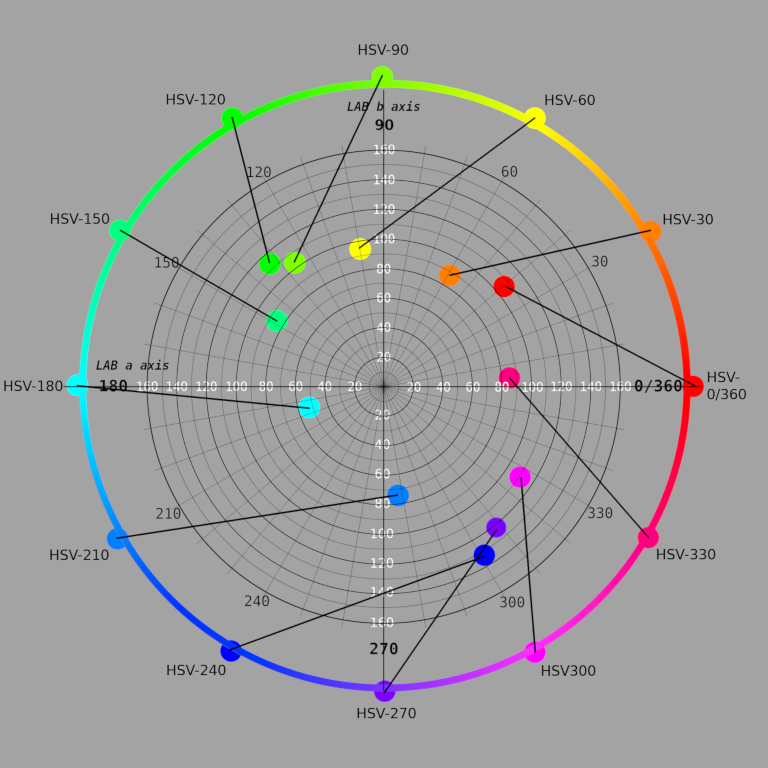 |
| ------------------------------------------------------------ | ---------------------------------------------------------------- | --------------------------------------------------------------------------- |
| 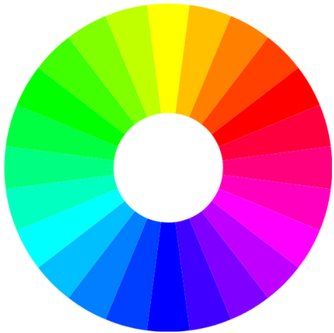 | 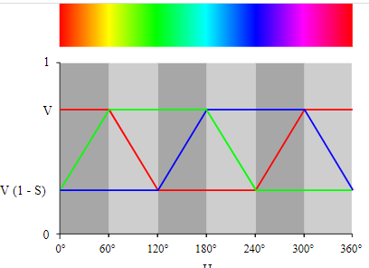     | 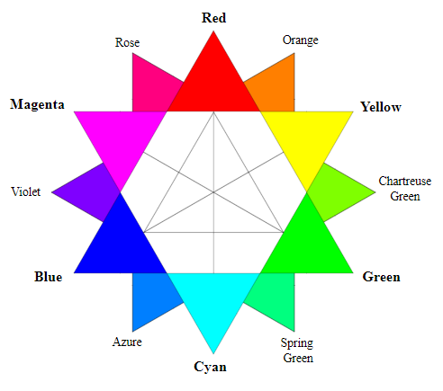                |

## HSL

  - HSL - Hue/Saturation/Lightness

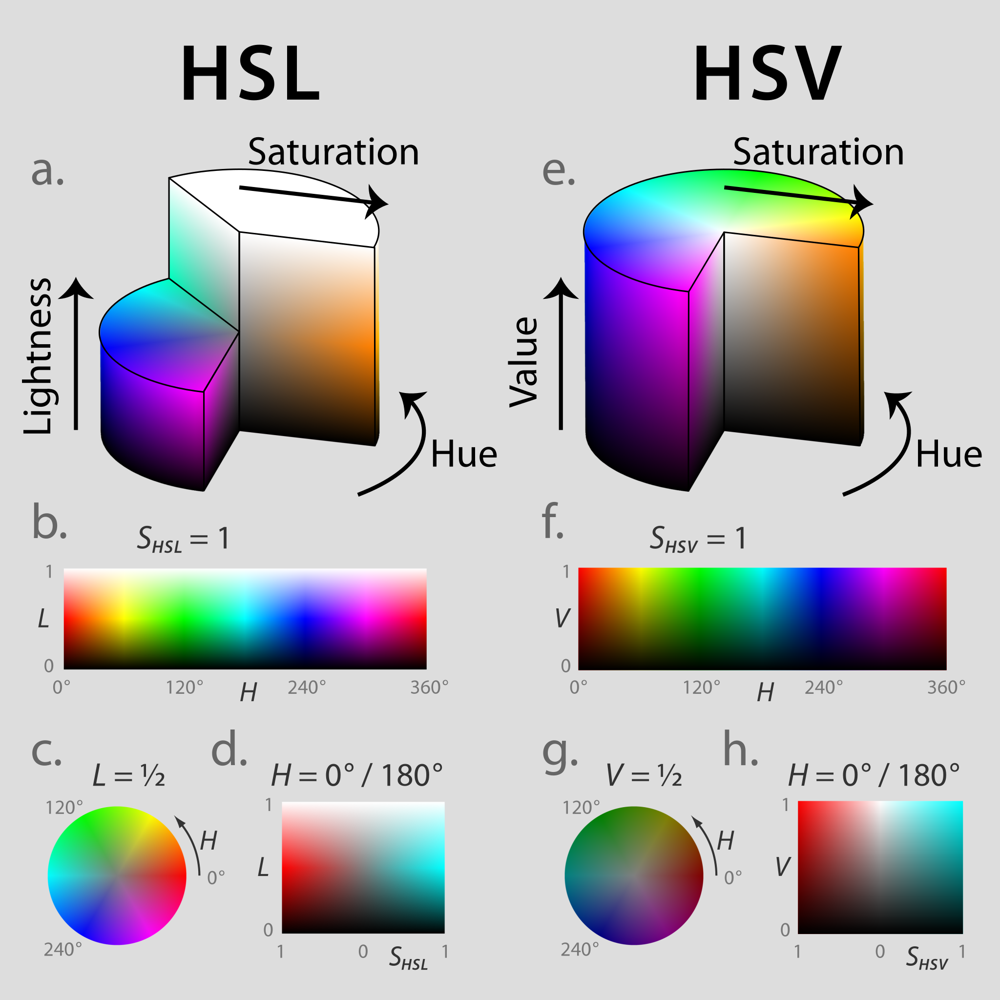

| HSV                                                          | HSL                                                          |
| ------------------------------------------------------------ | ------------------------------------------------------------ |
| 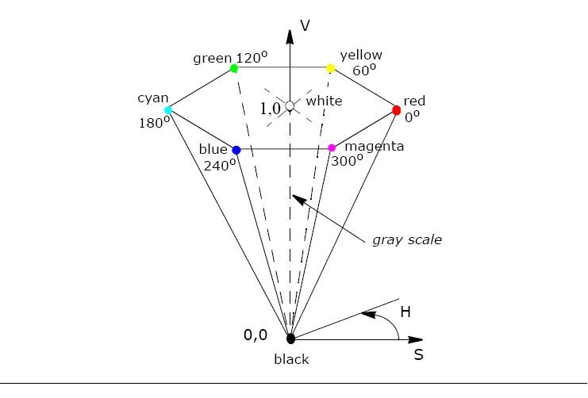 | 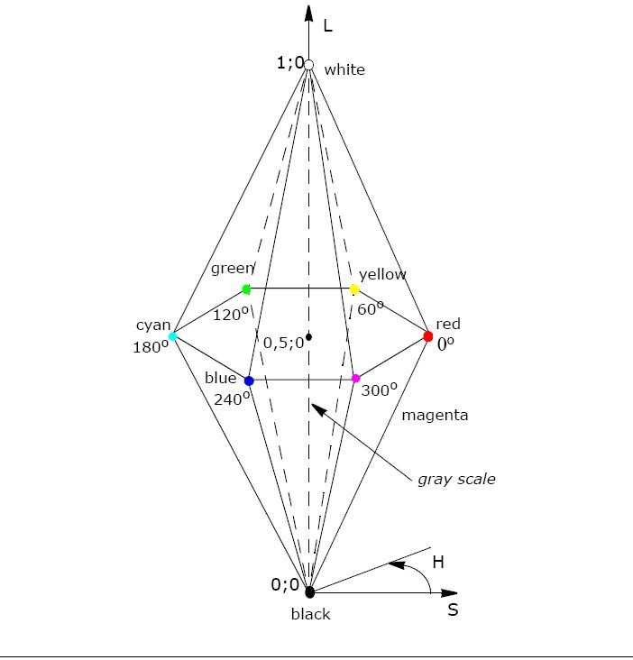 |
