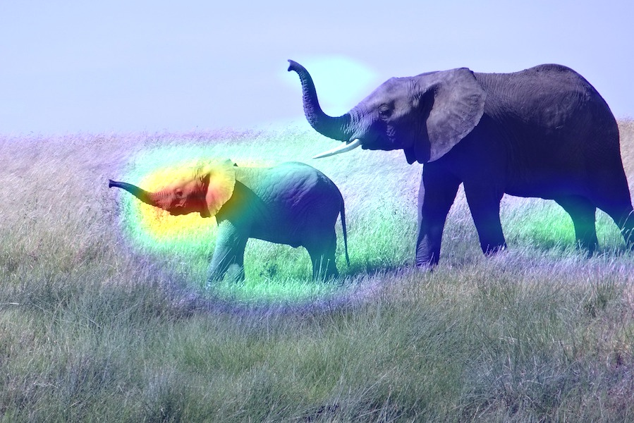

-----

| Title     | Tools VIS                                             |
| --------- | ----------------------------------------------------- |
| Created @ | `2019-08-20T06:28:49Z`                                |
| Updated @ | `2024-08-05T08:21:35Z`                                |
| Labels    | \`\`                                                  |
| Edit @    | [here](https://github.com/junxnone/aiwiki/issues/133) |

-----

# 模型可视化

  - 文字显示 & 图表显示
  - 文字显示
      - torchinfo
  - 网络架构可视化
  - Data 可视化
      - Feature Map
      - 热度图

| 可视化内容                                                                   | 描述                                           |
| ----------------------------------------------------------------------- | -------------------------------------------- |
| 卷积核输出的可视化 Intermediate ConvNets outputs  intermediate activations | 即可视化卷积核经过激活之后的结果。能够看到图像经过卷积之后结果，帮助理解卷积核的作用   |
| 卷积核的可视化 ConvNets filters                                             | 帮助我们理解卷积核是如何感受图像的                            |
| 热度图可视化 Heatmaps of class activation in an image                      | 通过热度图，了解图像分类问题中图像哪些部分起到了关键作用，同时可以定位图像中物体的位置。 |

### Tools

#### 网络架构可视化

  - 基于Web的
      - [netron](https://github.com/lutzroeder/netron)
      - [Quiver](/Quiver)
      - [NN-SVG](http://alexlenail.me/NN-SVG/index.html) - - -
        [Github](https://github.com/zfrenchee/NN-SVG)
      - [ConvNetDraw](https://cbovar.github.io/ConvNetDraw/)
      - [netscope](http://ethereon.github.io/netscope/) - - -
        [Github](https://github.com/ethereon/netscope)
  - 基于LaTex
      - [PlotNeuralNet](https://github.com/HarisIqbal88/PlotNeuralNet)
      - [tikz\_cnn](https://github.com/jettan/tikz_cnn)
  - 基于 GraphViz
  - 基于 Python
      - [draw\_convnet](https://github.com/gwding/draw_convnet)
      - [convnet-drawer](https://github.com/yu4u/convnet-drawer) (keras)

## 网络结构可视化

| Style         | Figure                                                       |
| ------------- | ------------------------------------------------------------ |
| LeNet Style   |  |
| AlexNet Style |  |

## Feature Map 可视化

### 卷积核输出的可视化

  - 第一层卷积层类似边缘检测的功能，在这个阶段里，卷积核基本保留图像所有信息
  - 随着层数的加深，卷积核输出的内容也越来越抽象，保留的信息也越来越少。
  - 越深的层数，越多空白的内容，也就说这些内容空白卷积核没有在输入图像中找到它们想要的特征

### 卷积核的可视化

  - 低层的卷积核似乎对颜色，边缘信息感兴趣。
  - 越高层的卷积核，感兴趣的内容越抽象，也越复杂。
  - 高层的卷积核感兴趣的图像越来越难通过梯度上升获得

## 热度图可视化

**获得最后一层卷积层的热度图，最后将热度图叠加到原图像，获得图像中起到关键分类作用的部分**

## Reference

  - [cnn-explainer](https://poloclub.github.io/cnn-explainer/)
  - [CNN-Visualization](https://github.com/scutan90/CNN-Visualization)
    \[[第七章 可视化工具 -
    CNN-Visualization](https://github.com/scutan90/CNN-Visualization/blob/master/CNN%E5%8F%AF%E8%A7%86%E5%8C%96.md#%E7%AC%AC%E4%B8%83%E7%AB%A0-%E5%8F%AF%E8%A7%86%E5%8C%96%E5%B7%A5%E5%85%B7)\]
  - [Mnist 可视化 -
    tensorflow](https://nbviewer.jupyter.org/github/wang-jinghui/MyCSDN_Blog/blob/master/%E5%8D%B7%E7%A7%AF%E7%A5%9E%E7%BB%8F%E7%BD%91%E7%BB%9CCNN%3ATensorflow%E5%AE%9E%E7%8E%B0%28%E4%BB%A5%E5%8F%8A%E5%AF%B9%E5%8D%B7%E7%A7%AF%E7%89%B9%E5%BE%81%E7%9A%84%E5%8F%AF%E8%A7%86%E5%8C%96%29/tensorflow%3Acnn%2Cfeature%2Cvisualization.ipynb)
  - [grad-cam](https://github.com/jacobgil/pytorch-grad-cam)
  - [tensorspace](https://tensorspace.org/)
