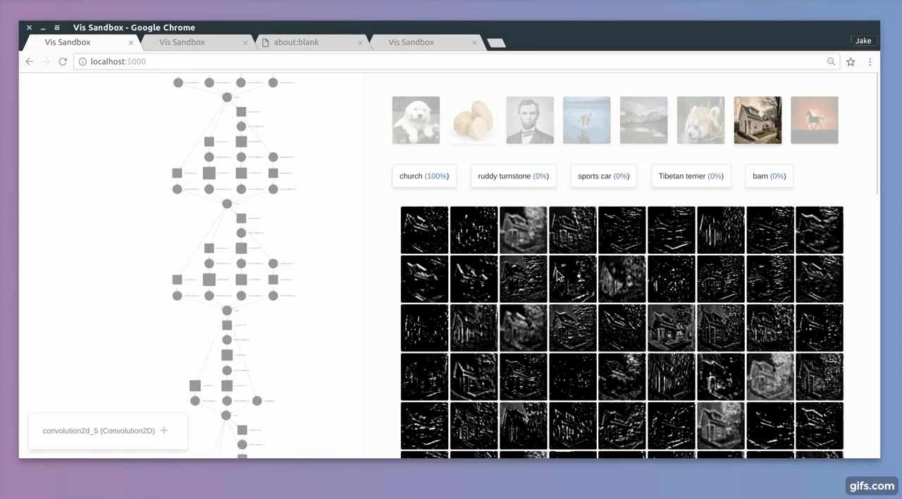
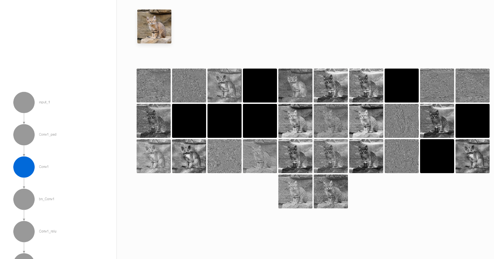
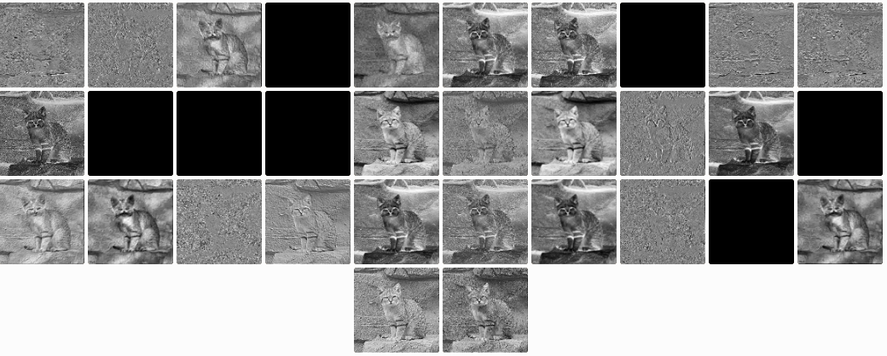
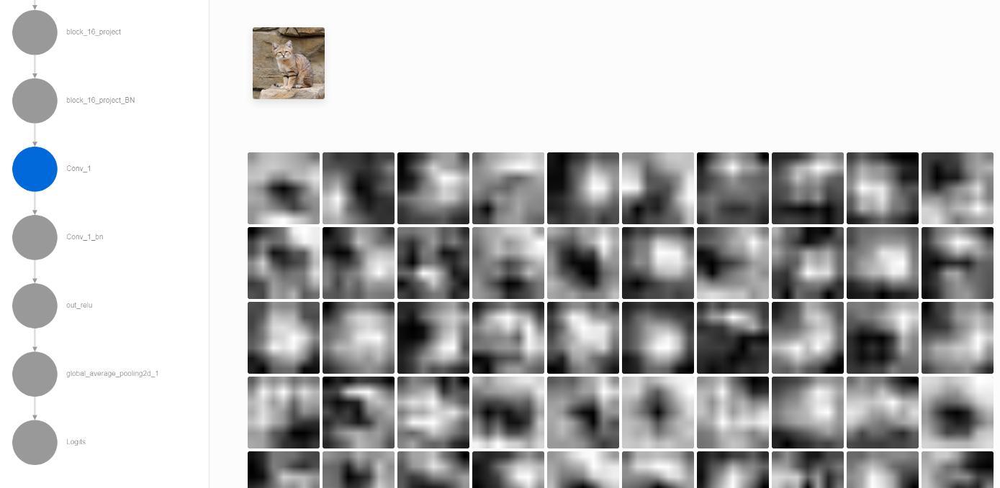

-----

| Title         | Tools VIS Quiver                                      |
| ------------- | ----------------------------------------------------- |
| Created @     | `2018-12-12T08:00:41Z`                                |
| Last Modify @ | `2022-12-25T04:20:07Z`                                |
| Labels        | \`\`                                                  |
| Edit @        | [here](https://github.com/junxnone/aiwiki/issues/136) |

-----

## Reference

  - [Docs](https://keplr-io.github.io/quiver/)
  - [Github repo](https://github.com/keplr-io/quiver)
  - [使用quiver进行网络可视化时的排雷过程](https://blog.csdn.net/macwinwin/article/details/78680287)
  - [可视化探索卷积神经网络提取特征](https://blog.csdn.net/wangyangzhizhou/article/details/84846267)

## Brief

  - 卷积可视化工具 Interactive convnet features visualization for Keras

## Install

    pip install quiver_engine

If you want the latest version from the repo

    pip install git+git://github.com/keplr-io/quiver.git

## Usecase

1.  Build your model in keras

<!-- end list -->

    model = Model(...)

2.  Launch the visualization dashboard with 1 line of code

<!-- end list -->

    quiver_engine.server.launch(model, classes=['cat','dog'], input_folder='./imgs')

3.  Explore layer activations on all the different images in your input
    folder.

## Example

  - keras\_mobilenet\_quiver.py

<!-- end list -->

    import keras.applications as apps
    from quiver_engine.server import launch
    
    #model = apps.vgg16.VGG16()
    model = apps.mobilenet.MobileNet()
    launch(model, input_folder="./data")

    mkdir -p data
    mkdir -p tmp

copy your image to the data folder

    python keras_mobilenet_quiver.py

in your brower: `localhost:5000` or `your_ip:5000`

| images                                                       |
| ------------------------------------------------------------ |
|  |
|  |
|  |

-----

> N.B. quiver\_engine.server 中有个 `gevent.wsgi` 需要替换为 `gevent.pywsgi`
