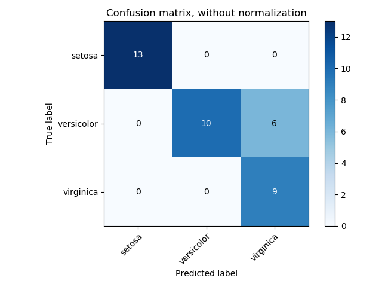
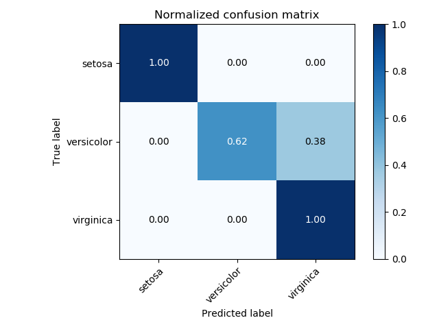
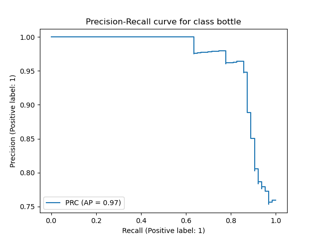
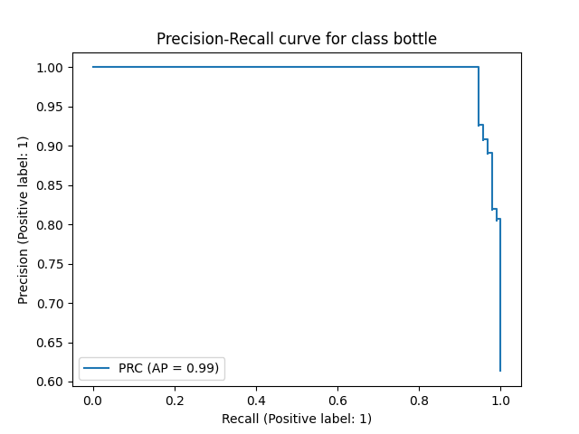
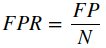
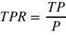
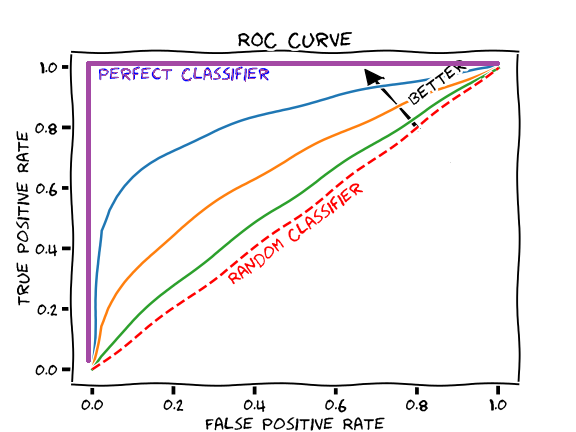

-----

| Title     | ML Metrics Classification                             |
| --------- | ----------------------------------------------------- |
| Created @ | `2021-11-21T04:55:43Z`                                |
| Updated @ | `2024-05-15T15:58:48Z`                                |
| Labels    | \`\`                                                  |
| Edit @    | [here](https://github.com/junxnone/aiwiki/issues/137) |

-----

# Metrics for Classification

  - 图像分类任务中根据二分类/多分类/多标签等有不同的 Metrics
  - **Accuracy** `当样本不均衡时，Accuracy 不能很好的区分模型`
  - **Precision**
  - **Recall**
  - Fβ/`F1`
  - ROC
  - PR
  - AUC
  - Confusion Matrix
  - Error Rate

## TP/TN/FP/FN

| 👇`Predict Label` | 1  | 0  | 👈`GroundTruth` |
| ---------------- | -- | -- | -------------- |
| 1                | TP | FP |                |
| 0                | FN | TN |                |

:bookmark: <kbd>Binary Classification</kbd>

## Accuracy

  - 预测正确的占总数的比例
  - 当样本不均衡时，Accuracy 不能很好的区分模型

-----

$\\huge Accuracy = \\frac{N\_{correct}}{N\_{Total}} = \\frac{TP + TN}{TP
+ TN + FP + FN}$

-----

$\\huge \\texttt{accuracy}(y, \\hat{y}) = \\frac{1}{n\_\\text{samples}}
\\sum\_{i=0}^{n\_\\text{samples}-1} 1(\\hat{y}\_i = y\_i)$

-----

### Balanced Accuracy

  - 用于 `P/N` 不平衡的情况
  - 如果 `P` 较多(990)，`N` 较少(10)，所有**sample**都预测为 `P`, **Accuracy** 很高(99%)

-----

## $\\texttt{balanced-accuracy} = \\frac{1}{2}\\left( \\frac{TP}{TP + FN} + \\frac{TN}{TN + FP}\\right )$

## $\\texttt{balanced-accuracy}(y, \\hat{y}, w) = \\frac{1}{\\sum{\\hat{w}\_i}} \\sum\_i 1(\\hat{y}\_i = y\_i) \\hat{w}\_i$

### Top-k Accuracy

  - 多分类的情况下，只要预测前 `k` 类别中包含目标类别，则为预测正确，计入 `Top-k Accuracy`

-----

$\\huge \\texttt{top-k accuracy}(y, \\hat{f}) =
\\frac{1}{n\_\\text{samples}} \\sum\_{i=0}^{n\_\\text{samples}-1}
\\sum\_{j=1}^{k} 1(\\hat{f}\_{i,j} = y\_i)$

## Precision

  - 所有识别为正例的情况中，识别正确的比例
  - 异常识别中表示为：值越大，FP 越少，误识别的概率越小

-----

$\\huge \\text{precision} = \\frac{tp}{tp + fp}$

## Recall

  - 所有实际类别为正例的情况中，识别正确的比例
  - 异常识别中表示为: 值越大，FN 越少，漏检的概率越小

-----

$\\huge \\text{recall} = \\frac{tp}{tp + fn}$

## AP

  - Average precision
  - AP 根据 `精确率-召回率曲线` 为在每个`阈值`处实现的精度的加权平均值，权重为前一个阈值的`召回率`的增加

$\\huge \\text{AP} = \\sum\_n (R\_n - R\_{n-1}) P\_n$

> where $P\_n$ and $R\_n$ are the precision and recall at the nth
> threshold

## Fβ

  - F1: 当 β = 1 时的 Fβ

-----

$\\huge F\_\\beta = (1 + \\beta^2) \\frac{\\text{Precision} \\times
\\text{Recall}}{\\beta^2 \\text{Precision} + \\text{Recall}}$

## micro/macro/weighted/samples

  - Multiclass and Multilabel Classification
  - **micro**: 取全部样例
  - **macro**: 按类别取均值
  - **weighted**: 对类别按比例给予权重计算
  - **samples**: 应用于 multilabel 问题

| average      | Precision                                                                                                                 | Recall                                                                                                                    | Fβ                                                                                                                   |
| ------------ | ------------------------------------------------------------------------------------------------------------------------- | ------------------------------------------------------------------------------------------------------------------------- | ------------------------------------------------------------------------------------------------------------------------------- |
| **micro**    | $P(y, \\hat{y})$                                                                                                          | $R(y, \\hat{y})$                                                                                                          | $F\_\\beta(y, \\hat{y})$                                                                                                        |
| **samples**  | $\\frac{1}{\\left|S\\right|} \\sum\_{s \\in S} P(y\_s, \\hat{y}\_s)$                                                      | $\\frac{1}{\\left|S\\right|} \\sum\_{s \\in S} R(y\_s, \\hat{y}\_s)$                                                      | $\\frac{1}{\\left|S\\right|} \\sum\_{s \\in S} F\_\\beta(y\_s, \\hat{y}\_s)$                                                    |
| **macro**    | $\\frac{1}{\\left|L\\right|} \\sum\_{l \\in L} P(y\_l, \\hat{y}\_l)$                                                      | $\\frac{1}{\\left|L\\right|} \\sum\_{l \\in L} R(y\_l, \\hat{y}\_l)$                                                      | $\\frac{1}{\\left|L\\right|} \\sum\_{l \\in L} F\_\\beta(y\_l, \\hat{y}\_l)$                                                    |
| **weighted** | $\\frac{1}{\\sum\_{l \\in L} \\left|\\hat{y}*l\\right|} \\sum*{l \\in L} \\left|\\hat{y}\_l\\right| P(y\_l, \\hat{y}\_l)$ | $\\frac{1}{\\sum\_{l \\in L} \\left|\\hat{y}*l\\right|} \\sum*{l \\in L} \\left|\\hat{y}\_l\\right| R(y\_l, \\hat{y}\_l)$ | $\\frac{1}{\\sum\_{l \\in L} \\left|\\hat{y}*l\\right|} \\sum*{l \\in L} \\left|\\hat{y}*l\\right| F*\\beta(y\_l, \\hat{y}\_l)$ |

  - $P(A, B) := \\frac{\\left| A \\cap B \\right|}{\\left|A\\right|}$
  - $R(A, B) := \\frac{\\left| A \\cap B \\right|}{\\left|B\\right|}$
  - $F\_\\beta(A, B) := \\left(1 + \\beta^2\\right) \\frac{P(A, B)
    \\times R(A, B)}{\\beta^2 P(A, B) + R(A, B)}$

## Confusion Matrix

  - **Confusion Matrix** - 混淆矩阵 - 误差矩阵
  - nxn 矩阵 n 为 类别
  - Normalization

| Confusion matrix without normalization                       | Confusion matrix with normalization                          |
| ------------------------------------------------------------ | ------------------------------------------------------------ |
|  |  |

    Confusion matrix, without normalization
    [[13  0  0]
     [ 0 10  6]
     [ 0  0  9]]
    Normalized confusion matrix
    [[1.   0.   0.  ]
     [0.   0.62 0.38]
     [0.   0.   1.  ]]

## AUC

  - **A**rea **U**nder the **C**urve
  - AUC常常用来评估二分类模型的性能, 能够综合的表达 `Precision` & `Recall` 性能
  - 通过计算曲线下的面积作为评估指标
  - 相比于准确率、召回率、F1值等依赖于判决阈值的评估指标，AUC则没有这个问题。

### PR-AUC

  - Precision-Recall Curve
  - 相差不大的 AP，但是有可能 `PRC` 有可能有较大区别
      - 如下两图，AP 只相差 2%，但是左图并不能同时在 `Precision` & `Recall` 上达到较好的平衡，图二则可以

| AnomalyCLIP `@mvtec-bottle`                                  | MuSC `@mvtec-bottle`                                         |
| ------------------------------------------------------------ | ------------------------------------------------------------ |
|  |  |

### ROC-AUC

  - ROC - `Receiver Operating Characteristic Curve` - 受试者工作特征曲线
  - 横坐标为假阳性率(FPR)
    
  - 纵坐标为真阳性率(TPR)
    

## Reference

  - [Metrics and scoring -
    scikit-learn](https://scikit-learn.org/stable/modules/model_evaluation.html#metrics-and-scoring-quantifying-the-quality-of-predictions)
  - [sklearn.metrics.confusion\_matrix](https://scikit-learn.org/stable/modules/generated/sklearn.metrics.confusion_matrix.html)
  - [The Relationship Between Precision-Recall and ROC
    Curves](https://www.biostat.wisc.edu/~page/rocpr.pdf)
