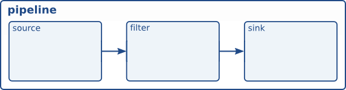

-----

| Title         | Media Tools GStreamer Concepts                        |
| ------------- | ----------------------------------------------------- |
| Created @     | `2021-12-11T04:09:29Z`                                |
| Last Modify @ | `2022-12-23T13:15:50Z`                                |
| Labels        | \`\`                                                  |
| Edit @        | [here](https://github.com/junxnone/aiwiki/issues/144) |

-----

## Reference

  - [GStreamer
    concepts](https://gstreamer.freedesktop.org/documentation/tutorials/basic/concepts.html)

## Brief

  - elements - Gstreamer 结构块
  - pad
  - bin
  - pipeline

### Elements

  - source element
  - filter elements
  - sink elements

