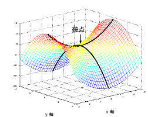
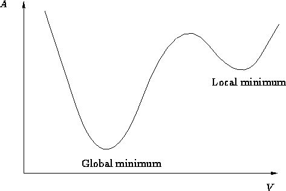

-----

| Title     | ML Arch GD xGD                                        |
| --------- | ----------------------------------------------------- |
| Created @ | `2020-04-04T13:09:55Z`                                |
| Updated @ | `2023-02-02T09:32:13Z`                                |
| Labels    | \`\`                                                  |
| Edit @    | [here](https://github.com/junxnone/aiwiki/issues/148) |

-----

# BGD SGD MBGD

## Reference

  - [随机梯度下降法，批量梯度下降法和小批量梯度下降法以及代码实现](https://blog.csdn.net/LoseInVain/article/details/78243051)
  - [优化器（Optimizer）介绍](https://blog.csdn.net/weixin_41417982/article/details/81561210)
  - [为什么说随机最速下降法(SGD)是一个很好的方法？](https://zhuanlan.zhihu.com/p/27609238)
  - [SGD过程中的噪声如何帮助避免局部极小值和鞍点？](https://zhuanlan.zhihu.com/p/36816689)
  - [Deep Learning
    最优化方法之SGD](https://blog.csdn.net/bvl10101111/article/details/72615436)
  - [最清晰的讲解各种梯度下降法原理与Dropout](https://baijiahao.baidu.com/s?id=1613121229156499765&wfr=spider&for=pc)
  - [一文搞懂深度学习中的梯度下降](https://www.cnblogs.com/wangguchangqing/p/10521330.html)
  - [An overview of gradient descent optimization
    algorithms](https://arxiv.org/pdf/1609.04747.pdf)
  - [梯度下降优化算法概述](https://alanlee.fun/2017/10/08/gradient-descent-methods/)

## Brief

  - **BGD ==\> SGD ==\> MBGD**
  - **BGD** 学习时间长/计算量大/内存消耗大
  - **SGD** 可以逃离局部最优点
  - **MBGD** - 结合 BGD + SGD，速度快/精度高

| Name                                               | Description        | 更新策略                                                         |
| -------------------------------------------------- | ------------------ | ------------------------------------------------------------ |
| **BGD** Batch Gradient Descent 批量梯度下降        | 使用整个训练集            |  |
| **SGD** Stochastic Gradient Descent 随机梯度下降   | 样本集中的一个随机样本        |  |
| **MBGD** Mini-batch Gradient Descent 小批量梯度下降 | 随机采样batch\_size个样本 |  |

-----

| 鞍点                                                           | 局部最小值                                                        |
| ------------------------------------------------------------ | ------------------------------------------------------------ |
|  |  |
