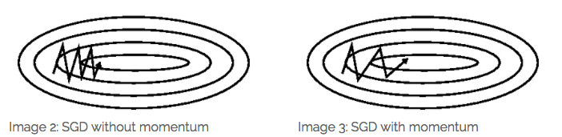
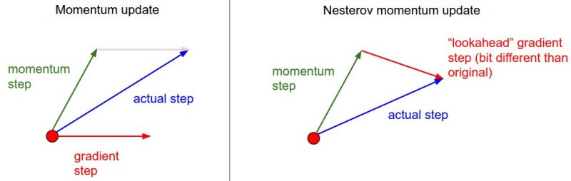

-----

| Title     | ML Arch GD Momentum                                   |
| --------- | ----------------------------------------------------- |
| Created @ | `2019-03-12T01:50:50Z`                                |
| Updated @ | `2023-02-02T09:32:07Z`                                |
| Labels    | \`\`                                                  |
| Edit @    | [here](https://github.com/junxnone/aiwiki/issues/150) |

-----

# Momentum

## Reference

  - [神经网络优化算法：梯度下降法、Momentum、RMSprop和Adam](https://www.cnblogs.com/jiaxblog/p/9695042.html)

## Brief

  - SGD --\> Momentum
  - **Momentum** - 对 SGD 进行指数加权平均平滑
  - **Nesterov’s Accelerated Momentum** - 比 标准 Momentum 收敛更好

| Name              | 更新策略                                                         |
| ----------------- | ------------------------------------------------------------ |
| GD                |  |
| SGD               |  |
| MBGD              |  |
| Momentum          |  |
| Nesterov Momentum |  |

> η - 学习率 γ - 原来梯度的比例

## 代码实现

| Name              | Code                                                                          |
| ----------------- | ----------------------------------------------------------------------------- |
| SGD               | `x += - learning_rate * dx`                                                   |
| Momentum          | `v = mu * v - learning_rate * dx` `x += v`                                 |
| Nesterov Momentum | `x_ahead = x + mu * v` `v = mu * v - learning_rate * dx_ahead` `x += v` |

## 指数加权平均

  - 缓和拟合曲线

> β - 典型值 0.9 (即当前值的0.1，前一个值的0.9)

## Momentum vs ...

