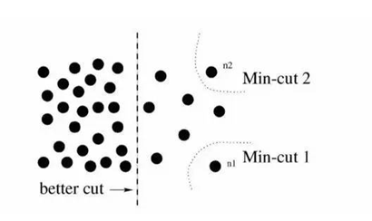
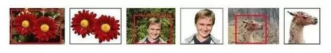

-----

| Title     | CV TIS                                                |
| --------- | ----------------------------------------------------- |
| Created @ | `2021-04-13T06:40:04Z`                                |
| Updated @ | `2023-03-08T07:37:26Z`                                |
| Labels    | \`\`                                                  |
| Edit @    | [here](https://github.com/junxnone/aiwiki/issues/158) |

-----

# Traditional Image Segmentation 传统图像分割

## DL 之前的 Segmentation 技术

  - Normalized cut
  - Grab Cut

### N-cut - Normalized cut

  - 通过像素和像素之间的关系权重来综合考虑 ，根据给出的阈值，将图像一分为二。
  - 每运行一次N-cut，只能切割一次图片，若yao要分割图像上的多个物体，需要多次运行
  - 分割效果比较差 

### Grab Cut - 交互分割

  - 给定一张图片，然后人工在想要分割的区域画一个框，然后机器会对这个框的内容进行分割
  - 保留的部分叫`前景`，删除的部分叫`背景`
  - 当前景背景颜色相近时，会出现分割错误

## History
