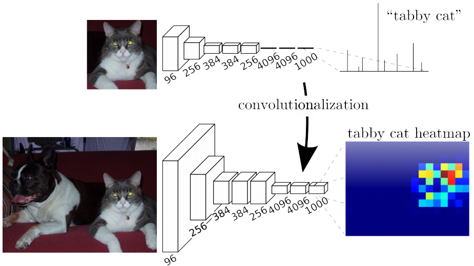
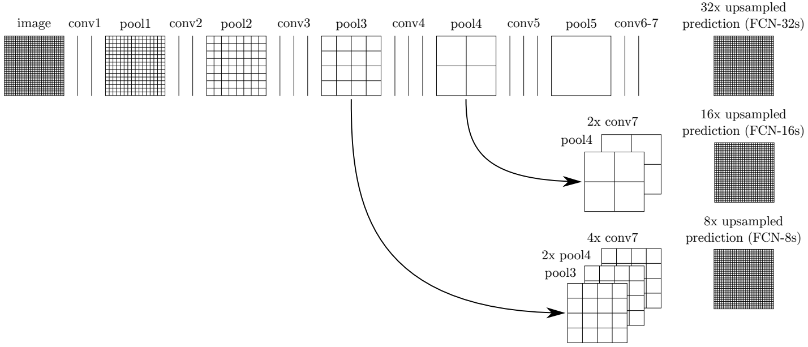
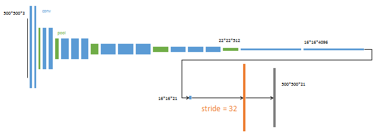
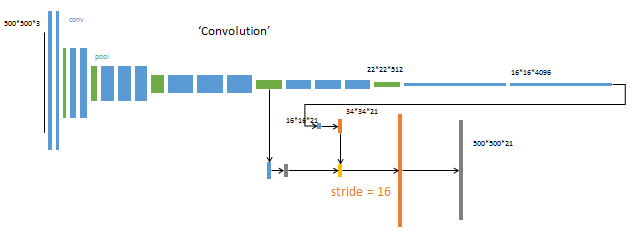
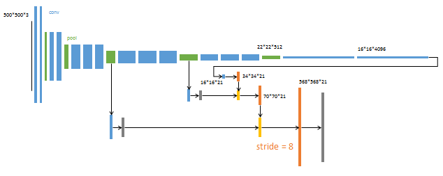
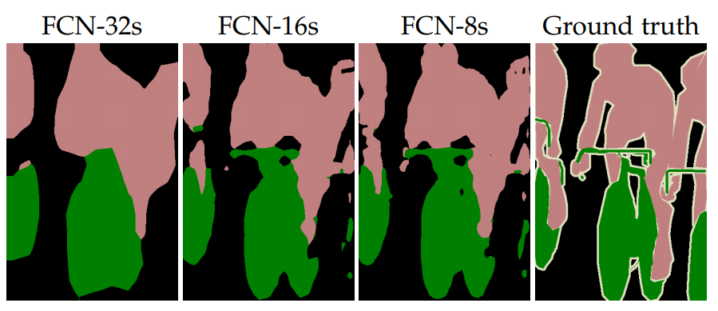

-----

| Title     | ML Tasks Image Segmentation FCN                       |
| --------- | ----------------------------------------------------- |
| Created @ | `2019-11-27T07:41:13Z`                                |
| Updated @ | `2023-11-21T14:42:14Z`                                |
| Labels    | \`\`                                                  |
| Edit @    | [here](https://github.com/junxnone/aiwiki/issues/160) |

-----

# FCN

  - 传统的CNN(AlexNet)结构中，前5层是卷积层，第6/7层是长度为4096的FC(全连接层)，第8层是长度为1000的FC，分别对应1000个类别的概率
  - FCN将这3层FC一维向量表示为卷积层，卷积核的大小 ( 通道数，宽，高) 分别为 (4096, 1, 1) - (4096, 1,
    1) - (1000, 1, 1), 所有的层都是卷积层，故称为全卷积网络
  - 从抽象的特征中恢复出每个像素所属的类别

基于CNN网络产生 feature map, FCN 采用反卷积层对最后一个卷积层的 feature map 进行上采样,
使它恢复到输入图像相同的尺寸，从而可以对每个像素都产生了一个预测,
同时保留了原始输入图像中的空间信息, 最后在上采样的特征图上进行逐像素分类

## 传统CNN分割方法

为了对一个像素分类，使用该像素周围的一个图像块作为CNN的输入用于训练和预测。

  - **存储开销大:** 若每个像素使用的图像块的大小为15x15，则所需的存储空间为原来图像的225倍
  - **计算效率低:** 相邻的像素块存在重复，对每个像素块逐个卷积，存在大量重复计算
  - **像素块大小的限制了感知区域的大小:** 像素块的大小比整幅图像的大小小很多，只能提取一些局部的特征，从而导致分类的性能受到限制

### 网络结构

  - 对第5层的输出（32倍放大）反卷积到原图大小
  - 为了提高精确度，将第4层的输出和第3层的输出也依次反卷积，分别需要16倍和8倍上采样

**FCN-8s 分析**

| Steps | Layers                 | feature map                            |
| ----- | ---------------------- | -------------------------------------- |
| 0     | Input                  | \-                                     |
| 1     | Conv1 + Pooling-1      | 1/2 feature map                        |
| 2     | Conv2 + Pooling-2      | 1/4 feature map                        |
| 3     | Conv3 + Pooling-3      | 1/8 feature map                        |
| 4     | Conv4 + Pooling-4      | 1/16 feature map                       |
| 5     | Conv5 + Pooling-5      | 1/32 feature map                       |
| 6     | Conv6 + Conv7          | 1/32 image size -\> heatmap 热图 - 高维特征图 |
| 7     | DConv\[S6\]            |                                        |
| 8     | Dconv\[S4\] + CropPool | 逐点相加融合特征                               |
| 9     | Dconv\[S3\] + CropPool | 逐点相加融合特征                               |

-----

**32s - 16s - 8s**

| Net     | Stream | pixel prediction stride | feature map              |
| ------- | ------ | ----------------------- | ------------------------ |
| FCN-32s | Single | 32                      | Pool-5                   |
| FCN-16s | Two    | 16                      | Pool-5 + Pool-4          |
| FCN-8s  | Three  | 8                       | Pool-5 + Pool-4 + Pool-3 |

> 32s/16s/8s : 指UpSample阶段最后一层 DConv 中 stride 的大小

| Name    | Net                                                          |
| ------- | ------------------------------------------------------------ |
| FCN-32s |  |
| FCN-16s |  |
| FCN-8s  |  |

-----

**UpSampling**

-----

**FCN-32S-16S-8S 对比**

-----

**优点**

  - 可以接受任意大小的输入图像
  - 更加高效，避免了由于使用像素块而带来的重复存储和计算卷积的问题

-----

**缺点**

  - 得到的结果还是不够精细: 8倍上采样比32倍的效果好，但是上采样的结果还是比较模糊和平滑，对图像中的细节不敏感
  - 没有考虑空间关系:
    对各个像素进行分类，没有充分考虑像素与像素之间的关系，忽略了在通常的基于像素分类的分割方法中使用的空间规整（spatial
    regularization）步骤，缺乏空间一致性

## 后续

  - DeepLab - Fully Connected CRF - conditional random fields

## Reference

  - [FCN的学习及理解（Fully Convolutional Networks for Semantic
    Segmentation）](https://blog.csdn.net/qq_36269513/article/details/80420363)
  - [paper - Fully Convolutional Networks for Semantic
    Segmentation](https://www.cv-foundation.org/openaccess/content_cvpr_2015/html/Long_Fully_Convolutional_Networks_2015_CVPR_paper.html)
  - [paper - CVPR 2015 - Fully Convolutional Networks for Semantic
    Segmentation - arxiv](https://arxiv.org/abs/1411.4038)
  - [paper - PAMI 2016 - Fully Convolutional Networks for Semantic
    Segmentation - arxiv](https://arxiv.org/abs/1605.06211)
  - [Github repo](https://github.com/shelhamer/fcn.berkeleyvision.org)
  - [全卷积网络 FCN 详解](https://zhuanlan.zhihu.com/p/30195134)
  - [网络结构 FCN-8S-PASCAL -
    Netscope](http://ethereon.github.io/netscope/#/preset/fcn-8s-pascal)
  - [计算机视觉中upsampling(上采样)的三种方式](https://blog.csdn.net/u014451076/article/details/79156967)
