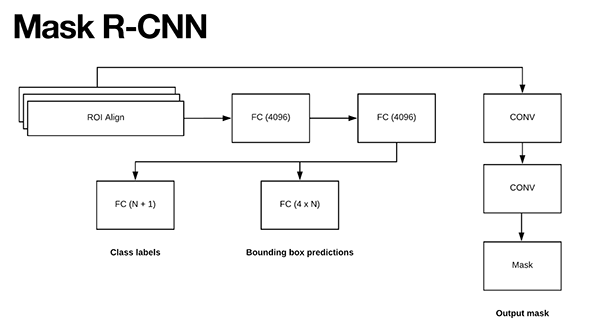
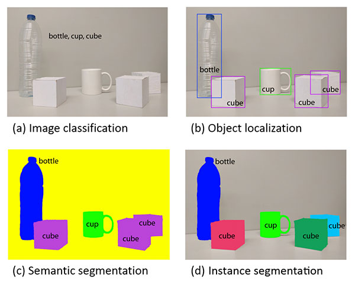
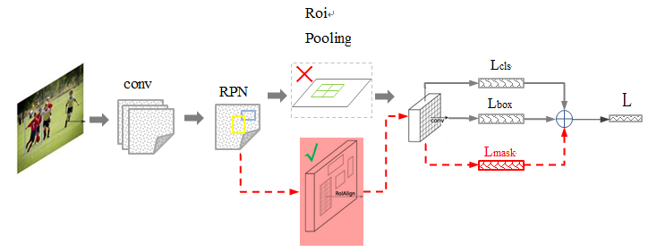
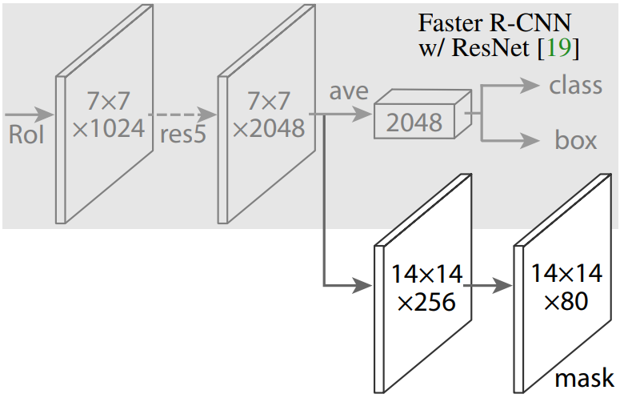
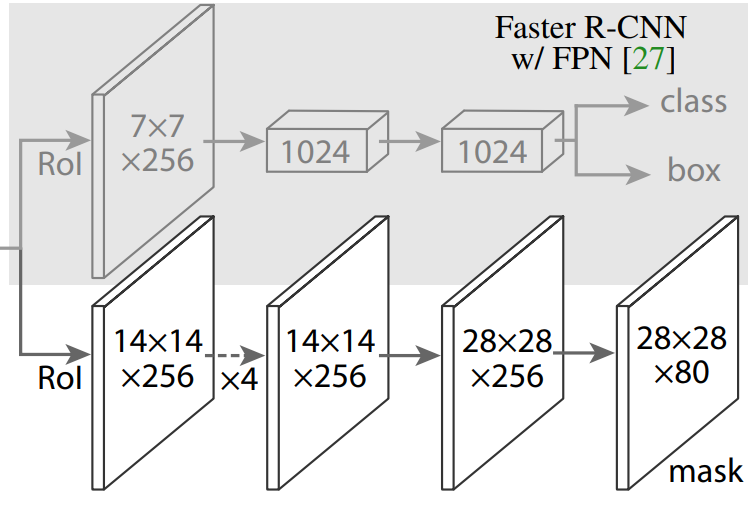
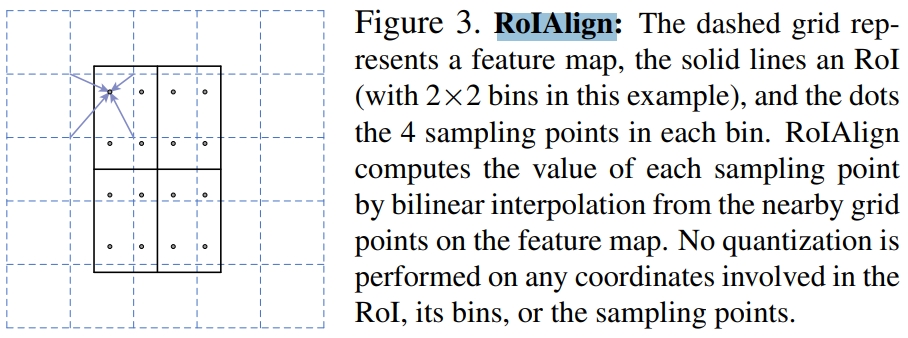
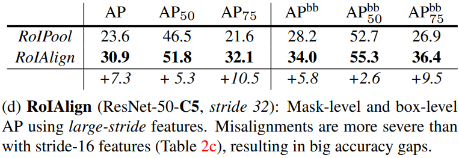

-----

| Title         | ML Tasks Image Segmentation MaskRCNN                  |
| ------------- | ----------------------------------------------------- |
| Created @     | `2019-06-22T08:06:11Z`                                |
| Last Modify @ | `2022-12-24T12:51:51Z`                                |
| Labels        | \`\`                                                  |
| Edit @        | [here](https://github.com/junxnone/aiwiki/issues/163) |

-----

## Reference

  - [paper - Mask R-CNN](https://arxiv.org/abs/1703.06870)
  - [paper - R-CNN](https://arxiv.org/abs/1311.2524)
  - [paper - Fast R-CNN](https://arxiv.org/abs/1504.08083)
  - [paper - Faster R-CNN](https://arxiv.org/abs/1506.01497)
  - [基于 OpenCV 的 Mask RCNN 实现](https://www.aiuai.cn/aifarm1178.html)
  - [基于 Keras 的 Mask R-CNN 实现](https://www.aiuai.cn/aifarm1180.html)
  - [Mask R-CNN for object detection and instance segmentation on Keras
    and TensorFlow](https://github.com/matterport/Mask_RCNN)
  - [~~Detectron - Caffe2 -
    facebookresearch~~](https://github.com/facebookresearch/Detectron)
  - [Detectron2 - pytorch -
    facebookresearch](https://github.com/facebookresearch/detectron2)
  - [some other
    implementation](https://detectron2.readthedocs.io/notes/benchmarks.html)

## Brief

  - 基于 Faster R-CNN 结构构建
  - 使用 ROIAlign 模块替换 ROIPooling 模块
  - 在ROI Align 模块的输出端新增一个分支. 该分支的输入为 ROI Align 的输出，该分支的输出送入到两个 Conv 层.
    Conv 层的输出即为 mask.

|  |  |
| ----------------------------------------------------------------------------------------------------------------------------- | ------------------------------------------------------------ |

Mask R-CNN 可以自动对图片中每个目标的进行分割，并构建像素级的 masks.

## vs Faster RCNN

| Backbones | Head Architecture                                            |
| --------- | ------------------------------------------------------------ |
| ResNet    |  |
| FPN       |  |

## ROIAlign

  - 不四舍五入取整, 减少量化时的损失
  - 使用 `bilinear interpolation` 方法取值

-----

-----

### Test Result - ROIPool vs ROIAlign

