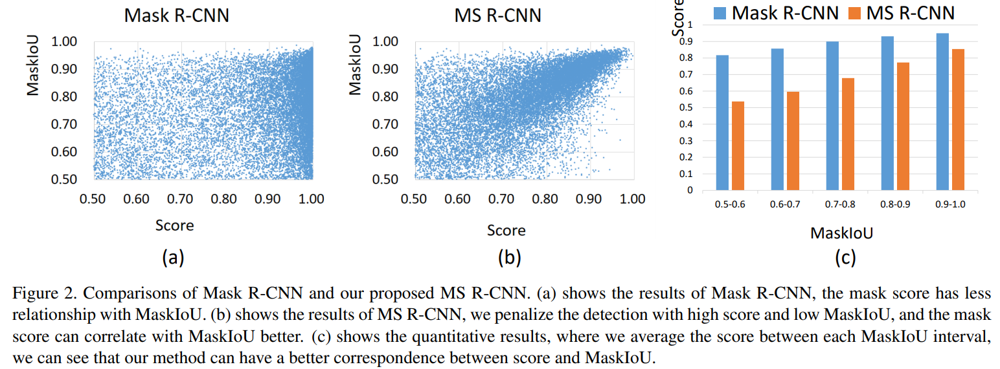
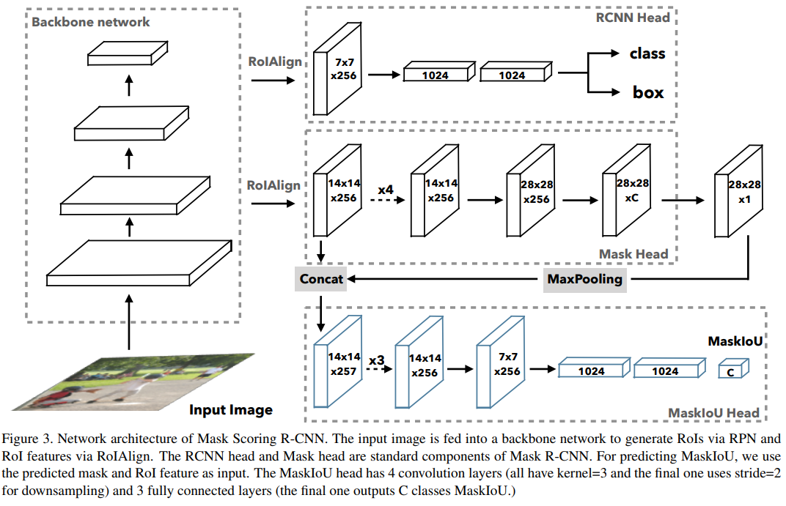
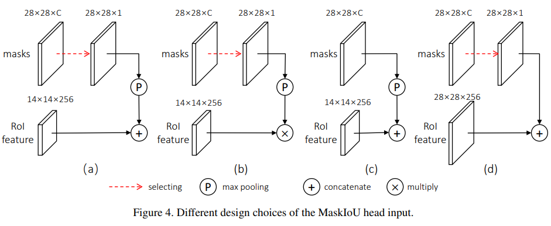
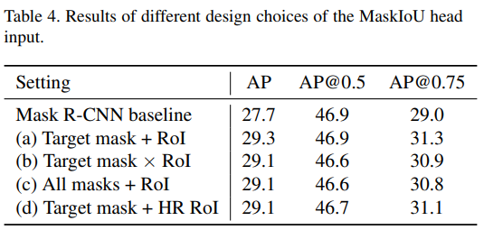
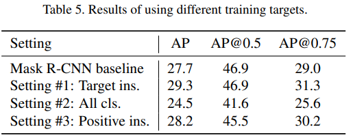
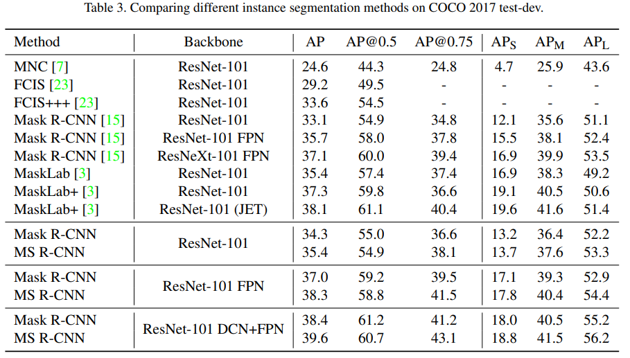

-----

| Title         | ML Tasks Image Segmentation MSRCNN                    |
| ------------- | ----------------------------------------------------- |
| Created @     | `2019-06-22T08:30:59Z`                                |
| Last Modify @ | `2022-12-24T12:52:20Z`                                |
| Labels        | \`\`                                                  |
| Edit @        | [here](https://github.com/junxnone/aiwiki/issues/164) |

-----

## Reference

  - [paper - 2019 - Mask Scoring
    R-CNN](https://arxiv.org/pdf/1903.00241.pdf)
  - [Code - Mask Scoring
    R-CNN](https://github.com/zjhuang22/maskscoring_rcnn)
  - [2019CVPR《Mask Scoring
    R-CNN》](https://www.cnblogs.com/wemo/p/10505970.html)
  - [性能超越何恺明Mask
    R-CNN！华科大开源图像分割新方法](https://www.jiqizhixin.com/articles/2019-05-15-4)
  - [CVPR2019 | Mask Scoring R-CNN
    论文解读](https://www.cnblogs.com/ManWingloeng/p/10717578.html)

## Brief

### Mask RCNN vs MS RCNN

  - Mask R-CNN的MaskIoU与分类置信度没有太强的关联
  - MS R-CNN 在 Mask R-CNN 框架上添加一个分支 MaskIoU Head 模块，用来学习MaskIoU

### MaskIoU Head

  - Input = `Predicted mask` + `Max Pooling (2,2)` + `ROIAlign layer`
  - Training
      - 使用 `threshold=0.5` 处理 mask
  - Inference
      - final mask confidence = MaskIoU x `classification score`

  - 不同的 `MaskIoU Head Input`

  - 不同的 `Training Targets`

## mAP 对比

  - 相比 Mask R-CNN
      - AP-S/M/L 上都有所提升
      - AP 0.5 有下降，0.75 有上升，整体 AP 提升一个点多

