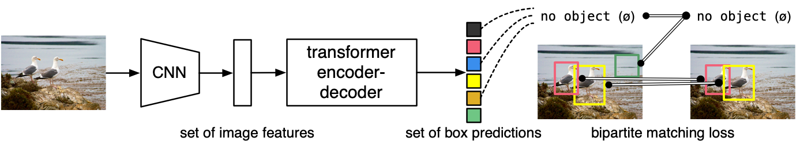
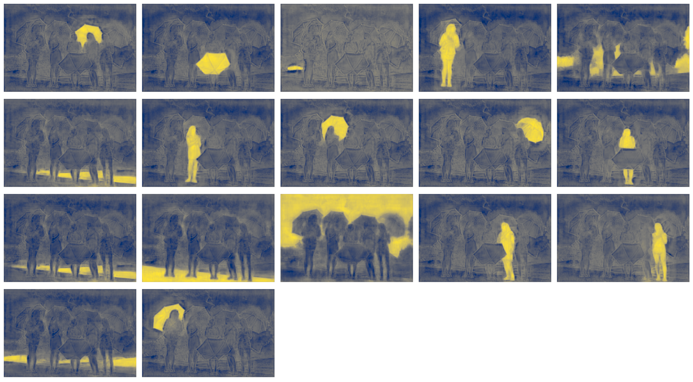

-----

| Title     | paper DETR                                            |
| --------- | ----------------------------------------------------- |
| Created @ | `2021-02-01T02:14:33Z`                                |
| Updated @ | `2024-10-15T10:01:39Z`                                |
| Labels    | \`\`                                                  |
| Edit @    | [here](https://github.com/junxnone/aiwiki/issues/165) |

-----

# DETR

  - **DE**tection **TR**ansformer
  - 简化了检测流程，去除了许多手工设计的的组件(NMS/AnchorGeneration) - `先验知识`
  - **传统的目标检测方法**是使用大量的 `proposals/anchors/window centers` 将问题转换为回归和分类问题
      - 受锚点设计/后处理(NMS)影响较大
  - 将目标检测问题视为**集合预测问题**
  - 使用匈牙利算法设计损失函数，实现二分匹配，计算损失，优化训练
  - `自回归模型` -\> `并行解码的 Transformer`
  - **特性**
      - 一次性预测固定数量 `N` 的预测集合
      - `+ no objects`

## Arch

  - Input Image: $x\_{img } \\in \\mathbb{R}^{3 ×H\_{0} ×W\_{0}}$
  - **CNN Backbone**
      - Feature Map: $f \\in \\mathbb{R}^{C ×H ×W}$
      - $C = 2048$
      - $H, W=\\frac{H\_{0}}{32},\\frac{W\_{0}}{32}$
  - **Transformer Encoder**
      - 1 x 1 Conv - 降维 C: 2048 → d ⇒ $z\_{0} \\in \\mathbb{R}^{d ×H
        ×W}$
      - Flatten to one dim(tokens) -\> $d×HW$
      - `+ Fixed Positional Encoding`
  - **Transformer Decoder**
      - `+ output positional encoding` 即 `object queries`
  - 同步输入，一次处理(不同于Transformer NLP: 左 → 右)
  - **Prediction FFNs**
      - N x (class prob + (x, y, h, w))

|  |
| ------------------------------------------------------------ |
|  |
|  |
|  |

### Set Prediction loss

  - DETR 解码器推理出 N(远大于图像中典型数量目标) 个预测结果
  - 用 $y$ 表示真实对象集合
  - 用 $\\hat{y}={\\hat{y}*{i}}*{i = 1}^{N}$ 表示 $N$ 个预测结果的集合。
  - 假设 $N$ 大于图像中的对象数量，我们也将 $y$ 视为大小为 $N$ 的集合，用 $\\varnothing$ （无对象）进行填充。
  - 为了在这两个集合之间找到二分匹配，我们寻找一个具有最低成本的 $N$ 个元素的排列
    $\\sigma\\in\\mathfrak{S}\_{N}$ ：
  - $\\hat{\\sigma}=\\underset{\\sigma\\in\\mathfrak{S}*{N}}{\\arg\\min}\\sum*{i}^{N}\\mathcal{L}*{match}(y*{i},\\hat{y}\_{\\sigma(i)})$
    ，
  - 其中 $\\mathcal{L}*{match}(y*{i},\\hat{y}*{\\sigma(i)})$ 是真实值 $y*{i}$
    与索引为 $\\sigma(i)$ 的预测之间的成对匹配成本。
  - 最优分配可以使用匈牙利算法有效地计算。
  - 匹配成本同时考虑了类别预测以及预测框和真实框的相似性。
      - 真实集合中的每个元素 $i$ 可以看作是 $y\_{i}=(c\_{i},b\_{i})$ ，其中 $c\_{i}$
        是目标类别标签（可能是无穷大）
      - $b\_{i}\\in\[0,1\]^{4}$ 是一个思维向量，它定义了真实框的中心坐标以及相对于图像大小的高度和宽度。
      - 对于索引为 $\\sigma(i)$ 的预测，我们将类别 $c\_{i}$ 的概率定义为
        $\\hat{p}*{\\sigma(i)}(c*{i})$ ，并将预测框定义为
        $\\hat{b}\_{\\sigma(i)}$ 。
      - 使用这些符号，我们将 $\\mathcal{L}*{match}(y*{i},\\hat{y}*{\\sigma(i)})$
        定义为
        $-\\mathbb{1}*{{c\_{i}\\neq\\varnothing}}\\hat{p}*{\\sigma(i)}(c*{i})+\\mathbb{1}*{{c*{i}\\neq\\varnothing}}\\mathcal{L}*{box}(b*{i},\\hat{b}\_{\\sigma(i)})$
        。
      - $\\mathbb{1}*{{c*{i}\\neq\\varnothing}}$ 是一个指示函数，如果
        $c\_{i}\\neq\\varnothing$ （即真实目标存在类别，不是无对象的情况），则值为 $1$ ，否则为 $0$
  - 定义损失:
      - $\\mathcal{L}*{Hungarian }(y,\\hat{y})=\\sum*{i =
        1}^{N}\[-log\\hat{p}*{\\hat{\\sigma}(i)}(c*{i})+\\mathbb{1}*{{c*{i}\\neq\\varnothing}}\\mathcal{L}*{box}(b*{i},\\hat{b}\_{\\hat{\\sigma}(i)})\]$
      - $\\hat{\\sigma}$ 是在第一步（1）中计算出的最优分配。在实际中，当 $c\_{i}=\\varnothing$
        时，我们将对数概率项的权重降低10倍以进行调整类别不平衡。
      - **框损失** $L\_{box}(b\_{i},\\hat{b}*{\\sigma(i)}) =
        \\lambda*{iou}L\_{iou}(b\_{i},\\hat{b}*{\\sigma(i)})+\\lambda*{L1}|b\_{i}-\\hat{b}\_{\\sigma(i)}|\_1$
      - 其中 $\\lambda\_{iou}$ 、 $\\lambda\_{L1}\\in\\mathbb{R}$
        是超参数。这两个损失通过批次中的对象数量进行归一化

### Positional Encoding

  - **Spatial positional encoding**
      - 每一层 encoder attention layer 都加
      - decoder attention layer 除了 bottom layer 都加
      - Sine / Learned
  - **Output positional encoding**
      - 即 Object queries
      - 每一层 decoder attention layer 都加
      - 通过学习得到
      - Inference 时为固定值

### Detection Output/Prediction FFNs

    class_embed = nn.Linear(hidden_dim, num_classes + 1)
    bbox_embed = MLP(hidden_dim, hidden_dim, 4, 3)

### Segmentation

  - **Mask-Head**
      - `Decoder Outputs` ==\> `Mask-Head`
      - `Binary mask` for BBox
  - **Training**
      - 1 - 联合 Training,
      - 2 - 先Training BBox,然后 fine-tune `Mask Head`
      - Training 结果差不多
      - 第 `2` 种方法更快
  - **Outputs**(N=100)
      - **pred\_logits** (1, N, num\_classes+1)
      - **pred\_boxes** (1, N, 4)
      - **pred\_masks** (1, N, H/4, W/4)

|  |  |
| ------------------------------------------------------------ | ------------------------------------------------------------ |
| Original Image                                               | Segmentation Output                                          |

| Prob \> 0.9                                                  |
| ------------------------------------------------------------ |
|  |

## Evaluation

  - **Evaluation-1** 对标超越 `Faster RCNN` 系列
  - **Evaluation-2**

| Num | Evaluation                                                   |
| --- | ------------------------------------------------------------ |
| 1   |  |
| 2   |  |

## Reference

  - 2020-05 **\[DETR\]** End-to-End Object Detection with Transformers
    \[[Paper](https://arxiv.org/abs/2005.12872v3)\]
    \[[Code](https://github.com/facebookresearch/detr)\]
  - [Object detection set prediction
    loss](https://senyang-ml.github.io/2020/06/04/detr/)
