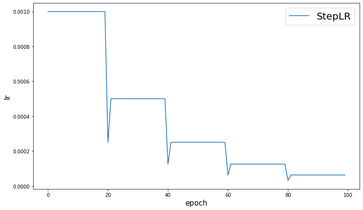
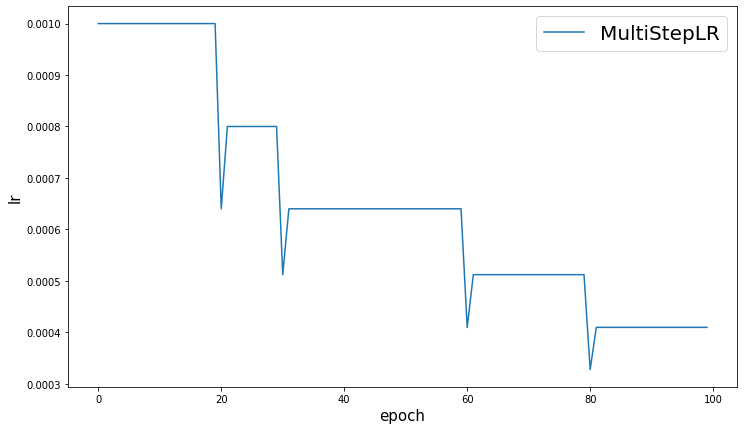
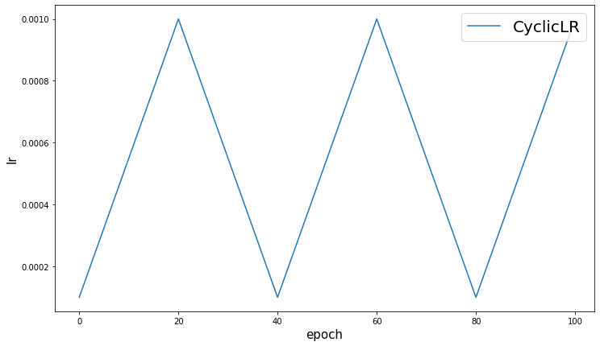
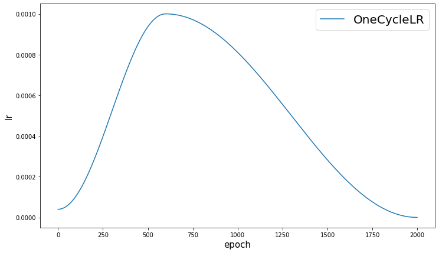
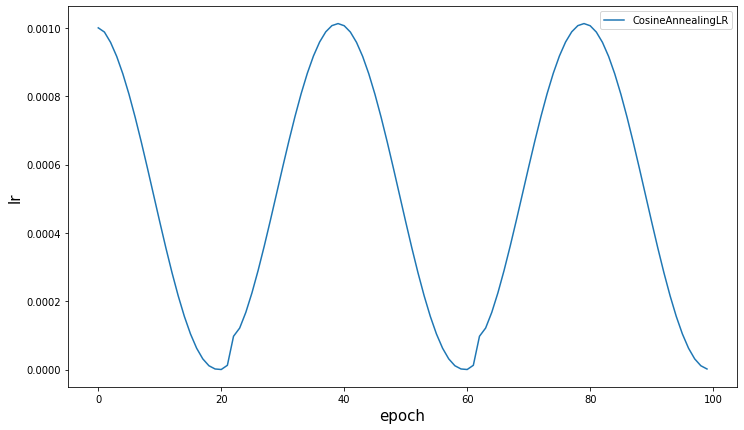
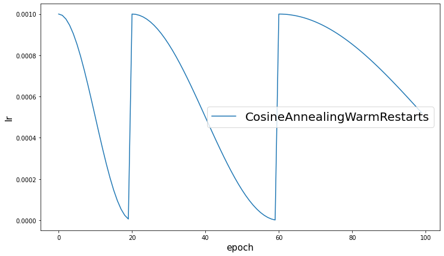
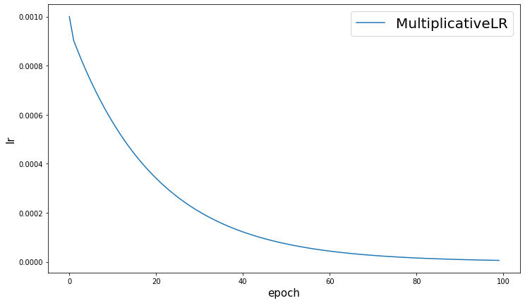

-----

| Title         | Tools Pytorch Optimizer                               |
| ------------- | ----------------------------------------------------- |
| Created @     | `2020-01-06T09:22:23Z`                                |
| Last Modify @ | `2022-12-25T04:08:16Z`                                |
| Labels        | \`\`                                                  |
| Edit @        | [here](https://github.com/junxnone/aiwiki/issues/174) |

-----

## Reference

  - [module-torch.optim](https://pytorch.org/docs/stable/optim.html#module-torch.optim)
  - [torch\_optim\_lr\_scheduler.ipynb](https://github.com/junxnone/examples/blob/master/pytorch/torch_optim_lr_scheduler.ipynb)
  - [Parameter optimization in neural
    networks](https://www.deeplearning.ai/ai-notes/optimization/)

## Brief

  - Optimezer - `torch.optim`
  - Learning Rate Scheduler

## Optimizer

| Optimizer  | Description |
| ---------- | ----------- |
| Adadelta   |             |
| Adagrad    |             |
| Adam       |             |
| AdamW      |             |
| SparseAdam |             |
| Adamax     |             |
| ASGD       |             |
| LBFGS      |             |
| RMSprop    |             |
| Rprop      |             |
| SGD        |             |

## Learning Rate Scheduler

| Learning Rate Scheduler     | Description                                                  |
| --------------------------- | ------------------------------------------------------------ |
| StepLR                      |  |
| MultiStepLR                 |  |
| ExponentialLR               |  |
| CyclicLR                    |  |
| OneCycleLR                  |  |
| CosineAnnealingLR           |  |
| CosineAnnealingWarmRestarts |  |
| MultiplicativeLR            |  |
| LambdaLR                    |                                                              |
| ReduceLROnPlateau           | 当 metrics 不再提升时减少学习率                                         |

## Tips

CIFAR10 example 用 GPU 的话需要在 `net.to(device)` 后重新定义一次 `optimizer`

    net = net.to(device)
    optimizer = optim.SGD(net.parameters(), lr=0.0001, momentum=0.9)
    for epoch in range(2):  # loop over the dataset multiple times
    
        running_loss = 0.0
        for i, data in enumerate(trainloader, 0):
            # get the inputs
            inputs, labels = data[0].to(device), data[1].to(device)
    
            # zero the parameter gradients
            optimizer.zero_grad()
    
            # forward + backward + optimize
            outputs = net(inputs)
            loss = criterion(outputs, labels)
            loss.backward()
            optimizer.step()
    
            # print statistics
            running_loss += loss.item()
            if i % 2000 == 1999:    # print every 2000 mini-batches
                print('[%d, %5d] loss: %.3f' %
                      (epoch + 1, i + 1, running_loss / 2000))
                running_loss = 0.0

  - [torch.optim](https://pytorch.org/docs/stable/optim.html) 也提到了需要把
    optimizer 定义放在 `.cuda()` 之后
