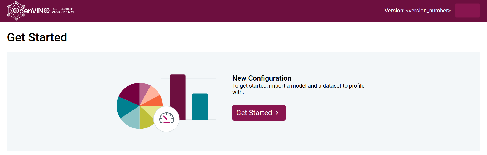

-----

| Title         | Tools OV Workbench                                    |
| ------------- | ----------------------------------------------------- |
| Created @     | `2020-02-03T03:42:45Z`                                |
| Last Modify @ | `2022-12-24T15:59:05Z`                                |
| Labels        | \`\`                                                  |
| Edit @        | [here](https://github.com/junxnone/aiwiki/issues/178) |

-----

## Reference

  - [Deep Learning
    Workbench](https://docs.openvinotoolkit.org/latest/_docs_Workbench_DG_Introduction.html)

## Brief

  - 基于web的图形界面
  - Download Intel OpenVINO model zoo
  - Model Optimizer
  - INT8 model
  - Accuracy Checker
  - Visualize Model
  - Compare Performance
  - Remote Machine

-----

