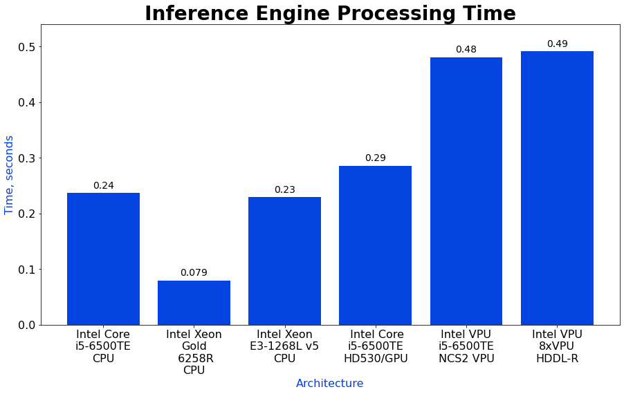
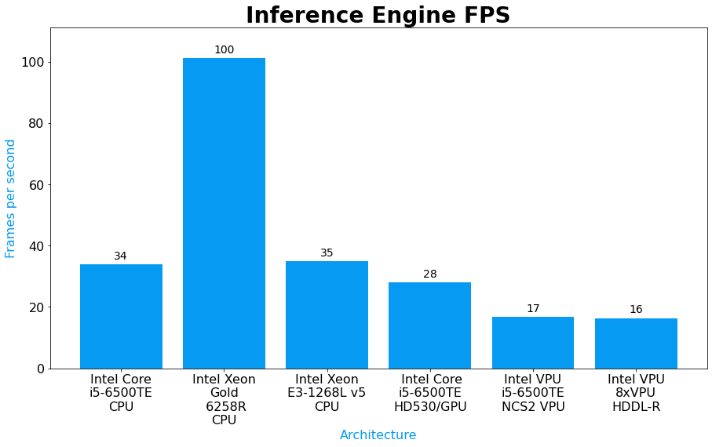
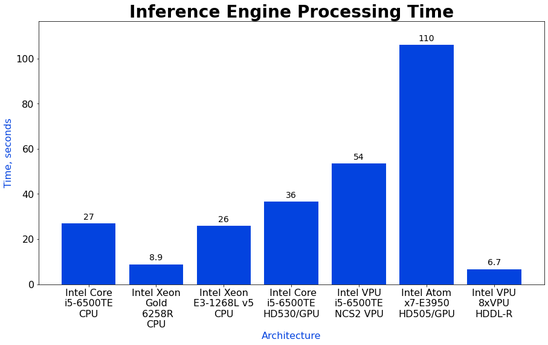
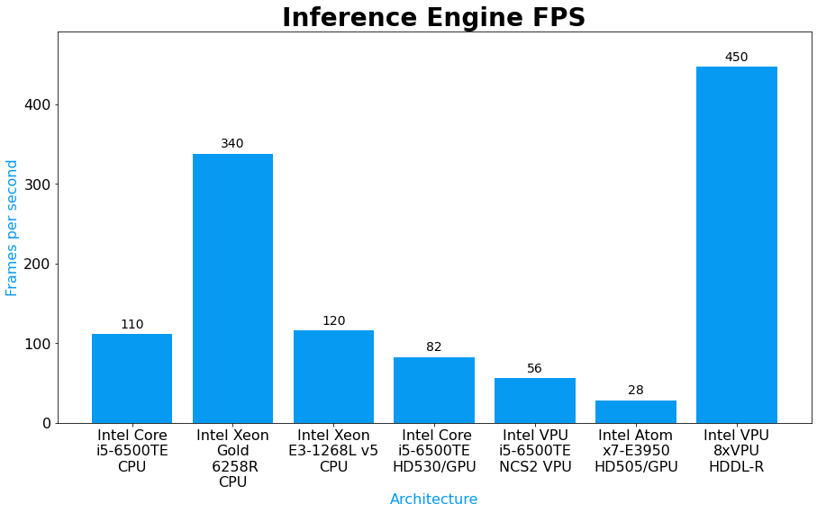
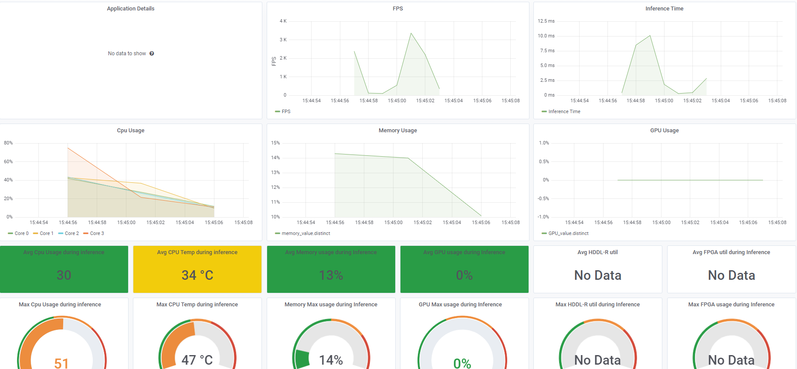

-----

| Title         | Tools OV DevCloud                                     |
| ------------- | ----------------------------------------------------- |
| Created @     | `2020-12-09T07:28:51Z`                                |
| Last Modify @ | `2022-12-24T15:58:47Z`                                |
| Labels        | \`\`                                                  |
| Edit @        | [here](https://github.com/junxnone/aiwiki/issues/179) |

-----

## Reference

  - [DevCloud](https://devcloud.intel.com/edge/)

## Brief

  - 测试不同 `Device`上的 `Performance`
  - 使用 `Jupyter Notebook`

| Mode  | Inference Time                                               | Throughput                                                   |
| ----- | ------------------------------------------------------------ | ------------------------------------------------------------ |
| Sync  |  |  |
| Async |  |  |

|  |
| ------------------------------------------------------------ |

**Files**

  - jupyter notebook
  - python inference script
  - OpenVINO IR models
  - test images/videos/labels

**Pipeline**

  - *Optional* - Convert Tensorflow/Pytorch model to OpenVINO IR
  - Create shell script to run on Edge Node
  - Create Jobs on jupyter notebook on different devices
  - Summary logs and plot performance

## Details

  - Python
      - qarpo
          - demoutils
              - progressUpdate
          - displayMultiversionURL
      - applicationMetricWriter
  - Shell
      - pbsnodes
      - qsub
