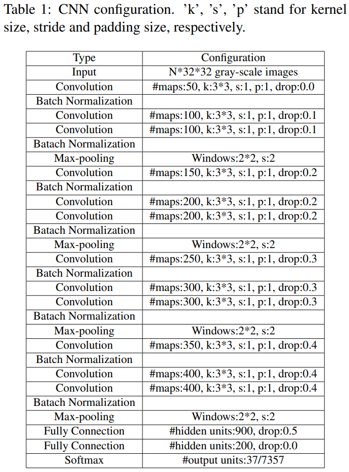

-----

| Title         | ML Tasks Image OCR SW                                 |
| ------------- | ----------------------------------------------------- |
| Created @     | `2020-05-08T06:06:40Z`                                |
| Last Modify @ | `2022-12-24T13:03:10Z`                                |
| Labels        | \`\`                                                  |
| Edit @        | [here](https://github.com/junxnone/aiwiki/issues/188) |

-----

# Sliding Windows CNN CTC

## Reference

  - [paper - 2017 - Scene Text Recognition with Sliding Convolutional
    Character Models](https://arxiv.org/pdf/1709.01727.pdf)
  - [场景文字识别Sliding
    Convolution笔记](https://blog.csdn.net/qq_14845119/article/details/79312860)
  - [Sequence Modeling With CTC](https://distill.pub/2017/ctc/)

## Brief

  - Sliding windows + CNN + [CTC](/CTC)
  - English & Chinese
      - Softmax Layer - 37/7357 English/Chinese

## Arch

| Name                    | Description                     |
| ----------------------- | ------------------------------- |
| Sliding window          | crop `bbox x N`                 |
| Classification Layer    | feature --\> label              |
| CTC Transcription layer | label --\> final predict result |

**Preprocess & Sliding Windows**

| Preprocess                                              | Training                                                                                                             | Testing |
| ------------------------------------------------------- | -------------------------------------------------------------------------------------------------------------------- | ------- |
| Input scale to `Height = 32`, Width 按比例缩放 (Pad -\> 256) | ✅                                                                                                                    | ✅       |
| Window size                                             | \- Single-scale `WxH = 32x32`  - Multi-scale `WxH = 32x24` - `WxH = 32x32` - `WxH = 32x40` - \> resize to `32x32` | `32x32` |
| Step Size `= 4`                                         | ✅                                                                                                                    | ✅       |

| Pipeline                                                     | CNN Layers                                                   | CTC Algo                                                     |
| ------------------------------------------------------------ | ------------------------------------------------------------ | ------------------------------------------------------------ |
|  |  |  |

| sliding windows examples |  |
| ------------------------ | ------------------------------------------------------------ |

## decoding

  - naive - `None` - `lexicon -free`
  - lexicon based
  - language model based
