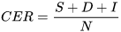

-----

| Title         | ML Tasks Image OCR Metrics                            |
| ------------- | ----------------------------------------------------- |
| Created @     | `2020-05-18T02:05:31Z`                                |
| Last Modify @ | `2022-12-24T13:00:43Z`                                |
| Labels        | \`\`                                                  |
| Edit @        | [here](https://github.com/junxnone/aiwiki/issues/190) |

-----

## Reference

  - [文本检测TIoU--metric](https://zhuanlan.zhihu.com/p/63541543)

## Brief

  - Frame Level
  - Character Level

## Character Level

### CER - Character Error Rate

| 来源       | 公式                                                           | Description                                                                                                                |
| -------- | ------------------------------------------------------------ | -------------------------------------------------------------------------------------------------------------------------- |
| Calamari |  | \- ed - edit distance  - 分母为 sequences `s1` & `s2` 长度最大值  - 取值 \[0, 1\]                                              |
| ASR      |  | \- S（substitution）\*\* 表示替换的字符数目 - D（deletion）表示删除的字符数目 - I（insertion）表示插入的字符数目 - N 表示参考序列中字符总数  - 取值 \[0, +∞) |

### WER - Word Error Rate
