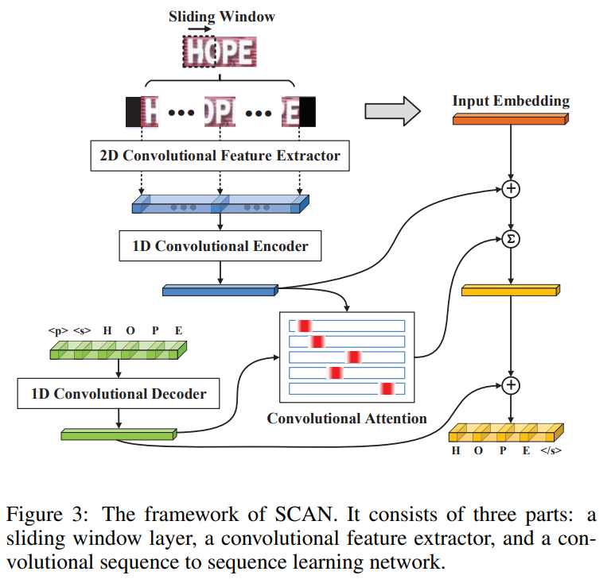
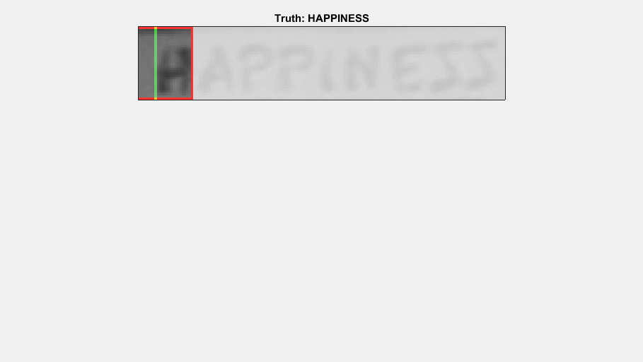
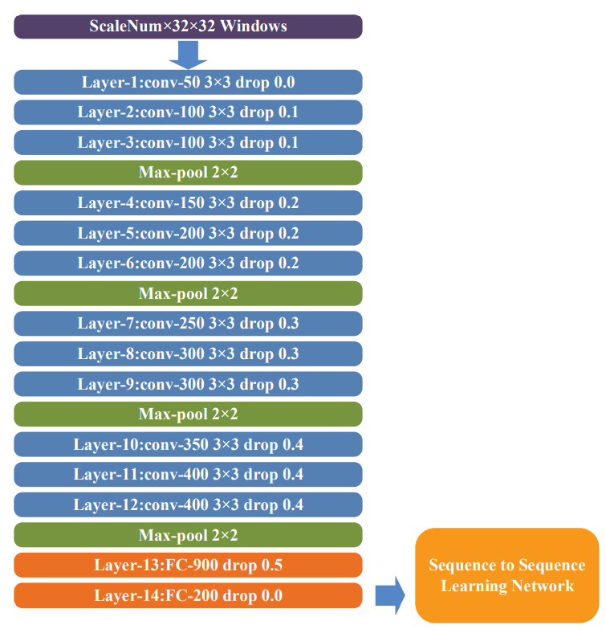
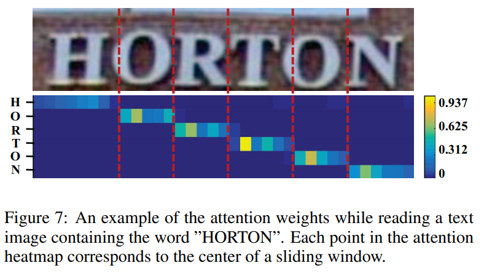

-----

| Title         | ML Tasks Image OCR SCAN                               |
| ------------- | ----------------------------------------------------- |
| Created @     | `2020-05-09T02:06:41Z`                                |
| Last Modify @ | `2022-12-24T13:04:24Z`                                |
| Labels        | \`\`                                                  |
| Edit @        | [here](https://github.com/junxnone/aiwiki/issues/191) |

-----

## Reference

  - [paper - 2018 - SCAN: Sliding Convolutional Attention Network for
    Scene Text Recognition](https://arxiv.org/pdf/1806.00578v1.pdf)

## Brief

  - Sliding Windows + CNN + Seq2Seq
  - Seq2Seq
      - Encoder
      - Decoder

## Arch

| Pipeline                                                     | Sliding                                                    |
| ------------------------------------------------------------ | ---------------------------------------------------------- |
|  |  |

| CNN Extractor                                                | Convolutional Attention                                      |
| ------------------------------------------------------------ | ------------------------------------------------------------ |
|  |  |

## Input

  - Resize `Height = 32` Pad `Width = 256`
  - Sliding Windows
      - Multi-scales --\> 按比例 resize --\> multi-channel input
      - `32x32` - `32x40` - `32x48`
