-----

| Title         | ML Tasks Image OCR TextScanner                        |
| ------------- | ----------------------------------------------------- |
| Created @     | `2020-05-15T05:52:22Z`                                |
| Last Modify @ | `2022-12-24T13:04:03Z`                                |
| Labels        | \`\`                                                  |
| Edit @        | [here](https://github.com/junxnone/aiwiki/issues/192) |

-----

## Reference

  - [paper - 2019 - TextScanner: Reading Characters in Order for Robust
    Scene Text Recognition ](https://arxiv.org/pdf/1912.12422.pdf)
  - [旷视研究院提出TextScanner：确保字符阅读顺序，实现文字识别新突破](https://zhuanlan.zhihu.com/p/100683420?utm_source=qq)
  - [【OCR实践系列】TextScanner的一些研究](https://zhuanlan.zhihu.com/p/133662322)
    --- [TF 实现](https://github.com/piginzoo/textscanner)

## Brief

  - History issues

| Model        | 缺点                | 优点      |
| ------------ | ----------------- | ------- |
| RNN          | 注意力漂移             |         |
| Segmentation | 字符分割为不同部分 & 多字符黏连 | 不规则字体识别 |

  - 基于 `CA-FCN`
      - Remove Character Attentions - CA
      - ResNet-50
  - `Vatti clipping algo` - vati 1992
  - `Sequence label` - `Character label` - Mutual-Supervision
  - Branch

| Branch                  | Output                      | Description |
| ----------------------- | --------------------------- | ----------- |
| Class Branch 类别分支    | Character Segmentation Maps | 字符分割 mask   |
| Geometry Branch 几何分支 | Localization Maps           | 字符位置顺序      |

### Attention Decoder vs Segmentation-based vs TextScanner

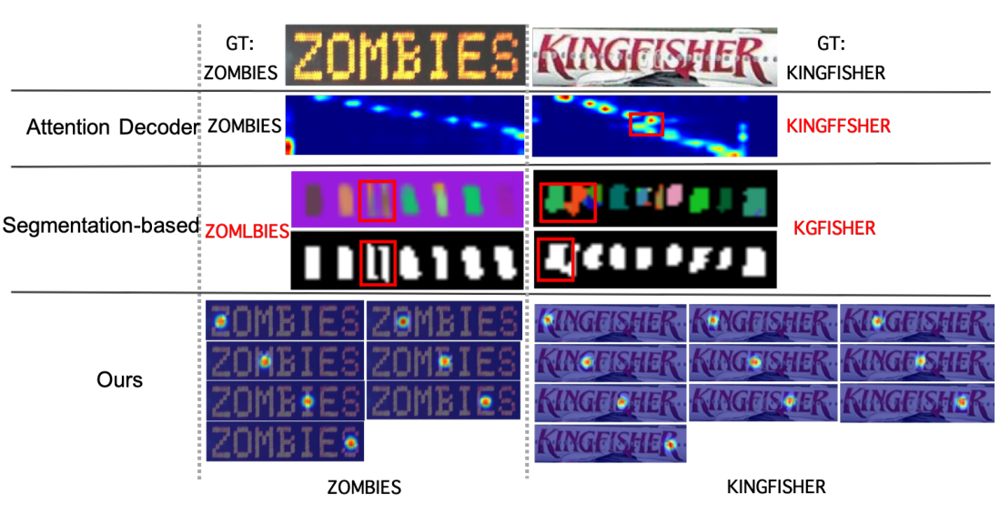

## Arch

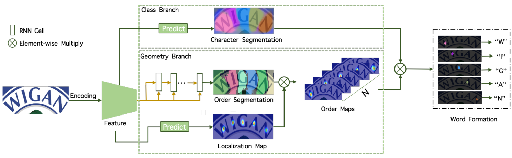

## Class Branch

  - CNN Backbone --\> 3x3 + 1x1 Conv Layers --\> Softmax Layer --\>
    Character Segmentation maps
  - Output - G - `hxwxc`
      - `c` = all character classes + background

## Geometry Branch

  - CNN Backbone --\> sigmoid layer --\> Localization Maps
  - CNN Backbone --\> Encoder --\> RNN(GRU) --\> Decoder --\> Order
    Segmentation Maps
  - Output
      - Localization map - Q - `hxwx1`
      - Order segmentation maps - S -`hxwxN`
          - `N` - 预定义的字符序列长度
      - Order map - `H = Q * S` - `hxwxN`

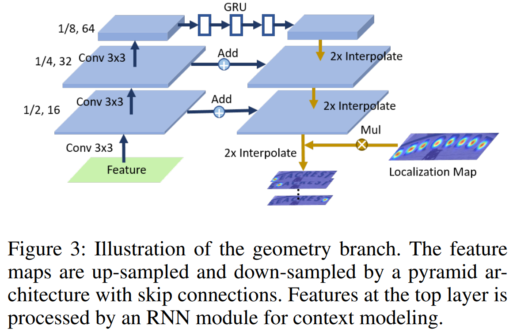

### Mutual-Supervision

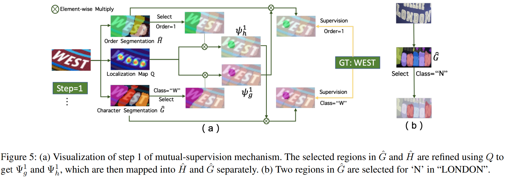

## Word Formation

| classification scores | 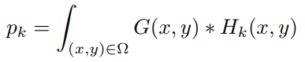 |
| --------------------- | ------------------------------------------------------------ |

## Training

  - `5 epchs` pre-train `@SynthText - character level` + `1 epoch`
    fine-tuning `@real images sequence-level`
  - Init LR = `10^-3` -\> `10^-4` -\> `10^-5`
  - Input - Resize to `64x256`
  - Adam

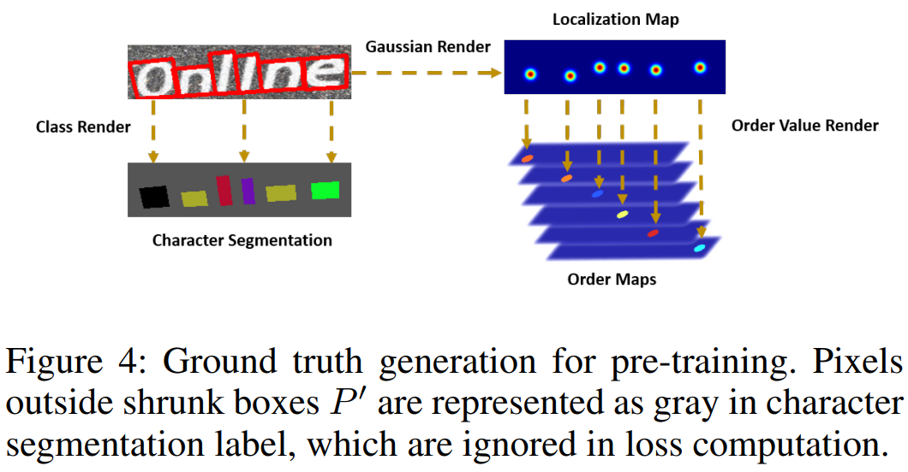

## Loss

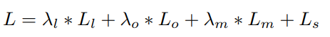

  - `Lc` - Localization map
  - `Lo` - Order segmentation
  - `Ls` - Text segmentation
  - `Lm` - Mutual supervision
  - `λ`
      - `λl` - `=10`
      - `λo` - `=10`
      - `λm`
          - pretrain `=0`
          - 其他 `=1`

| Mutual supervision Loss | 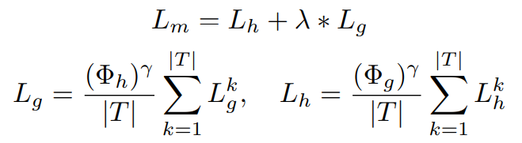 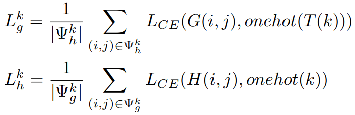 |
| ----------------------- | ---------------------------------------------------------------------------------------------------------------------------- |

> `λ = 0.2` - `γ = 2`

## Test

**English Dataset Test**

  - IC13 - ICDAR 2013
  - IC15 - ICDAR 2015
  - IIIT - IIIT 5K-Words
  - SVT - Street View Text
  - SVTP - SVT-Perspective
  - CT - CUTE80
  - MLT-2017
  - SynthText
  - Synth90K

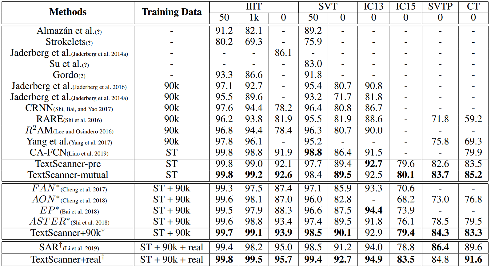

**Chinese Dataset Test**

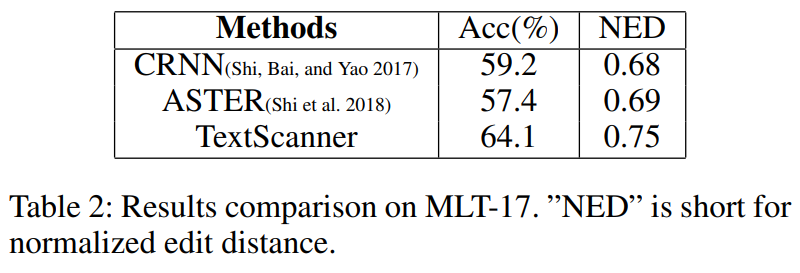
