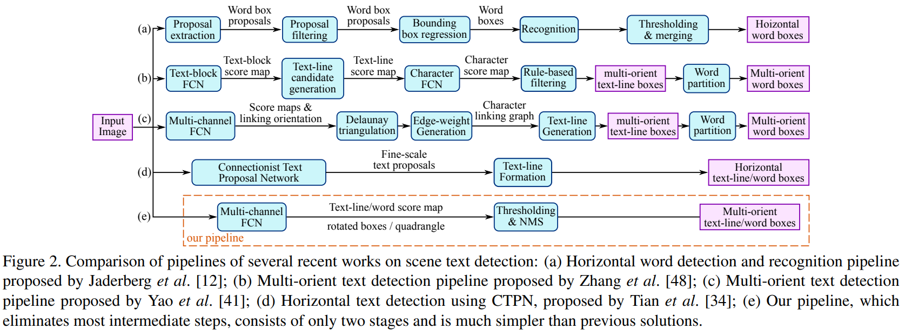
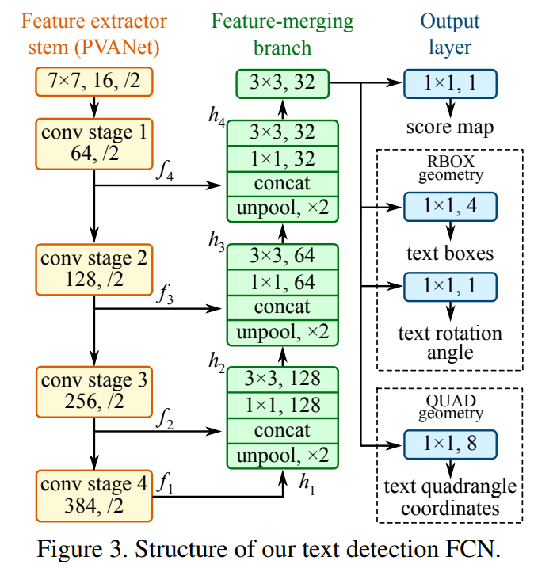

-----

| Title         | ML Tasks Image OCR EAST                               |
| ------------- | ----------------------------------------------------- |
| Created @     | `2020-05-28T02:07:31Z`                                |
| Last Modify @ | `2022-12-24T13:02:13Z`                                |
| Labels        | \`\`                                                  |
| Edit @        | [here](https://github.com/junxnone/aiwiki/issues/193) |

-----

## Reference

  - [paper - 2017 -EAST: An Efficient and Accurate Scene Text
    Detector](https://arxiv.org/pdf/1704.03155.pdf)
  - [OCR EAST: An Efficient and Accurate Scene Text Detector
    自然场景下的文字算法详解](https://www.jianshu.com/p/6e35829a38de)
  - [A tensorflow implementation of EAST text
    detector](https://github.com/argman/EAST)

## Brief

## Pipeline

## Arch

