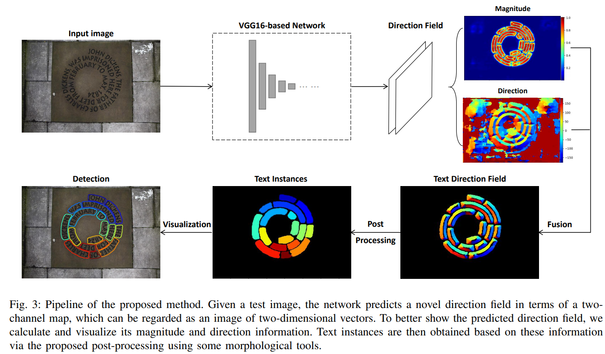

-----

| Title         | ML Tasks Image OCR TextField                          |
| ------------- | ----------------------------------------------------- |
| Created @     | `2020-05-28T02:38:04Z`                                |
| Last Modify @ | `2022-12-24T13:04:14Z`                                |
| Labels        | \`\`                                                  |
| Edit @        | [here](https://github.com/junxnone/aiwiki/issues/194) |

-----

## Reference

  - [paper - 2018 - TextField: Learning A Deep Direction Field for
    Irregular Scene Text
    Detection](https://arxiv.org/pdf/1812.01393.pdf)
  - [论文阅读TextField: Learning A Deep Direction Field for Irregular Scene
    Text
    Detection](https://blog.csdn.net/weixin_42367386/article/details/89838941)
  - [论文速读（Yongchao Xu——【2018】TextField\_Learning A Deep Direction Field
    for Irregular Scene
    Text](https://www.cnblogs.com/lillylin/p/10408573.html)

## Brief

## Pipeline

