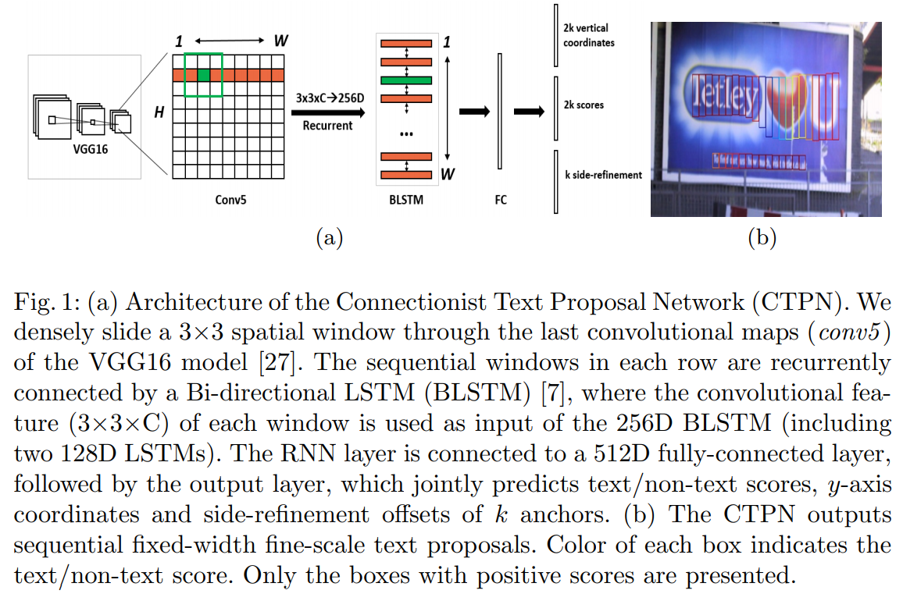

-----

| Title         | ML Tasks Image OCR CTPN                               |
| ------------- | ----------------------------------------------------- |
| Created @     | `2020-05-28T06:03:37Z`                                |
| Last Modify @ | `2022-12-24T13:02:06Z`                                |
| Labels        | \`\`                                                  |
| Edit @        | [here](https://github.com/junxnone/aiwiki/issues/197) |

-----

## Reference

  - [paper - 2016 - Detecting Text in Natural Image with Connectionist
    Text Proposal Network](https://arxiv.org/pdf/1609.03605)
  - [场景文字检测—CTPN原理与实现](https://zhuanlan.zhihu.com/p/34757009)
  - [Github code - Detecting Text in Natural Image with Connectionist
    Text Proposal Network ](https://github.com/tianzhi0549)

## Brief

## Arch

