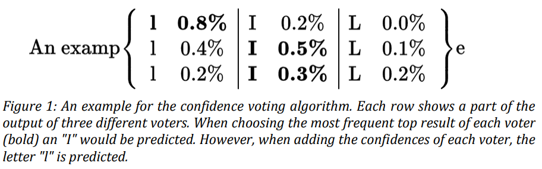

-----

| Title         | ML Tasks Image OCR Calamari                           |
| ------------- | ----------------------------------------------------- |
| Created @     | `2020-06-01T09:43:32Z`                                |
| Last Modify @ | `2022-12-24T13:01:38Z`                                |
| Labels        | \`\`                                                  |
| Edit @        | [here](https://github.com/junxnone/aiwiki/issues/201) |

-----

## Reference

  - [paper - 2018 Calamari A High-Performance Tensorflow-based Deep
    Learning Package for Optical Character
    Recognition](https://arxiv.org/ftp/arxiv/papers/1807/1807.02004.pdf)
  - [paper - 2018 - State of the Art Optical Character Recognition
    of 19th Century Fraktur Scripts using Open Source
    Engines](https://arxiv.org/ftp/arxiv/papers/1810/1810.03436.pdf)
  - [paper - 2017 - Improving OCR Accuracy on Early Printed Books by
    utilizing Cross Fold Training and
    Voting](https://arxiv.org/pdf/1711.09670.pdf)
  - [Github -
    Calamari-OCR/calamari](https://github.com/Calamari-OCR/calamari)
  - [字符识别引擎Calamari总结](https://blog.csdn.net/qq_14845119/article/details/81103207)
  - [ocreval](https://github.com/eddieantonio/ocreval)
  - [The ISRI analytic tools for OCR
    evaluation.pdf](https://github.com/junxnone/tech-io/files/4744176/The.ISRI.analytic.tools.for.OCR.evaluation.pdf)
  - [OCR-Workshop - CIS OCR
    Group](https://github.com/cisocrgroup/OCR-Workshop)
  - [Calamari-OCR
    Voting](https://github.com/Calamari-OCR/calamari/tree/master/calamari_ocr/ocr/voting)

## Brief

## Calamari-OCR Voting

  - [code analysis](/Calamari_Voting)
  - character level
  - textline
      - voting length

-----

  - Single - 取单个 Confidence 最大值 频率最大的
  - Adding - 取多个 Confidence 和最大的

  - 每行代表一个 `voter` 对字符 `x` predict 为 `[l/Ⅰ/L]` 的 `Confidence`
      - Single - 有两个 `voter` predict 为 `Ⅰ`
      - Adding - 三个 `voter` 相同字符的 Confidence (列)相加后 `l` Confidence 最大

### Model Cross Fold Training

  - data 分为 N 份
  - 1-N 每次选择一份作为 Testing，其他作为 Training，训练 N 个 Model

> N = 5

### Code Analysis

  - sequence\_voter
  - confidence\_voter\_default\_ctc
  - confidence\_voter\_fuzzy\_ctc

> fuzzy\_ctc 没用到 是什么？
