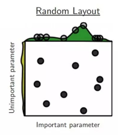

-----

| Title         | ML AutoML HPO RandomSearch                            |
| ------------- | ----------------------------------------------------- |
| Created @     | `2022-01-19T10:48:34Z`                                |
| Last Modify @ | `2022-12-25T04:52:52Z`                                |
| Labels        | `index`                                               |
| Edit @        | [here](https://github.com/junxnone/aiwiki/issues/204) |

-----

# Random Search

  - Random Search比Gird Search更有效
  - 实际操作的时候，一般也是先用Gird Search的方法，得到所有候选参数，然后每次从中随机选择进行训练。

