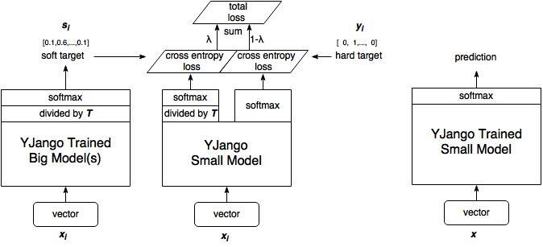

-----

| Title     | ML PostP KD s                                         |
| --------- | ----------------------------------------------------- |
| Created @ | `2021-04-25T05:42:37Z`                                |
| Updated @ | `2023-02-03T08:44:45Z`                                |
| Labels    | \`\`                                                  |
| Edit @    | [here](https://github.com/junxnone/aiwiki/issues/208) |

-----

# Distilling the Knowledge in a Neural Network

## Reference

  - 2015-03 Distilling the Knowledge in a Neural Network
    \[[Paper](https://arxiv.org/abs/1503.02531)\] \[[Code](codelink)\]

## Brief

  - `Soft Target` 比 `Hard Target` 包含更多的信息
      - 不同类之间的关系(相似性)

## Motivation

  - 背景/存在的问题
      - 粗暴地使用one-hot编码丢失了类间和类内关于相似性的额外信息
  - 做了什么尝试/分别有什么效果
      - 使用带温度的softmax函数
  - 应用领域

## 原理

  - Pipeline
      - Hard Traget ==\> Teacher Model
      - Teacher Model ==\> Soft Target(softmax output)
      - Soft Target ==\> Student Model

### 蒸馏温度 `T` 的影响

| 公式     |  |
| ------ | ------------------------------------------------------------ |
| T = 1  | 标准 Softmax 函数                                                |
| T \> 1 | T 越大概率趋向平缓                                                   |

| T/Input `x = [2,7,10]` | Output                                           |
| ---------------------- | ------------------------------------------------ |
| T=1                    | \[3.19450938e-04 4.74107229e-02 9.52269826e-01\] |
| T=2                    | \[0.01475347 0.17973411 0.80551241\]             |
| T=3                    | \[0.04834092 0.25594054 0.69571853\]             |
| T=4                    | \[0.08417934 0.29381477 0.62200588\]             |

|  |  |
| ------------------------------------------------------------ | ------------------------------------------------------------ |

## Evaluation

  - **Evaluation 1** 蒸馏网络可以达到和多模型预测类似的结果
  - **Evaluation 2** 蒸馏网络可以用更少的数据集在测试数据集上达到更好的效果

| Num | Evaluation                                                   |
| --- | ------------------------------------------------------------ |
| 1   |  |
| 2   |  |

## Tricks
