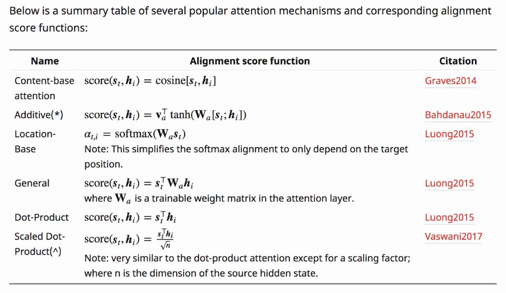

-----

| Title     | ML Attention                                          |
| --------- | ----------------------------------------------------- |
| Created @ | `2020-05-09T03:15:34Z`                                |
| Updated @ | `2025-02-07T08:30:44Z`                                |
| Labels    | \`\`                                                  |
| Edit @    | [here](https://github.com/junxnone/aiwiki/issues/210) |

-----

# Attention 注意力

  - [Attention-mechanisms -
    paperswithcode](https://paperswithcode.com/methods/category/attention-mechanisms)
  - 目的
      - 减少计算 - 可以减小处理高维输入数据的计算负担，通过结构化的选取输入的子集，降低数据维度
      - 优化算法 - 让任务处理系统更专注于找到输入数据中显著的与当前输出相关的有用信息

<!-- end list -->

``` markmap
---
title: 注意力机制
markmap:
  initialExpandLevel: 3
---

# 注意力机制

## 起源背景
- 1953 年科林・切里研究的听觉选择性注意（鸡尾酒会效应 ）
- 1958 年唐纳德・布罗德本特提出的注意力过滤模型
- 20 世纪 60 年代乔治・斯珀林对视觉选择性注意的研究
- ...
- 2014年 **[Bahdanau Attention](https://arxiv.org/abs/1409.0473)** 
- 2015  **[Luong Attention](https://arxiv.org/abs/1508.04025)**
- 2017《Attention Is All You Need》提出了 Transformer 架构
- ...

## 分类
- **按计算区域分类**
    - **Soft Attention（软注意力）**：
      - 对输入的所有信息进行全局计算，为每个位置都分配一个注意力权重，这些权重是连续且可微的 ，类似加权平均的方式，模型会综合考虑所有信息，只是对不同部分给予不同程度的关注。这种方式比较“理性”，能利用全局信息，但计算量较大，例如在机器翻译中，会综合考虑源语言句子的各个部分来生成目标语言。
    - **Hard Attention（硬注意力）**：
      - 只关注输入信息中的某一个或几个特定位置，即精准定位到单个或少量的key，其他位置的权重为0 。由于只关注部分信息，计算效率高，但这种选择是离散且不可导的，难以通过反向传播进行优化，训练难度较大，应用相对受限。
    - **Local Attention（局部注意力）**：
      - 结合了Soft Attention和Hard Attention的特点，是一种折中的方式。它不是关注全局，也不是只关注某一个点，而是关注输入信息中的一个局部区域，对局部区域内的信息计算注意力权重 。计算量和效果介于前两者之间，在处理长序列数据时，既能减少计算量，又能较好地捕捉局部依赖关系，比如在处理长文本时，可按段落或窗口划分局部区域进行注意力计算。
- **按所用信息分类**
    - **General Attention（一般注意力）**：
      - 通常利用外部信息来构建两段文本或者两个特征序列之间的关系，比如在机器翻译中，源语言句子和目标语言句子之间通过注意力机制建立联系，模型会参考源语言的整体信息来生成目标语言。
    - **Self - Attention（自注意力）**：
      - 只使用输入序列自身内部的信息，寻找输入原文内部不同位置之间的关系，每个位置的输出都综合考虑了序列中其他位置的信息，不需要额外的外部信息，能更好地捕捉序列中的长距离依赖关系，在Transformer架构中被广泛应用，使模型在处理文本时能更好地理解上下文。
- **按结构层次分类**
    - **单层Attention**：
      - 只在一个层次上对输入进行注意力计算，模型只考虑一次注意力分配，相对简单，计算量较小，但对复杂信息的处理能力有限。
    - **多层Attention**：
      - 通过堆叠多个注意力层，让模型能够从不同层次、不同粒度对输入信息进行处理，逐步提取更高级、更抽象的特征，从而增强模型对复杂数据的理解和表达能力，不过计算成本也会相应增加。
    - **多头Attention（Multi - Head Attention）**：
      - 多个注意力头并行工作，每个头使用不同的参数进行计算，相当于从不同的子空间、不同角度对输入进行关注，然后将多个头的结果进行拼接或融合，能更全面地捕捉输入数据中的各种关系和特征，提升模型的性能和表达能力 ，在Transformer架构中是关键组成部分。
 - **按模型结合方式分类**
    - **与CNN结合的Attention**：
      - 将注意力机制融入卷积神经网络（CNN）中，通过注意力机制来增强CNN对图像中关键区域的关注，提高特征提取的针对性和有效性，比如在图像分类任务中，帮助模型更聚焦于物体的关键部位，提升分类准确率。
    - **与LSTM结合的Attention**：
      - 与长短期记忆网络（LSTM）相结合，在处理序列数据时，注意力机制可以帮助LSTM更好地捕捉序列中的重要信息，解决长序列依赖问题，例如在文本情感分析中，突出与情感表达相关的关键语句。
    - **纯Attention计算模型**：
      - 如Transformer架构，完全基于注意力机制构建，摒弃了传统的循环或卷积结构，通过自注意力机制和多头注意力机制来处理序列数据，在自然语言处理和计算机视觉等领域取得了很好的效果 。
- **按相似度计算方式分类**
    - **点乘注意力（Dot - Product Attention）**：
      - 通过计算query向量和key向量的点积来衡量它们之间的相似度，得到注意力得分，计算简单高效，在很多注意力机制实现中被广泛使用。
    - **缩放点乘注意力（Scaled Dot - Product Attention）**：
      - 在点乘注意力的基础上，对计算得到的点积结果除以一个缩放因子（通常是维度的平方根），以防止点积结果过大导致softmax函数梯度消失，在Transformer中使用的就是缩放点乘注意力。
    - **加法注意力（Additive Attention）**：
      - 将query和key通过线性变换映射到一个新的空间，然后通过一个前馈神经网络（通常是单隐层）计算它们的和来得到注意力得分，这种方式计算复杂度相对较高，但在某些情况下能更好地捕捉复杂的关系。
    - **双线性注意力（Bilinear Attention）**：
      - 使用一个可学习的矩阵来计算query和key之间的相似度，即通过矩阵乘法将query和key进行关联，这种方式可以学习到query和key之间的非线性关系 。
    - **基于核函数的注意力（Kernel - based Attention）**：
      - 利用核函数（如高斯核等）来计算query和key之间的相似度，将低维空间的向量映射到高维空间，从而更好地捕捉数据中的复杂模式和关系 。 


```

## 分类

| Name          | Description                   |
| ------------- | ----------------------------- |
| Location-wise | Object Position               |
| Item-wise     | Seq2Seq / Vector/ Feature Map |

| Name           | Description                                                  |
| -------------- | ------------------------------------------------------------ |
| Soft Attention | `sequence` 中 取概率加权和                                          |
| Hard Attention | `sequence` 中 只有一个取 `1`, 其他取 `0` <br>不可导，不能反向传播<br> `@RL强化学习` |

| Name              | Description |
| ----------------- | ----------- |
| Self-attention    |             |
| Context-attention |             |

## 计算方式



## Reference

  - [paper - 2014 - Neural Machine Translation by Jointly Learning to
    Align and Translate](https://arxiv.org/abs/1409.0473)
  - [paper - 2015 - Effective Approaches to Attention-based Neural
    Machine Translation](https://arxiv.org/abs/1508.04025)
  - [Attention注意力机制介绍](https://www.cnblogs.com/hiyoung/p/9860561.html)
  - [论文阅读:
    图像分类中的注意力机制(attention)](https://blog.csdn.net/Wayne2019/article/details/78488142)
  - [Attention机制 -
    图像](https://blog.csdn.net/weixin_41923961/article/details/81516589?utm_source=copy)
  - [计算机视觉中的注意力机制](https://zhuanlan.zhihu.com/p/32928645)
  - [目前主流的attention方法都有哪些？](https://www.zhihu.com/question/68482809)
  - [模型汇总24 - 深度学习中Attention
    Mechanism详细介绍：原理、分类及应用](https://zhuanlan.zhihu.com/p/31547842)
  - [attention模型方法综述](https://zhuanlan.zhihu.com/p/37835894)
  - [Attention综述](https://zhuanlan.zhihu.com/p/62136754)
  - [BahdanauAttention与LuongAttention注意力机制简介](https://blog.csdn.net/u010960155/article/details/82853632)
  - [一文看懂 Bahdanau 和 Luong 两种 Attention
    机制的区别](https://zhuanlan.zhihu.com/p/129316415)
  - [Attention Model（mechanism） 的
    套路](https://blog.csdn.net/bvl10101111/article/details/78470716)
  - [Attention注意力机制的前世今身](https://blog.csdn.net/c9Yv2cf9I06K2A9E/article/details/107010733)
