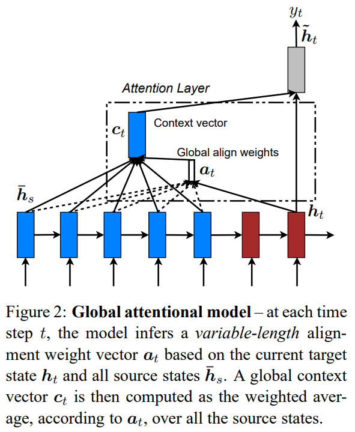
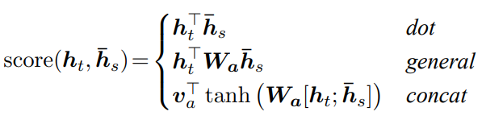
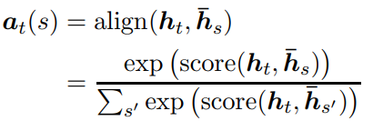
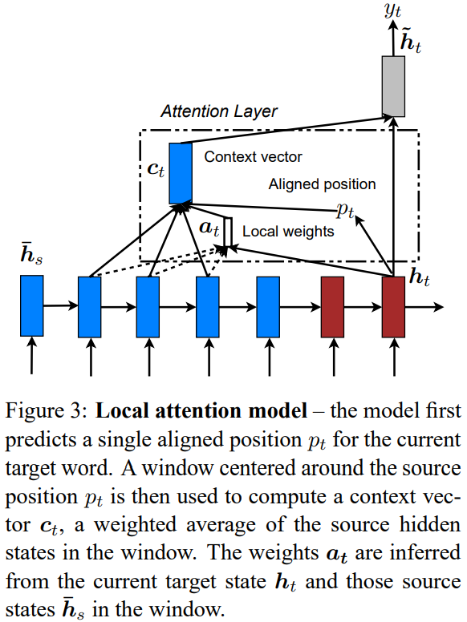
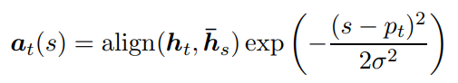
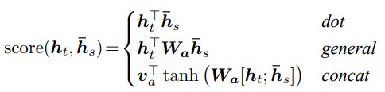
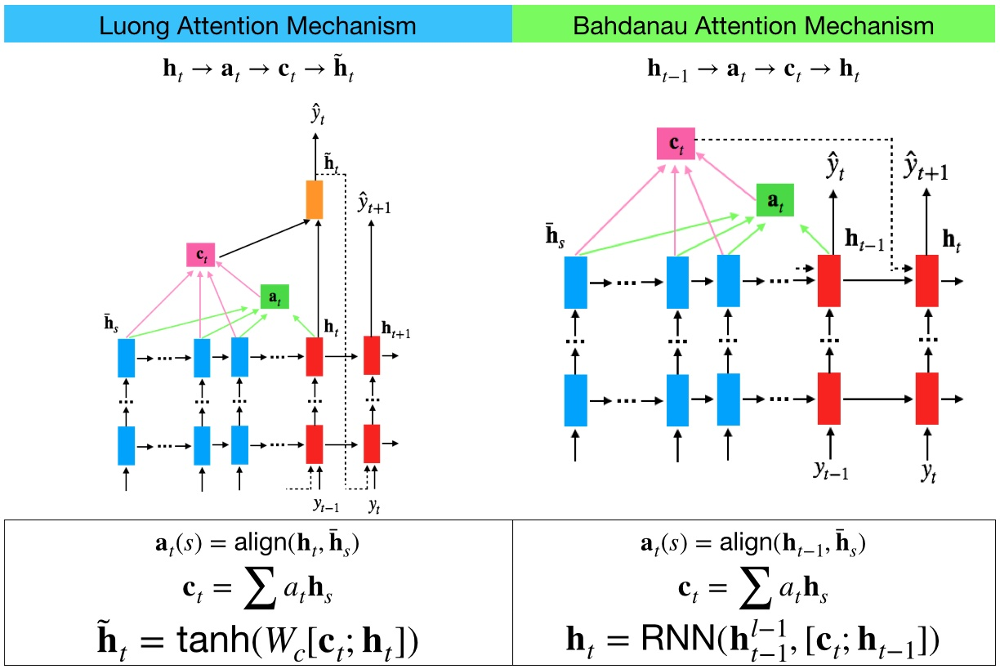

-----

| Title         | ML Attention Luong                                    |
| ------------- | ----------------------------------------------------- |
| Created @     | `2020-07-01T03:51:29Z`                                |
| Last Modify @ | `2022-12-24T13:30:58Z`                                |
| Labels        | \`\`                                                  |
| Edit @        | [here](https://github.com/junxnone/aiwiki/issues/211) |

-----

# Luong Attention

## Reference

  - [paper - 2014 - Neural Machine Translation by Jointly Learning to
    Align and Translate](https://arxiv.org/abs/1409.0473)
  - [paper - 2015 - Effective Approaches to Attention-based Neural
    Machine Translation](https://arxiv.org/abs/1508.04025)
  - [BahdanauAttention与LuongAttention注意力机制简介](https://blog.csdn.net/u010960155/article/details/82853632)
  - [一文看懂 Bahdanau 和 Luong 两种 Attention
    机制的区别](https://zhuanlan.zhihu.com/p/129316415)

## Brief

| Name             | Pipeline                                                     | 公式                                                                                                                             |
| ---------------- | ------------------------------------------------------------ | ------------------------------------------------------------------------------------------------------------------------------ |
| Global Attention |  |     |
| Local Attention  |  |                                                                    |

## Alignment Model

## Bahdanau Attention vs Luong Attention

| Name                                                        | Description     | score                                                        |
| ----------------------------------------------------------- | --------------- | ------------------------------------------------------------ |
| Bahdanau Attention [paper](https://arxiv.org/abs/1409.0473) | h(t-1) -\> a(t) |                                                              |
| Luong Attention [paper](https://arxiv.org/abs/1508.04025)   | h(t) -\> a(t)   |  |

