-----

| Title         | ML Attention S                                        |
| ------------- | ----------------------------------------------------- |
| Created @     | `2020-05-09T02:39:37Z`                                |
| Last Modify @ | `2022-12-25T05:03:58Z`                                |
| Labels        | `index`                                               |
| Edit @        | [here](https://github.com/junxnone/aiwiki/issues/212) |

-----

# Attention Is All You Need

## Reference

  - [paper - 2017 - Attention Is All You
    Need](https://arxiv.org/pdf/1706.03762.pdf)
  - [The Illustrated
    Transformer](http://jalammar.github.io/illustrated-transformer/)
  - [解析Transformer模型](https://mp.weixin.qq.com/s/kjLFPyTb7pal7oorX3ejkw)
  - [position\_encoding](https://github.com/tensorflow/examples/blob/master/community/en/position_encoding.ipynb)
  - [transformer jupyter notebook -
    tensorflow](https://github.com/tensorflow/docs/blob/master/site/en/tutorials/text/transformer.ipynb)

## Brief

  - 堆叠 Encoders-Decoders
      - do not share weight
  - 并行计算
  - Attention
      - Self-attention
      - Multi-Head Attention
  - Feed Forward
  - [Position Encoding](/Position_Encoding)

## Arch

| 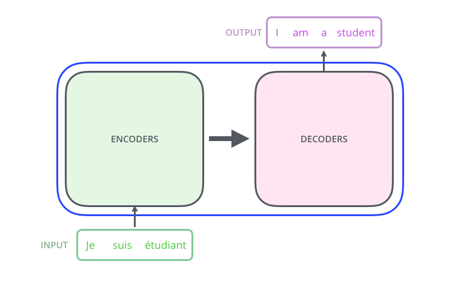 | 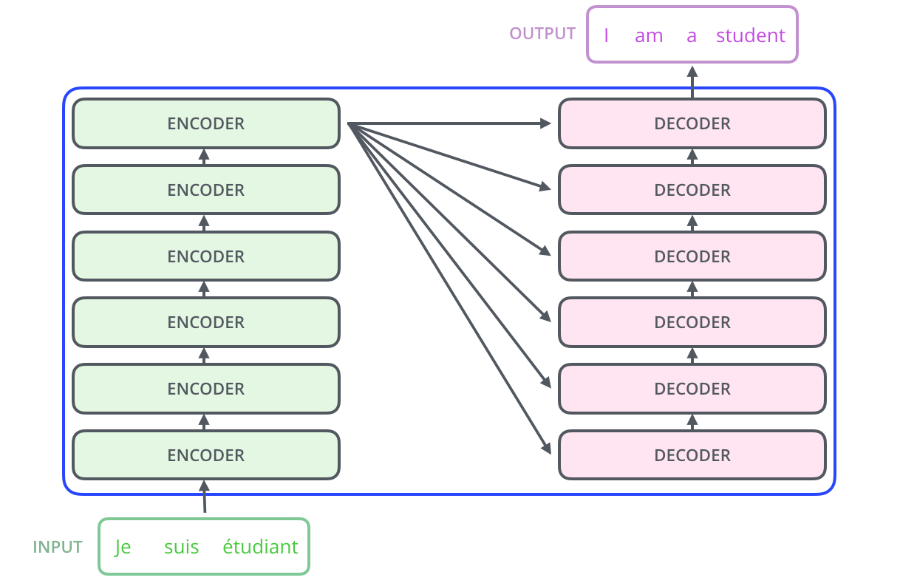 |
| ------------------------------------------------------------ | ------------------------------------------------------------ |
| \~                                                           | 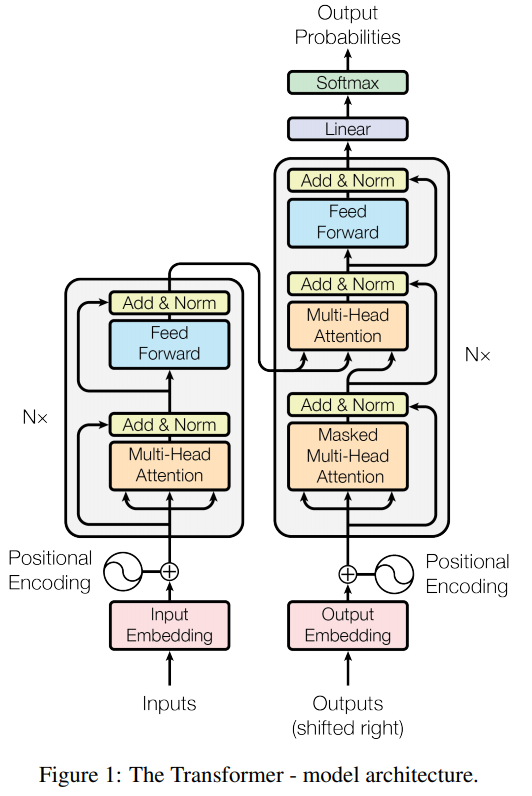 |

### Encoder

| Encoder                                                      | Self-Attention                                               |
| ------------------------------------------------------------ | ------------------------------------------------------------ |
| 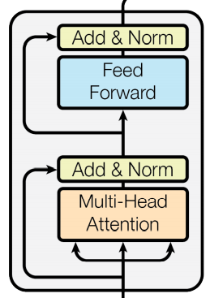 | 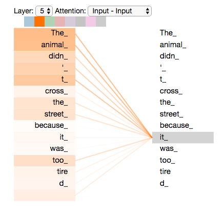 |

#### Self-Attention

| Steps | Description                                      | Figure                                                       |
| ----- | ------------------------------------------------ | ------------------------------------------------------------ |
| 1     | Queries & Keys & Values                          | 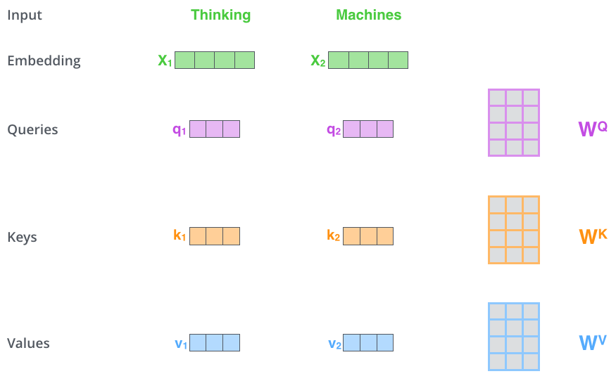 |
| 2     | Calculate score                                  | 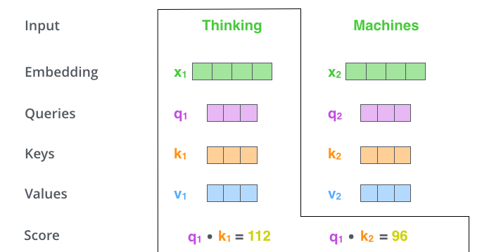 |
| 3     | Divide by 8 `= 64^1/2`  more stable gradients | 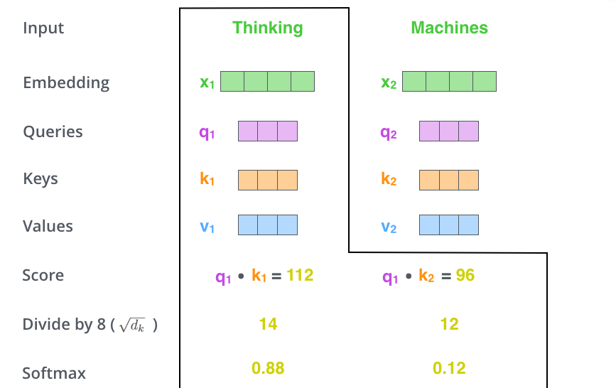 |
| 4     | Softmax                                          | 同上                                                           |
| 5     | `Score x Values`                                 | 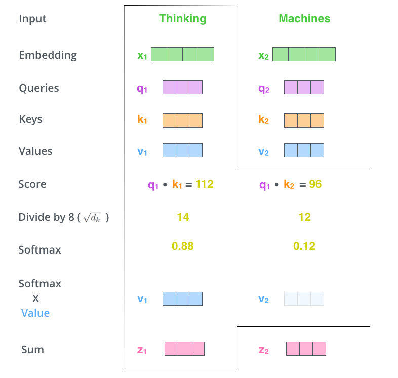 |
| 6     | \+ weighted value vectors                        | 同上                                                           |

**Matrix Calculation**
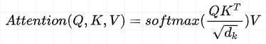

| 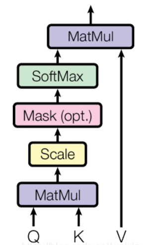 | 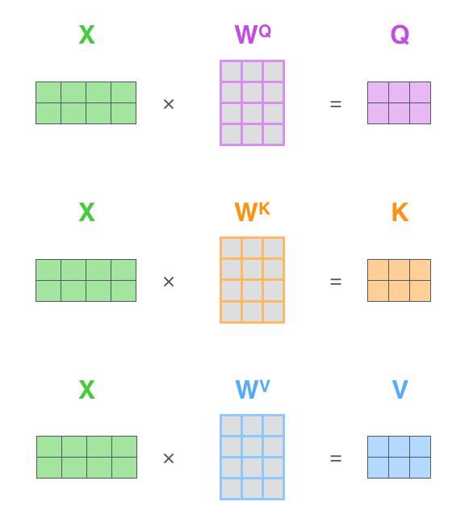 | 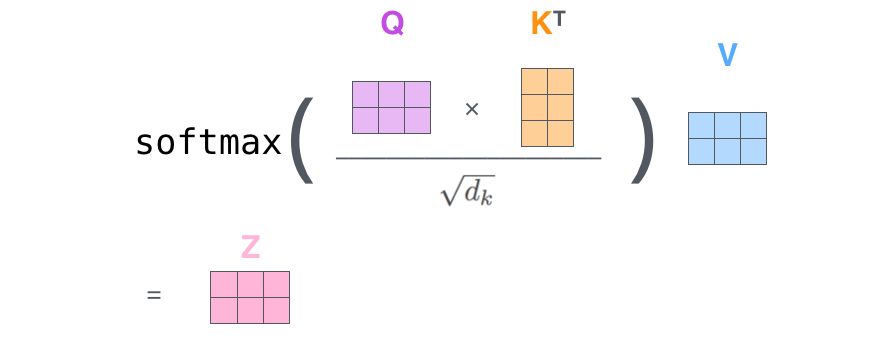 |
| ------------------------------------------------------------ | ------------------------------------------------------------ | ------------------------------------------------------------ |

#### MultiHead-Attention

  - N 个 `Self-Attention` 合并

| 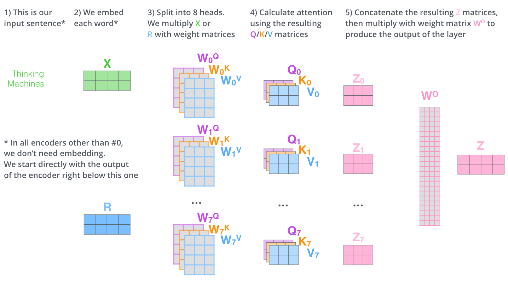 | 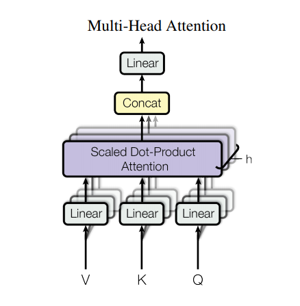 |
| ------------------------------------------------------------ | ------------------------------------------------------------ |

**Head 1 vs 2 vs 8**

| Head-1                                                       | Head-2                                                       | Head-8                                                       |
| ------------------------------------------------------------ | ------------------------------------------------------------ | ------------------------------------------------------------ |
|  | 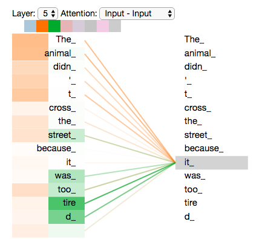 | 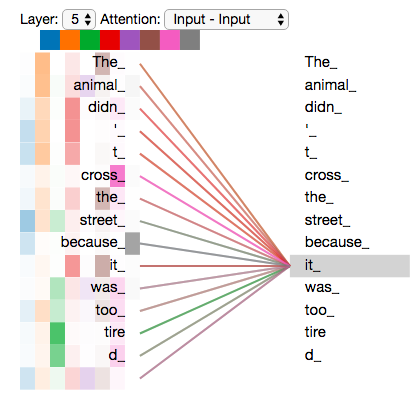 |

**Matrix Calculation**

| Calculate Q/K/V | 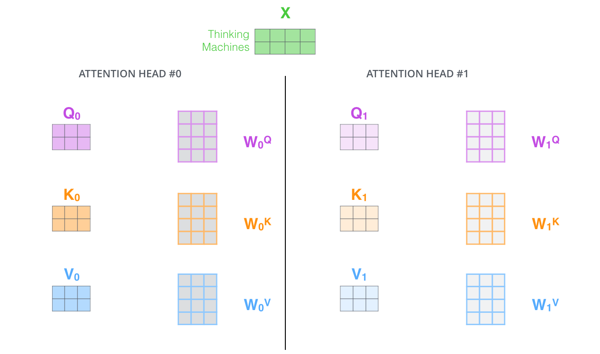 |
| --------------- | ------------------------------------------------------------ |
| Calculate Z     | 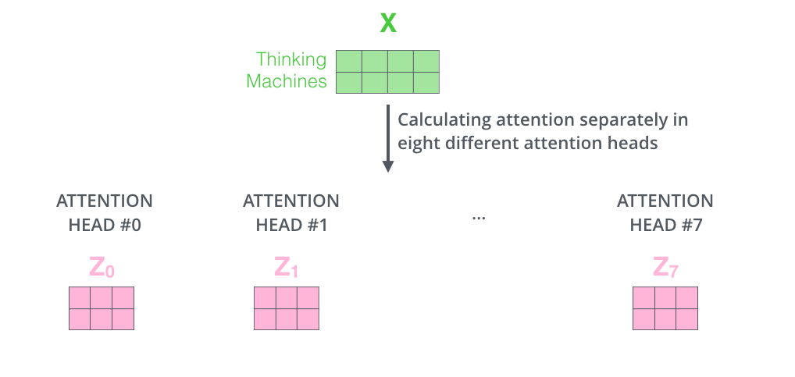 |
| Concatenate Z   | 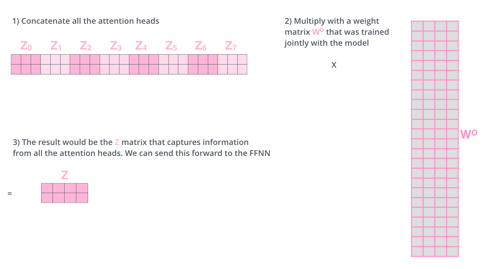 |

#### Feed Forward

  - `Dense` --\> `  RELU ` --\> `Dense`

#### Positional Encoding

  - 使用正弦函数和余弦函数来构造每个位置的值
  - 可以在测试阶段接受长度超过训练集实例的情况
    

## 存在问题

  - 复杂度 O(n^2), 需要计算量大
