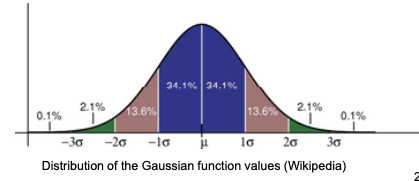

-----

| Title         | Math GaussianFilter                                   |
| ------------- | ----------------------------------------------------- |
| Created @     | `2020-09-17T09:05:39Z`                                |
| Last Modify @ | `2022-12-27T03:37:55Z`                                |
| Labels        | \`\`                                                  |
| Edit @        | [here](https://github.com/junxnone/aiwiki/issues/215) |

-----

# Gaussian Filter 高斯滤波器

## Reference

  - [理解高斯滤波(Gaussian Filter)](https://www.jianshu.com/p/961490ea0458)
  - [高斯函数](https://www.cnblogs.com/pacino12134/p/11372555.html)

## Brief

  - 用高斯函数对image做卷积计算

| Name | 公式                                                           | 图例                                                           |
| ---- | ------------------------------------------------------------ | ------------------------------------------------------------ |
| 1-D  |  |  |
| 2-D  |                                                              |  |

