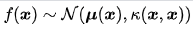

-----

| Title         | Math GaussianProcess                                  |
| ------------- | ----------------------------------------------------- |
| Created @     | `2020-07-15T01:58:53Z`                                |
| Last Modify @ | `2022-12-27T03:39:01Z`                                |
| Labels        | \`\`                                                  |
| Edit @        | [here](https://github.com/junxnone/aiwiki/issues/216) |

-----

# Gaussian Process 高斯过程

## Reference

  - [1.7. 高斯过程 -
    apachecn/sklearn-doc-zh](https://github.com/apachecn/sklearn-doc-zh/blob/master/docs/master/8.md)
  - [The Gaussian Processes Web Site](http://www.gaussianprocess.org/)
  - [透彻理解高斯过程Gaussian Process
    (GP)](https://blog.csdn.net/paulfeng20171114/article/details/80276061)
  - [什么是Gaussian process? ——
    说说高斯过程与高斯分布的关系](https://zhuanlan.zhihu.com/p/27555501)
  - [Gaussian
    processes](http://krasserm.github.io/2018/03/19/gaussian-processes/)
  - [GPR =
    sklearn](https://scikit-learn.org/stable/modules/generated/sklearn.gaussian_process.GaussianProcessRegressor.html)
  - [Gaussian Processes for Machine
    Learning](http://www.gaussianprocess.org/gpml/chapters/RW.pdf)
  - [GPR -
    高斯过程回归可视化](https://www.jgoertler.com/visual-exploration-gaussian-processes/)
  - [核函数(Kernel
    function)](https://blog.csdn.net/mengjizhiyou/article/details/103437423)

## 基础知识

  - \[随机过程\]
  - [高斯分布](/Gaussian_distribution)

## Brief

  - 高斯过程 : 符合高斯分布的变量的集合
      - **随机向量** -
        
      - **f(x) 服从多元高斯分布** -
        
      - 
      - **均值函数** -
        
      - **核函数(Kernel Function)/协方差函数(Covariance Function)** -
        
  - GP 是特殊**随机过程**: **随机变量都是服从高斯分布的**
  - GP 即 服从高斯分布的量的变化

## 核函数/协方差函数

  - 用于生成协方差矩阵, 衡量任意两个点之间的`距离`
  - 平稳核函数 - RBF/周期
  - 非平稳核函数 - 线性

| 核函数                                              | 公式                                                           |
| ------------------------------------------------ | ------------------------------------------------------------ |
| 常量 Constant                                   |                                                              |
| 线性 Linear                                     |                                                              |
| 高斯噪声 Gaussian noise                           |                                                              |
| 平方指数 SE-Squared exponential                   |                                                              |
| Ornstein–Uhlenbeck                               |                                                              |
| 马顿核 Matérn                                    |                                                              |
| 周期 Periodic                                   |                                                              |
| 有理二次方 Rational quadratic                      |                                                              |
| 高斯核/径向基函数 Gaussian/RBF(Radial Basis Function) |  |

> **随机过程** - 确定性过程研究一个量随时间确定的变化，而随机过程描述的是一个量随时间可能的变化

## GPR - Gaussian Process Regression

  - **Regression Analysis/回归分析** - 分析变量之间的相关性/相关方向/强度，建立模型预测变量
  - 用高斯过程作为先验, 学习函数

**Pipeline**

| Steps | Description                                                                                                                                    |
| ----- | ---------------------------------------------------------------------------------------------------------------------------------------------- |
| 1     | 高斯过程先验 : 认为给定x，y服从分布 ， |
| 2     | 训练数据 (x, y) 学习映射函数 f                                                                                                                           |
| 3     |                                                                                                                                                |

## GPC - Gaussian Process Classification

## Tips

  - 随机过程描述的是一个量随时间可能的变化
