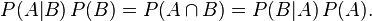
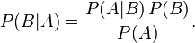

-----

| Title         | Math BT                                               |
| ------------- | ----------------------------------------------------- |
| Created @     | `2020-07-14T06:08:46Z`                                |
| Last Modify @ | `2022-12-25T04:36:08Z`                                |
| Labels        | \`\`                                                  |
| Edit @        | [here](https://github.com/junxnone/aiwiki/issues/217) |

-----

# 贝叶斯定理

## Reference

  - [一个例子搞清楚（先验分布/后验分布/似然估计）](https://blog.csdn.net/qq_23947237/article/details/78265026)
  - [贝叶斯定理](https://blog.csdn.net/qq_41529692/article/details/84105315)

## Brief

  - **先验/Prior** - 原因 ==\> 结果, 事情发生之前, 根据以往经验和分析得到的
      - **先验概率/Prior Probability**
          - `e.g. 抛硬币正面向上的概率`
      - **先验分布/Prior Distribution** - 已知结果, 估计分布
  - **后验/Posterior** - 结果 ==\> 原因 事情发生, 在相关结果或者背景给定并纳入考虑之后的
      - **后验概率/Posterior Probability**
      - **后验分布/Posterior Distribution** - 已知历史, 估计分布
  - \*\*似然估计/Likelihood \*\* - 已知原因, 估计分布

| Name               | Details                                                      |
| ------------------ | ------------------------------------------------------------ |
| 贝叶斯推断              |  |
| x                  | 结果 - 观察得到的数据                                                 |
| θ                  | 原因 - 决定数据分布的参数                                               |
| 后验/Posterior       |  |
| 先验/Prior           |  |
| 似然估计/Likelihood    |  |
| 证据因子/边缘似然/Evidence |  |

## 贝叶斯公式

| 推理                                                           |
| ------------------------------------------------------------ |
|  |
|  |

  - P(A|B) - 事件 B 发生后 A 发生的概率 - 条件概率 - 后验概率
  - P(B|A) - 事件 A 发生后 B 发生的概率
  - P(A) / P(B) - A/B 发生的概率 - 先验概率
