-----

| Title         | ML AutoML HPO BO SMBO                                 |
| ------------- | ----------------------------------------------------- |
| Created @     | `2021-03-22T06:58:23Z`                                |
| Last Modify @ | `2022-12-24T13:20:42Z`                                |
| Labels        | \`\`                                                  |
| Edit @        | [here](https://github.com/junxnone/aiwiki/issues/218) |

-----

## Reference

  - [Sequential Model-Based Optimization for General Algorithm
    Configuration](https://www.cs.ubc.ca/~hutter/papers/10-TR-SMAC.pdf)
  - [Demo - Maximize Target Function
    ](https://nbviewer.jupyter.org/github/junxnone/examples/blob/master/BayesianOptimization/BayesianOptimization_visualization.ipynb)

## Brief

  - SMBO - Sequential model-based optimization
  - 类似于 Active Learning
  - 顺序模型
  - 只能处理数值参数
  - 无早停机制

## Pipeline

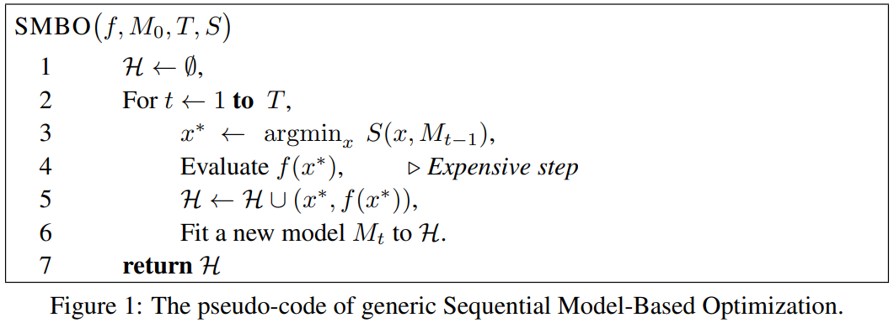

| Name  | Description                                        |
| ----- | -------------------------------------------------- |
| θ     | 输入(参数集合)                                           |
| f     | loss function(HPO 中为 metrics\[loss/accuracy/iou\]) |
| M0/Mt | 分布模型 - GP                                          |
| S     | 查询函数 EI/PI/GP-UCB/etc.                             |
| H     | Obvervation History/历史观测值                          |

| Steps | Description                |
| ----- | -------------------------- |
| 1     | θ 参数集合加入到 History中         |
| 2     | 迭代 T 次                     |
| 3     | 通过 S 选出点 x\*               |
| 4     | 使用 x\* 训练 f                |
| 5     | 把获取的经验 (x\*, f(x\*)) 加入到 H |
| 6     | 更新 M                       |
| 7     | 获取最终 H (经验list)            |

## Examples

| Target Function          | 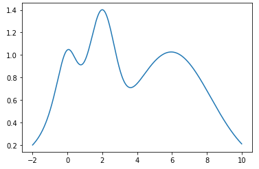 |
| ------------------------ | ------------------------------------------------------------ |
| Random 2 points + 1 step | 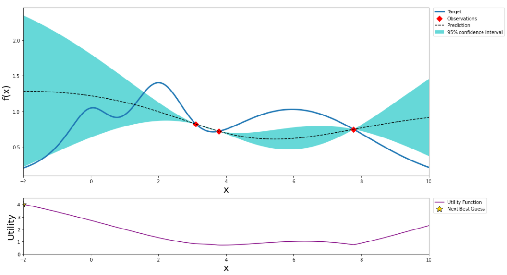 |
| Next Step                | 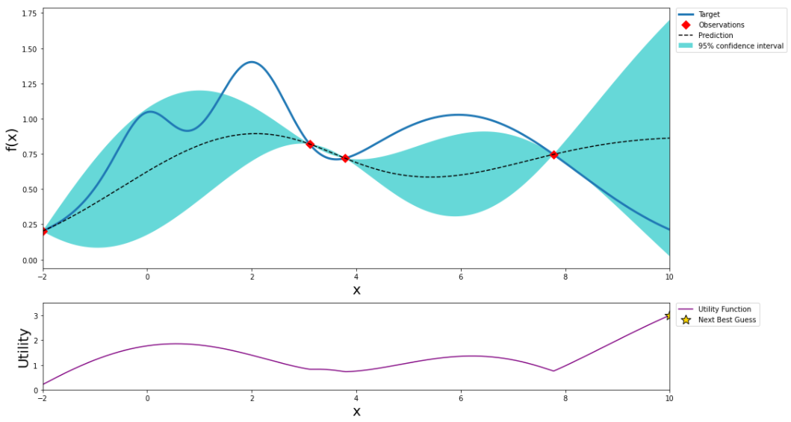 |
| Next Step                | 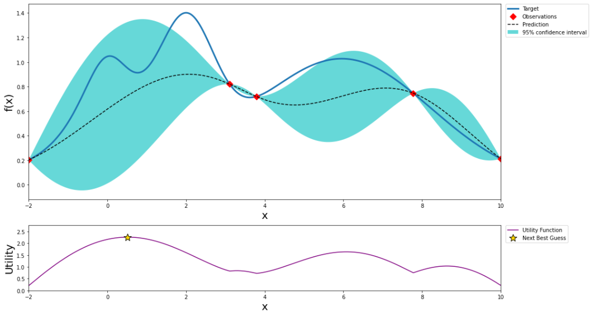 |
| Next Step                | 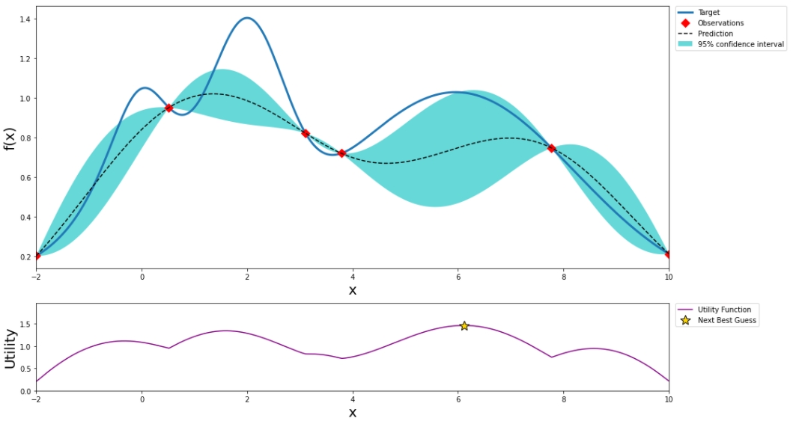 |
| Next Step                | 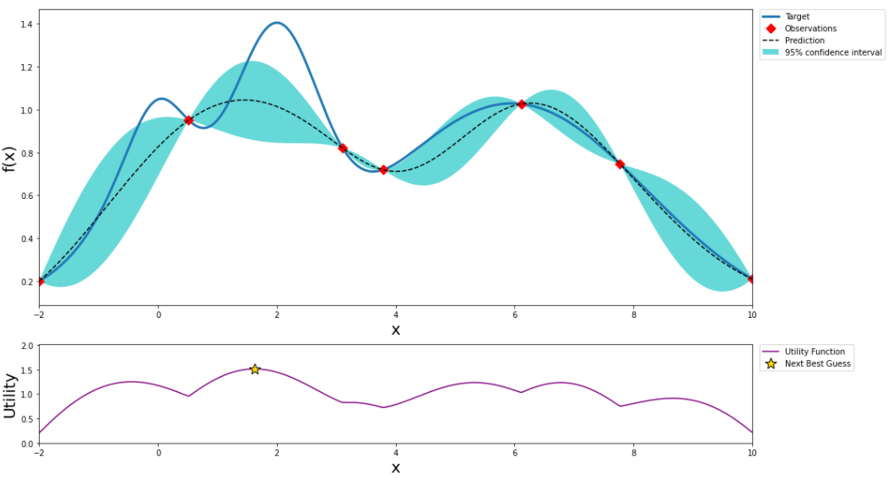 |
| Next Step                | 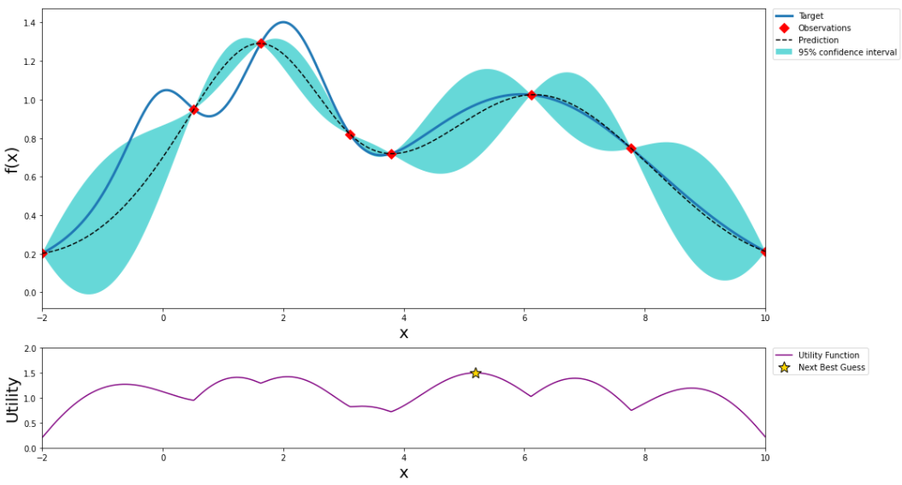 |
| Next Step                | 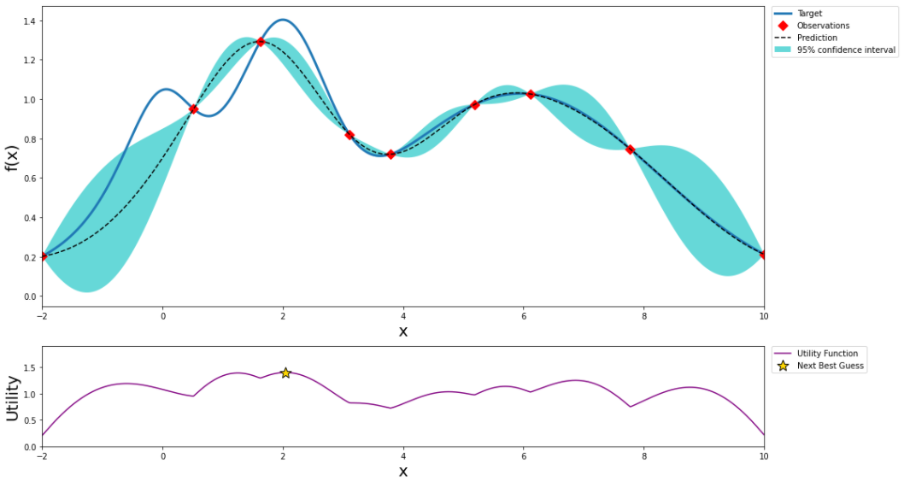 |
| Next Step                | 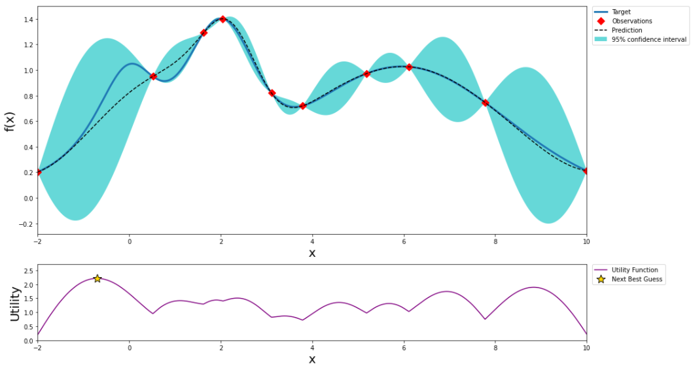 |
| Next Step                | 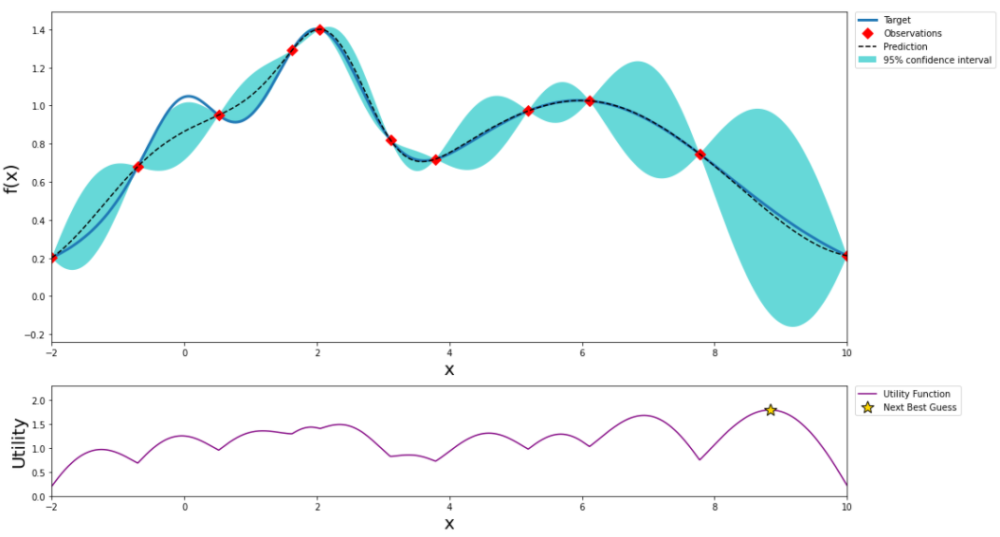 |
