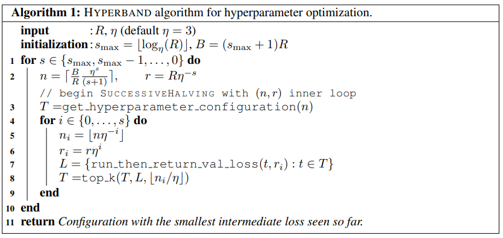

-----

| Title         | ML AutoML HPO BO BOHB                                 |
| ------------- | ----------------------------------------------------- |
| Created @     | `2021-03-30T07:40:05Z`                                |
| Last Modify @ | `2022-12-24T13:20:57Z`                                |
| Labels        | \`\`                                                  |
| Edit @        | [here](https://github.com/junxnone/aiwiki/issues/219) |

-----

## Reference

  - 2015 **SHA - Successive Halving Algorithm** [Non-stochastic Best Arm
    Identification and Hyperparameter
    Optimization](https://arxiv.org/abs/1502.07943)
  - 2018 **ASHA** [A System for Massively Parallel Hyperparameter
    Tuning](https://arxiv.org/abs/1810.05934)
  - 2016 [Hyperband: Bandit-Based Configuration Evaluation for
    Hyperparameter
    Optimization](https://openreview.net/pdf?id=ry18Ww5ee)
  - 2018 **BOHB** [BOHB: Robust and Efficient Hyperparameter
    Optimization at Scale](https://arxiv.org/abs/1807.01774)
  - 2018 [Practical Hyperparameter Optimization for Deep
    Learning](https://openreview.net/pdf?id=HJMudFkDf)
  - [VEGA-HPO](https://www.noahlab.com.hk/opensource/vega/page/doc.html?path=algorithms/hpo)
  - [Massively Parallel Hyperparameter
    Optimization](https://blog.ml.cmu.edu/2018/12/12/massively-parallel-hyperparameter-optimization/)
  - [NNI -
    BOHBO](https://github.com/microsoft/nni/blob/master/docs/zh_CN/Tuner/BohbAdvisor.rst)

## Brief

  - BOHB - Bayesian Optimization and Hyperband
  - 属于 动态资源分配/Dynamic Resource Allocation

## Hyperband

  - Hyperband 是对 Successive Halving 的扩展

| Successive Halving                                           | Hyperband                                                    |
| ------------------------------------------------------------ | ------------------------------------------------------------ |
|  |  |

| SHA  |   |
| ---- | :----------------------------------------------------------- |
| ASHA |  |

## BOHB Algorithm

