-----

| Title         | ML AutoML HPO BO TPE                                  |
| ------------- | ----------------------------------------------------- |
| Created @     | `2021-03-30T07:38:38Z`                                |
| Last Modify @ | `2022-12-24T13:21:15Z`                                |
| Labels        | \`\`                                                  |
| Edit @        | [here](https://github.com/junxnone/aiwiki/issues/221) |

-----

## Reference

  - 2011 [Algorithms for Hyper-Parameter
    Optimization](https://papers.nips.cc/paper/2011/file/86e8f7ab32cfd12577bc2619bc635690-Paper.pdf)
  - 2013 [Making a Science of Model Search: Hyperparameter Optimization
    in Hundreds of Dimensions for Vision
    Architectures](http://proceedings.mlr.press/v28/bergstra13.pdf)
  - [Tree-structured Parzen
    Estimator（TPE）](https://zhuanlan.zhihu.com/p/55606172)
  - [Towards automating machine learning: benchmarking tools for
    hyperparameter tuning, Thorben
    Jensen](https://github.com/ThorbenJensen/pydata2018berlin-hyperparameter-optimization/blob/master/pydata_hyperparameter.pdf)

## Brief

  - TPE - Tree-structured Parzen Estimator
      - 参数空间是树形的, 存在依赖关系 - `Configuration spaces are tree-structured`
  - 可异步并行
  - TPE 是根据 p(x|y) 和 p(y) 进行建模

| Steps          | 推导                                                           |
| -------------- | ------------------------------------------------------------ |
| 选取 loss 阈值 y\* | 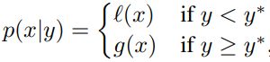 |
| \*\*           | 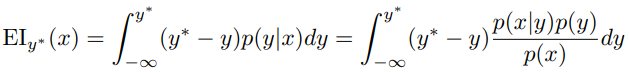 |
| 构造参数           | 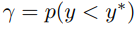 |
| 构造函数           | 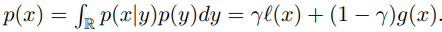 |
| \*\*           | 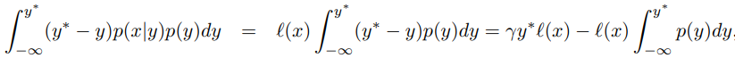 |
| \*\*           | 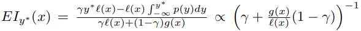 |

| y\*                                                          | l(x) & g(x)                                                  |
| ------------------------------------------------------------ | ------------------------------------------------------------ |
| 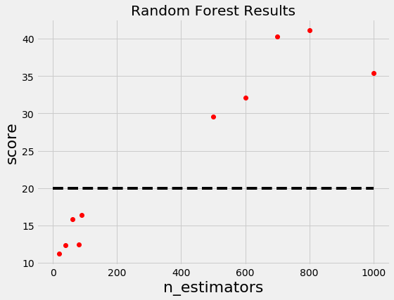 | 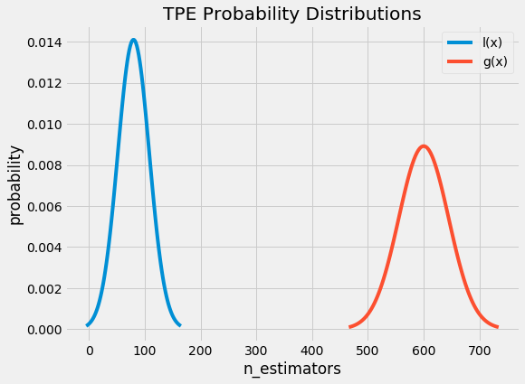 |

## Pipeline

| Steps                                       | Diagram                                                      |
| ------------------------------------------- | ------------------------------------------------------------ |
| 1 测试超参数 选择Loss 阈值  - Best  - Worse | 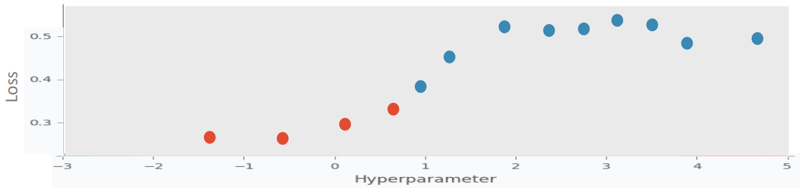 |
| 2 构建Best/Worse分布 对候选参数求分布值               | 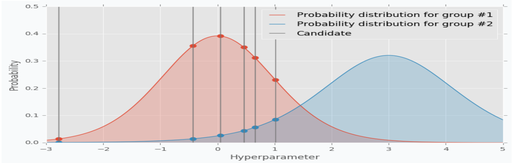 |
| 3 `EI = p(good)/p(bad)`                     | 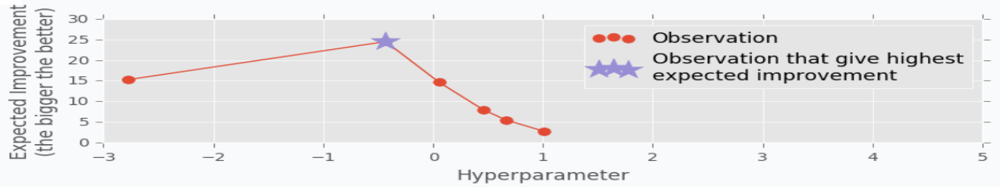 |
