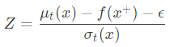

-----

| Title         | ML AutoML HPO BO AF                                   |
| ------------- | ----------------------------------------------------- |
| Created @     | `2021-03-30T02:28:50Z`                                |
| Last Modify @ | `2022-12-26T14:51:34Z`                                |
| Labels        | `index`                                               |
| Edit @        | [here](https://github.com/junxnone/aiwiki/issues/222) |

-----

# Acquisition Function

## Reference

  - [Exploring Bayesian
    Optimization](https://distill.pub/2020/bayesian-optimization/)
  - [ucb/ei/pi code
    实现](https://github.com/fmfn/BayesianOptimization/blob/91441fe4002fb6ebdb4aa5e33826230d8df560d0/bayes_opt/util.py#L74)
  - [BayesianOptimization\_visualization\_af\_ucb\_ei\_poi.ipynb](https://github.com/junxnone/examples/blob/master/BayesianOptimization/BayesianOptimization_visualization_af_ucb_ei_poi.ipynb)
  - [exploitation\_vs\_exploration.ipynb](https://github.com/fmfn/BayesianOptimization/blob/91441fe4002fb6ebdb4aa5e33826230d8df560d0/examples/exploitation_vs_exploration.ipynb)

## Brief

  - Acquisition Function - 采集函数
  - AF 查询点分为两个方向 `Exploritation/开发` + `Exploration/探索`
  - 常用的 AF
      - UCB
      - EI
      - PI

## Exploritation/开发 & Exploration/探索

| 模式               | 选择策略    | 查询点分布            |
| ---------------- | ------- | ---------------- |
| Exploritation/开发 | 选择高均值的点 | 开发查询点集中在 `peaks` |
| Exploration/探索   | 选择高方差的点 | 探索查询点更分散         |

| Exploritation/开发                                             | Exploration/探索                                               |
| ------------------------------------------------------------ | ------------------------------------------------------------ |
|  |  |

| Acquisition Functions |  |
| --------------------- | ------------------------------------------------------------ |

## 不同的 AF

| Acquisition Functions                            | Description           |
| ------------------------------------------------ | --------------------- |
| PI - Probability of Improvement                  | 选择具有最大可能性提高的点作为下一个查询点 |
| EI - Expected Improvement                        | 选择具有最大期望提高的点作为下一个查询点  |
| Thompson Sampling                                |                       |
| UCB - Upper Confidence Bound                     |                       |
| GP-UCB - Gaussian Process Upper Confidence Bound |                       |
| Entropy Search                                   |                       |
| Predictive Entropy Search                        |                       |

## PI - Probability of Improvement


  - f(x) 为 x 的目标函数
  - f(x+) 为目前最优 x 的目标函数值
  - ϵ 是一个比较小的正数 用来平衡 exploration/exploitation
  - μ (x) 是目标函数均值
  - σ (x) 是目标函数方差

<!-- end list -->

``` 
    def _poi(x, gp, y_max, xi):
        mean, std = gp.predict(x, return_std=True)
        z = (mean - y_max - xi)/std
        return norm.cdf(z)
```

| ϵ     | PI Iterations                                               |
| ----- | ----------------------------------------------------------- |
| 0.075 |  |
| 0.3   |    |
| 3     |     |

## EI - Expected Improvement




``` 
    def _ei(x, gp, y_max, xi):
        mean, std = gp.predict(x, return_std=True)
        a = (mean - y_max - xi)
        z = a / std
        return a * norm.cdf(z) + std * norm.pdf(z)
```

| ϵ    | EI Iterations                                                |
| ---- | ------------------------------------------------------------ |
| 0.01 |  |
| 0.3  |   |
| 3    |    |

## Thompson Sampling


## Random


## UCB - Upper Confidence Bound


``` 
    def _ucb(x, gp, kappa):
        mean, std = gp.predict(x, return_std=True)
        return mean + kappa * std
```

## EI-PI (PI + λ \* EI)

## GP-UCB - Gaussian Process Upper Confidence Bound


## AF 比较


