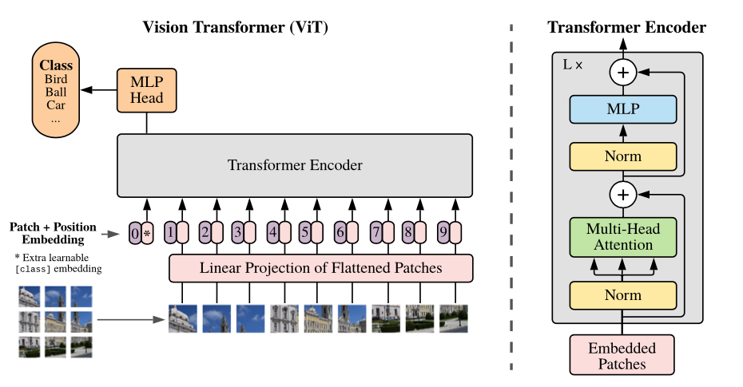

-----

| Title         | ML Transformer ViT                                    |
| ------------- | ----------------------------------------------------- |
| Created @     | `2021-02-01T03:01:44Z`                                |
| Last Modify @ | `2022-12-24T15:49:14Z`                                |
| Labels        | \`\`                                                  |
| Edit @        | [here](https://github.com/junxnone/aiwiki/issues/223) |

-----

## Reference

  - 10/2020 [An Image is Worth 16x16 Words: Transformers for Image
    Recognition at Scale](https://arxiv.org/abs/2010.11929)
  - [vision\_transformer -
    google-research](https://github.com/google-research/vision_transformer)
  - [vit-pytorch](https://github.com/lucidrains/vit-pytorch)
  - [用Transformer完全替代CNN](https://zhuanlan.zhihu.com/p/266311690)
  - [Vision Transformer -
    GiantPandaCV](https://zhuanlan.zhihu.com/p/317756159)

## Brief

  - `Image Patch` X `N`
  - `Linear Projection`
  - `Position Embedding`
  - `Learnable Embedding`

## Pipeline

  - Split - `Image(H x W x C)` -\> `Patches(N x P x P x C)`
  - Linear Projection - `Patches` x `W`-\> `Vectors(NxD)`
  - Position Embedding `(N + 1) x D`
  - `Position Embedding` + `Patch Embedding`
  - Transformer Encoder
  - MLP Head

|  |  |
| ------------------------------------------------------------ | ---------------------------------------------------------- |

## Training

  - SGD `momentum=0.9`
  - Development Set for Gird **Search Learning Rate**
      - Pets/Flowers = 10% / Cifar = 2% / ImageNet = 1%
  - Cosine Learning rate decay
  - Batch size = 512
