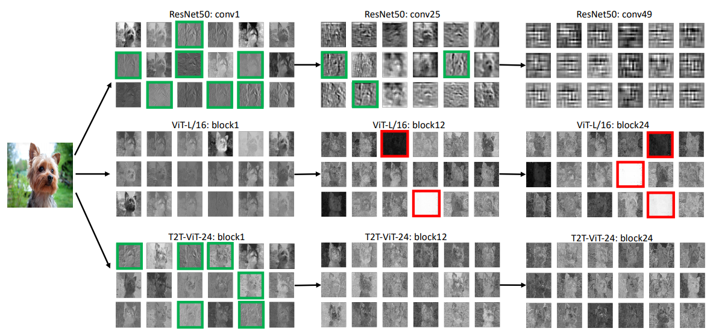
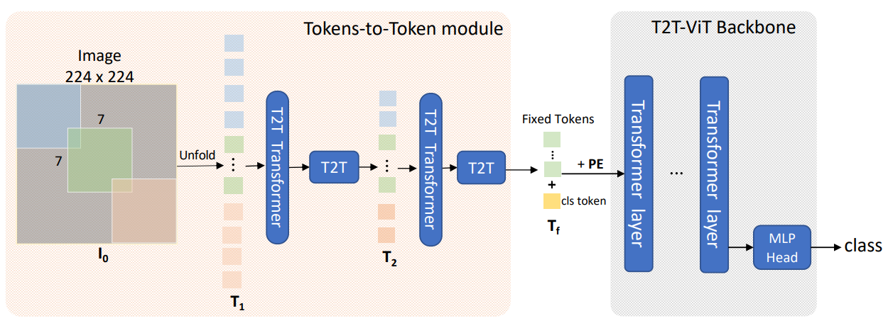
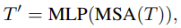
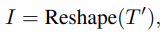
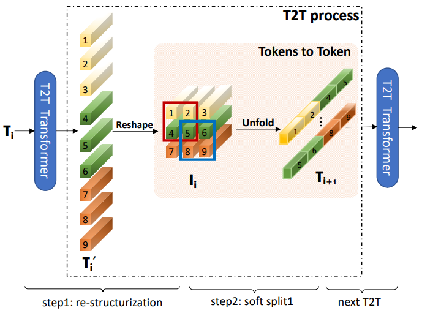

-----

| Title     | ML Transformer T2TViT                                 |
| --------- | ----------------------------------------------------- |
| Created @ | `2021-02-18T05:34:31Z`                                |
| Updated @ | `2023-02-03T07:59:13Z`                                |
| Labels    | \`\`                                                  |
| Edit @    | [here](https://github.com/junxnone/aiwiki/issues/227) |

-----

## Reference

  - 2021-01 **\[T2T-ViT\]** Tokens-to-Token ViT: Training Vision
    Transformers from Scratch on ImageNet
    \[[Paper](https://arxiv.org/abs/2101.11986)\]
    \[[Code](https://github.com/yitu-opensource/T2T-ViT)\]
  - [vit\_pytorch.t2t -
    lucidrains](https://github.com/lucidrains/vit-pytorch/blob/main/vit_pytorch/t2t.py)

## Brief

  - ViT 不能学习到局部特征
      - 比 CNN 需要更多data
  - ViT backbone 冗余的 Attention 设计导致 feature 不够丰富，训练困难

**如下图, 分析了 `ResNet & ViT & T2T-ViT` 学习到的 `low level feature`**

  - 绿色为 `low level structure features` (edges/lines)
  - 红色为 ViT 中 学习到的 `invalid feature` (zeros/large value)

## Arch

  - Image Soft Split to Tokens
  - T2T Module x 2
  - Concat Class Token + Position Embedding
  - T2T-ViT

## Tokens to Token / T2T Module

| Steps              | Formula                                                                                                                        | Description |
| ------------------ | :----------------------------------------------------------------------------------------------------------------------------- | ----------- |
| Re-structurization |     |             |
| Soft Split         | Image : (kernel, strde, padding) = (7, 4, 2)  Tokens : (kernel, strde, padding) = (3, 2, 1)                                 |             |

## Backbone

  - 测试了几种模式最终得出结论 : **Deep-Narrow 模式提升性能更多(减少冗余与计算复杂度，提升特征丰富性)**
      - Dense Connection 类似于DenseNet
      - **Deep-narrow** vs shallow-wide结构 类似于Wide-ResNet一文的讨论
      - Channel Attention 类似SENet
      - More Split Head 类似ResNeXt
      - Ghost操作 类似GhostNet
