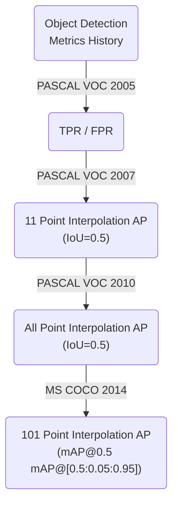
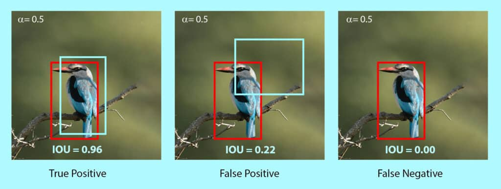

-----

| Title     | ML Metrics Detection                                  |
| --------- | ----------------------------------------------------- |
| Created @ | `2019-01-16T03:46:56Z`                                |
| Updated @ | `2023-02-20T08:13:11Z`                                |
| Labels    | \`\`                                                  |
| Edit @    | [here](https://github.com/junxnone/aiwiki/issues/230) |

-----

## Metrics

  - IoU - `Intersection over Union`
  - TP/FP/FN
  - Precision
  - Recall
  - TPR - `True Positive Rate`
  - FPR - `False Positive Rate`
  - Accuracy
  - AP - `Average Precision`
  - mAP - `Mean Average Precison`
  - AR - `Average Recall`
  - GIoU
  - Image/Object Level

## Object Detection Metrics History

## TP/FP/FN

  - 根据 IoU 的值确定 TP/FP/FN

## Precision

$\\huge Precision = \\frac{TP}{TP+FP} = \\frac{TP}{\\text{Total
Predictions}}$

  - 识别为正例的样例中，识别正确的比例

## Recall

$\\huge Recall = \\frac{TP}{TP+FN} = \\frac{TP}{\\text{Total Ground
Truths}}$

  - 样本所有正例中，识别正确的比例
  - 也被称作`查全率`， 即检测出来的样本/实际应该检测出的样本。

## Tools

  - [Open-Source Visual Interface for Object Detection
    Metrics](https://github.com/rafaelpadilla/review_object_detection_metrics)

## Reference

  - [目标检测评价指标(mAP)](https://www.cnblogs.com/makefile/p/metrics-mAP.html)
  - [SSD算法评估：AP，
    mAP和Precision-Recall曲线](https://blog.csdn.net/xunan003/article/details/79252162)
  - [目标检测的评价指标](https://blog.csdn.net/Liven_Zhu/article/details/81316627)
  - [一文了解目标检测/图像分割/coco数据集检测评价标准 -
    Oldpan](https://oldpan.me/archives/understand-coco-metric)
  - [深度学习中IU、IoU(Intersection over Union)的概念理解以及python程序实现 -
    Oldpan](https://oldpan.me/archives/iu-iou-intersection-over-union-python)
  - [MS COCO数据集目标检测评估（Detection
    Evaluation）](https://blog.csdn.net/u014734886/article/details/78831884)
  - [目标检测中Recall、Precision和IOU](https://blog.csdn.net/yongjiankuang/article/details/78336860)
  - [目标检测性能评价指标（mAP、IOU）](https://blog.csdn.net/qq_40196164/article/details/86301784)
  - [\[Algorithm\]
    机器学习算法常用指标总结](https://www.cnblogs.com/maybe2030/p/5375175.html)
  - [F1 score](https://en.wikipedia.org/wiki/F1_score)
  - [目标检测（Object Detection）中性能衡量指标mean Average
    Precision（mAP）的含义与计算](https://blog.csdn.net/asasasaababab/article/details/79994920)
  - [详解对象检测网络性能评价指标mAP计算](https://cloud.tencent.com/developer/article/1370654)
  - [Iou 的计算](https://www.cnblogs.com/q735613050/p/10618558.html)
  - [目标检测 anchor
    理解笔记](https://www.cnblogs.com/zfcode/p/mu-biao-jian-ce-anchor-li-jie-bi-ji.html)
  - [【mAP】关于目标检测mAP的一些理解](https://blog.csdn.net/u014636245/article/details/89236073)
  - [Omni-benchmarking Object
    Detection](https://towardsdatascience.com/omni-benchmarking-object-detection-b390cc4114cd)
  - [mAP (mean Average Precision) for Object
    Detection](https://medium.com/@jonathan_hui/map-mean-average-precision-for-object-detection-45c121a31173)
  - [The PASCAL Visual Object Classes (VOC)
    Challenge](http://homepages.inf.ed.ac.uk/ckiw/postscript/ijcv_voc09.pdf)
  - [Metrics for object
    detection](https://github.com/rafaelpadilla/Object-Detection-Metrics)
  - [An Introduction to Evaluation Metrics for Object
    Detection](https://blog.zenggyu.com/en/post/2018-12-16/an-introduction-to-evaluation-metrics-for-object-detection/)
  - [Mean Average Precision (mAP) in Object
    Detection](https://learnopencv.com/mean-average-precision-map-object-detection-model-evaluation-metric)
