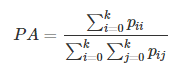
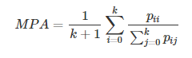
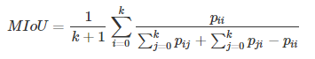

-----

| Title         | ML Metrics Segmentation                               |
| ------------- | ----------------------------------------------------- |
| Created @     | `2020-03-03T02:31:43Z`                                |
| Last Modify @ | `2022-12-24T12:33:24Z`                                |
| Labels        | \`\`                                                  |
| Edit @        | [here](https://github.com/junxnone/aiwiki/issues/231) |

-----

## Reference

  - [图像语义分割准确率度量方法总结](https://zhuanlan.zhihu.com/p/38236530)
  - [Evaluating image segmentation models. - Jeremy
    Jordan](https://www.jeremyjordan.me/evaluating-image-segmentation-models/)

## Brief

| Name                  | MIoU | Pixel Accuracy | FWIoU | Precision | Recall | PQ | SQ | RQ |
| --------------------- | ---- | -------------- | ----- | --------- | ------ | -- | -- | -- |
| Semantic Segmentation | √    | √              | √     | √         | √      |    |    |    |
| Instance Segmentation | √    | √              | √     | √         | √      |    |    |    |
| Panoptic Segmentation | √    |                |       |           |        | √  | √  | √  |

## Accuracy

| Accuracy                              | Formula                                                      |
| ------------------------------------- | ------------------------------------------------------------ |
| PA Pixel Accuracy 像素准确率         |  |
| MPA Mean Pixel Accuracy 平均像素准确率 |  |

  - `pij` 表示本属于类 `i` 但被预测为类 `j` 的像素数量

## IoU

  - IoU - `Intersection over Union`
  - MIoU - `Mean IoU`
      - 基于类进行计算 IOU , 将每一类的 IOU计算之后累加, 再进行平均
  - FWIoU - `Frequency Weighted IoU`
      - 根据每个类出现的频率设置权重

| IoU   | Formula                                                                                                                        |
| ----- | ------------------------------------------------------------------------------------------------------------------------------ |
| MIoU  |                                                                    |
| FWIoU |  |

## PQ - SQ - RQ
