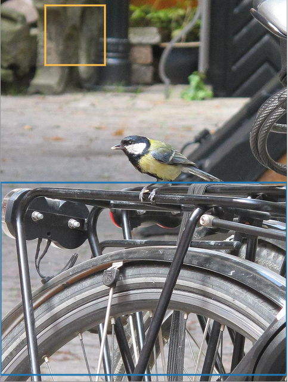
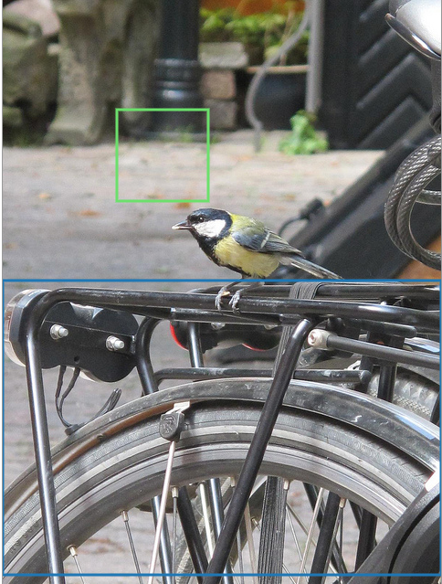
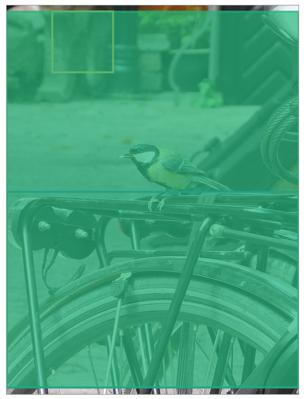
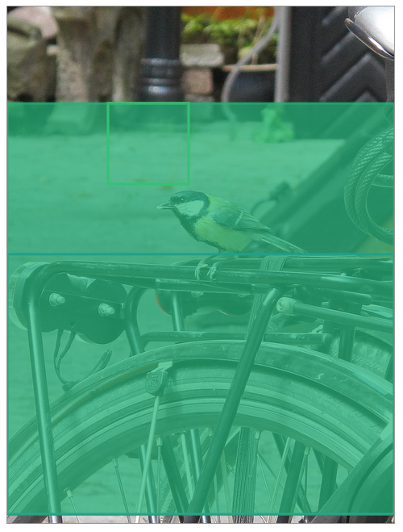
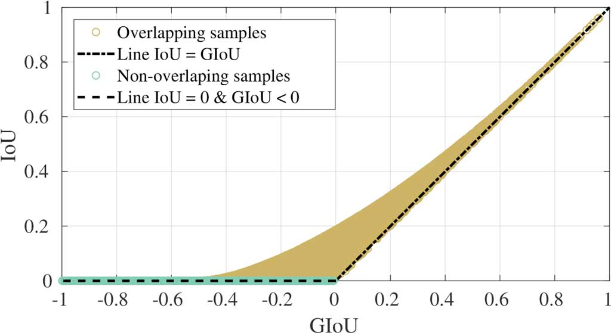
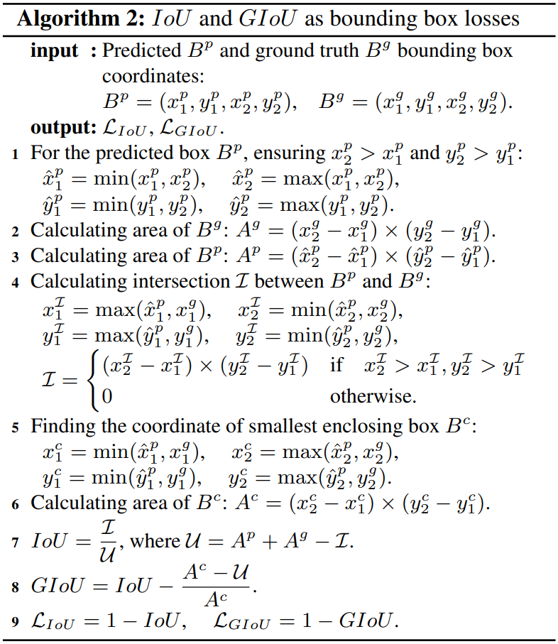

-----

| Title         | ML Metrics Detection GIoU                             |
| ------------- | ----------------------------------------------------- |
| Created @     | `2019-12-10T07:47:50Z`                                |
| Last Modify @ | `2022-12-24T12:34:15Z`                                |
| Labels        | \`\`                                                  |
| Edit @        | [here](https://github.com/junxnone/aiwiki/issues/232) |

-----

## Reference

  - [Github repo](https://github.com/generalized-iou)
  - [官网](https://giou.stanford.edu/)
  - [paper - Generalized Intersection over Union: A Metric and A Loss
    for Bounding Box Regression](https://giou.stanford.edu/GIoU.pdf)

## Brief

  - GIoU - `Generalized Intersection over Union`

## IOU - Jaccard Index

  - 目标检测中用来衡量 Predict 结果和 GT 的距离

-----

问题 - Q?

  - IoU 无法优化无重叠的 BBox

> 如下图中 2 和 1 的 IOU 都是 0， 但是理论认为 2 比 1 应该有更好的值
> 
> > 蓝绿色为 GT, 另一个 BBox 为 Predict

| 1                                                            | 2                                                            |
| ------------------------------------------------------------ | ------------------------------------------------------------ |
|  |  |

## GIOU

-----

区域 `C`

  - 包含 A 和 B 的最小 BBox

| 1                                                            | 2                                                            |
| ------------------------------------------------------------ | ------------------------------------------------------------ |
|  |  |

-----

  - GIOU 取值范围 `[-1, 1]`

## GIOU Loss

-----

计算方法

  - GIOU Loss 范围为 \[0, 2\]

