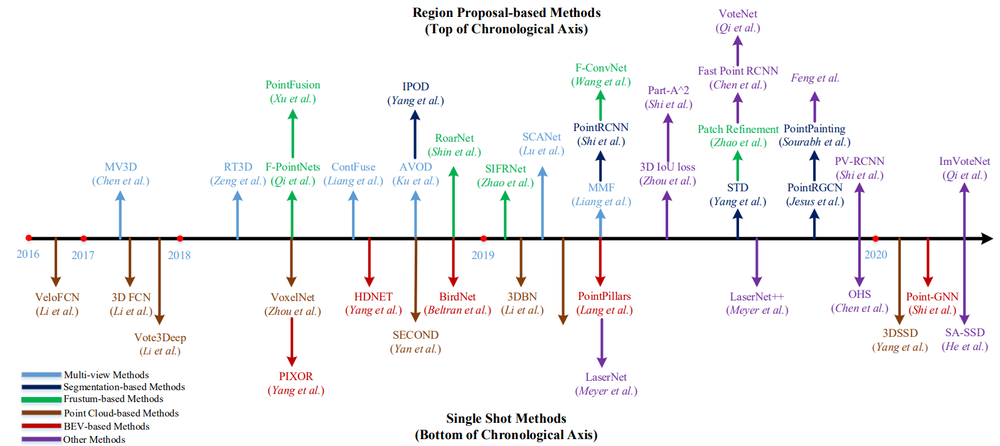

-----

| Title         | 3D DL                                                 |
| ------------- | ----------------------------------------------------- |
| Created @     | `2021-08-30T05:52:23Z`                                |
| Last Modify @ | `2022-12-25T03:48:34Z`                                |
| Labels        | \`\`                                                  |
| Edit @        | [here](https://github.com/junxnone/aiwiki/issues/233) |

-----

## Reference

  - Deep Learning for 3D Point Clouds: A
    Survey\[[Paper](https://arxiv.org/pdf/1912.12033.pdf)\]
    \[[Code](https://github.com/QingyongHu/SoTA-Point-Cloud)\]

## Brief

  - Tasks
      - Shape Classification
      - Object Detection & Tracking
      - Segmentation

## Overview

## History

### Classification

### Detection

### Semantic Segmentation

### Instance Segmentation

## Evaluation

## Tricks
