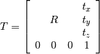
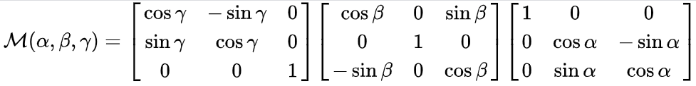
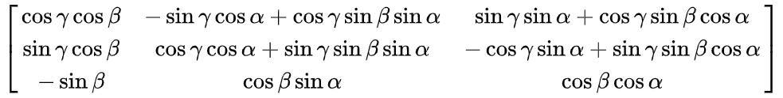

-----

| Title         | 3D Cloud RM                                           |
| ------------- | ----------------------------------------------------- |
| Created @     | `2021-05-11T03:41:25Z`                                |
| Last Modify @ | `2022-12-25T04:52:33Z`                                |
| Labels        | `index`                                               |
| Edit @        | [here](https://github.com/junxnone/aiwiki/issues/234) |

-----

# Rotation Matrix 旋转矩阵

## Reference

  - [旋转矩阵](https://zh.wikipedia.org/wiki/%E6%97%8B%E8%BD%AC%E7%9F%A9%E9%98%B5)
  - [三维空间刚体运动](https://blog.csdn.net/weixin_40883049/article/details/86567439)
  - [三维空间变换](https://blog.csdn.net/weixin_43827285/article/details/106073977)
  - [D欧式变换理论与实践](https://blog.csdn.net/u011178262/article/details/84479181)
  - [PCL点云库——旋转平移矩阵](https://blog.csdn.net/fei_12138/article/details/110280338)

## Brief

  - **pcl 旋转平移矩阵 (4x4)**



``` 
            ↓-------> This column is the translation
    | 1 0 0 x |  \
    | 0 1 0 y |   }-> The identity 3x3 matrix (no rotation) on the left
    | 0 0 1 z |  /
    | 0 0 0 1 |    -> We do not use this line (and it has to stay 0,0,0,1)
```

  - 最后一行的 `|0 0 0 1|` 不使用

### 平移

  - (x, y z) 为平移参数
  - 每个值表示沿对应轴的平移量

### 旋转

  - 沿 x/y/z 轴旋转参数由矩阵中左上角的 `3x3` 子矩阵表示
  - α/β/γ 分别表示沿 x/y/z 轴旋转的角度

|  |
| ------------------------------------------------------------ |
|  |
