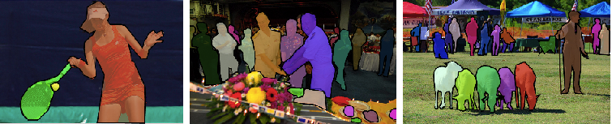
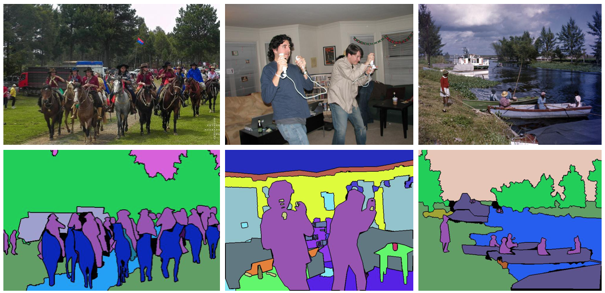
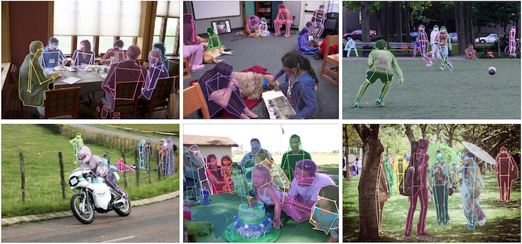
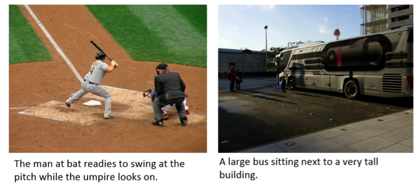

-----

| Title         | Datasets Image2D COCO                                 |
| ------------- | ----------------------------------------------------- |
| Created @     | `2018-12-19T13:02:50Z`                                |
| Last Modify @ | `2022-12-24T16:11:36Z`                                |
| Labels        | \`\`                                                  |
| Edit @        | [here](https://github.com/junxnone/aiwiki/issues/247) |

-----

## Reference

  - [COCO dataset](http://cocodataset.org/#home)
  - [Microsoft COCO: Common Objects in Context
    - 2015](https://arxiv.org/pdf/1405.0312.pdf)
  - [COCO Annotation Data format](http://cocodataset.org/#format-data)
  - [SSD Object Detection with
    opencv/training\_toolbox\_tensorflow](https://github.com/opencv/training_toolbox_tensorflow/blob/develop/training_toolbox/ssd_detector/README.md)
  - [Detection Evaluation &
    Metrics](http://cocodataset.org/#detection-eval)
  - [MS COCO数据集目标检测评估（Detection
    Evaluation）](https://blog.csdn.net/u014734886/article/details/78831884)
  - [COCO数据库](https://blog.csdn.net/happyhorizion/article/details/77894205)
  - [labelme2coco.py -
    labelme](https://github.com/wkentaro/labelme/blob/master/examples/instance_segmentation/labelme2coco.py)

## Brief

Microsoft COCO Datasets

  - Detection
  - Keypoints
  - Segmentation
      - Stuff - Semantic Segmentation
      - Panoptic
  - Captions

## Download

    curl https://sdk.cloud.google.com | bash
    mkdir train2017
    gsutil -m rsync gs://images.cocodataset.org/train2017 train2017
    wget http://images.cocodataset.org/annotations/annotations_trainval2017.zip

## COCO Challenges Tasks

| Tasks                 | Labels                                                       |
| --------------------- | ------------------------------------------------------------ |
| Object Detection      |  |
| Stuff Segmentation    |  |
| Panoptic Segmentation |  |
| Keypoint Detection    |  |
| Captioning            |  |

## Annotation format

### Detection

    annotation{
           "id" : int,
           "image_id" : int,
           "category_id" : int,
           "segmentation" : RLE or [polygon],
           "area" : float,
           "bbox" : [x,y,width,height],
           "iscrowd" : 0 or 1,
    }
    
    categories[{
           "id" : int,
           "name" : str, 
           "supercategory" : str,
    }]

> iscrowd=1 是否是 semantic segmentation
