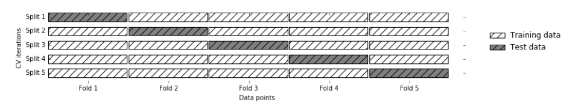
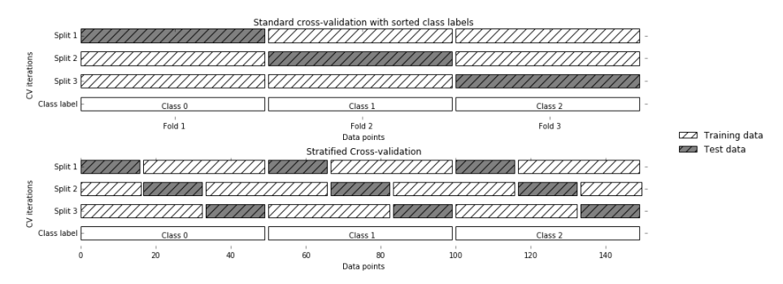
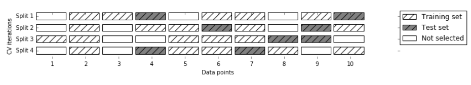

-----

| Title     | ML Metrics CrossValidation                            |
| --------- | ----------------------------------------------------- |
| Created @ | `2020-06-11T05:02:59Z`                                |
| Updated @ | `2023-02-02T09:03:00Z`                                |
| Labels    | \`\`                                                  |
| Edit @    | [here](https://github.com/junxnone/aiwiki/issues/249) |

-----

# CrossValidation 交叉验证

## Reference

  - [几种交叉验证（cross
    validation）方式的比较](https://www.cnblogs.com/ysugyl/p/8707887.html)
  - [sklearn - cross
    validation](https://scikit-learn.org/stable/modules/cross_validation.html#cross-validation)
  - [sklearn.model\_selection
    介绍](https://www.cnblogs.com/XD00/p/12290528.html)

## Brief

  - Cross Validation - `交叉验证`

| Num | Cross Validation    | Description |
| --- | ------------------- | ----------- |
| 1   | K Fold              |             |
| 2   | Repeated K-Fold     |             |
| 3   | Leave One Out (LOO) |             |
| 4   | Leave P Out (LPO)   |             |
| 5   | Shuffle & Split     |             |
| 6   | Stratified `@12345` |             |
| 7   | Group `@12345`      |             |

## Standard Cross Validation - K Fold Cross Validation

  - data split `K` part
  - `x` ∈ \[1, K\] part 作为 Test, 剩下的 `K-1` part 作为 training

> K = 5 / 10

## Stratified k-fold cross validation - 分层交叉验证

  - 每一折中都保持着原始数据中各个类别的比例关系

## Leave-one-out Cross-validation 留一法

  - 样本容量为n，则k=n，进行n折交叉验证，每次留下一个样本进行验证
  - 主要针对小样本数据

## Shuffle-split cross-validation

