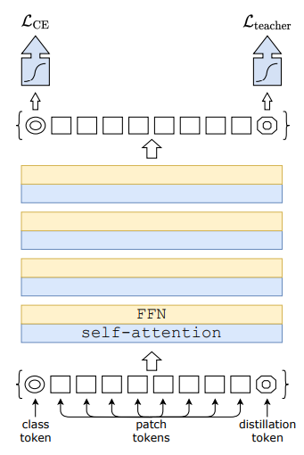
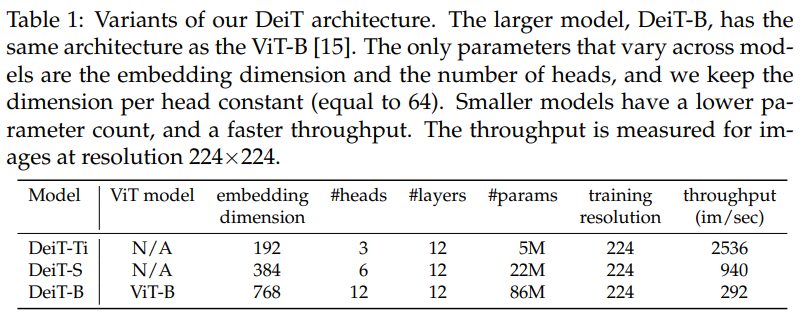
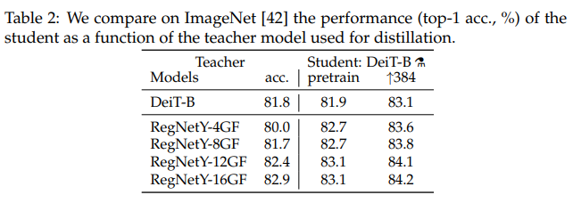
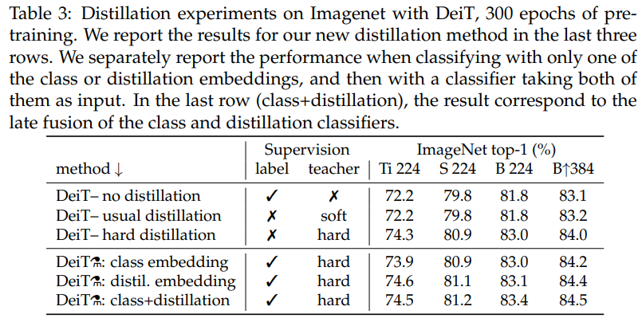
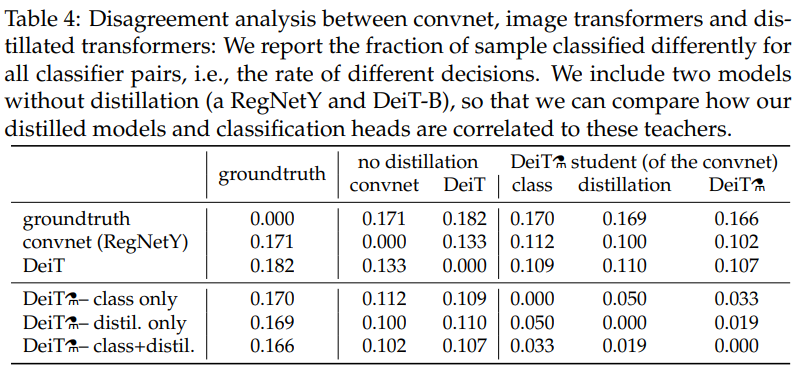
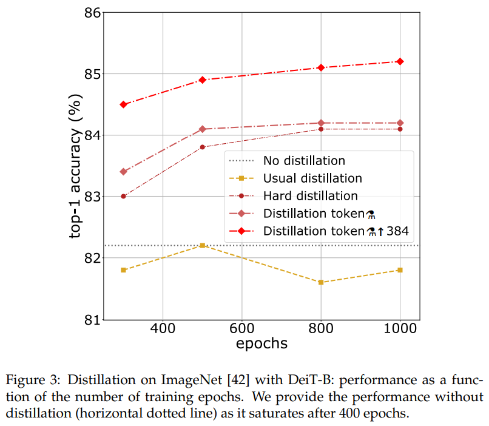
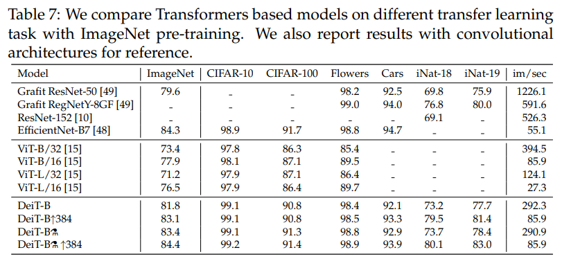
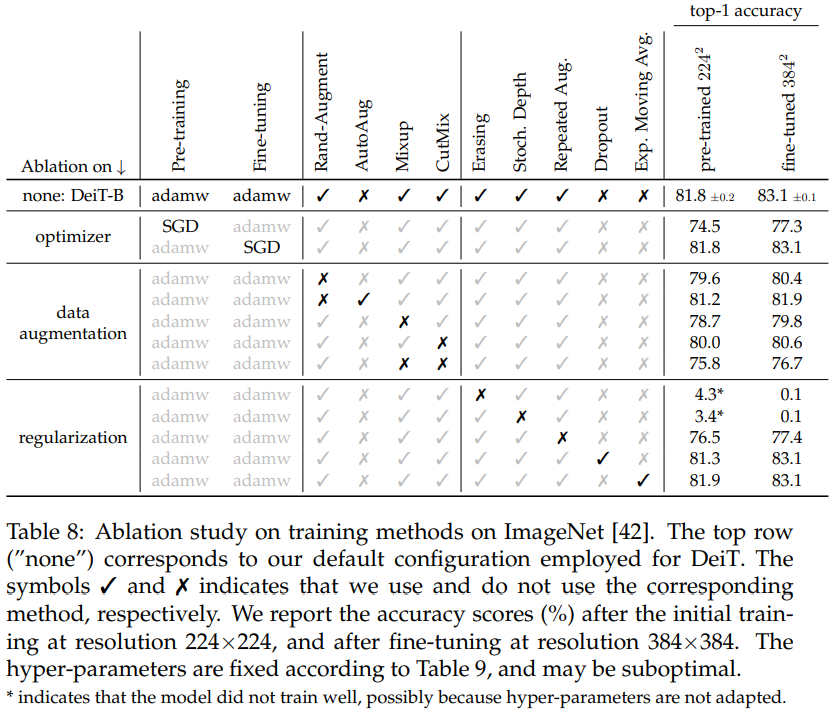

-----

| Title         | ML Transformer DeiT                                   |
| ------------- | ----------------------------------------------------- |
| Created @     | `2021-02-18T07:42:25Z`                                |
| Last Modify @ | `2022-12-24T15:49:38Z`                                |
| Labels        | \`\`                                                  |
| Edit @        | [here](https://github.com/junxnone/aiwiki/issues/253) |

-----

## Reference

  - 2020-12 **\[DeiT\]** Training data-efficient image transformers &
    distillation through attention
    \[[Paper](https://arxiv.org/abs/2012.12877)\]
    \[[Code](https://github.com/facebookresearch/deit)\]
  - [timm
    code](https://github.com/rwightman/pytorch-image-models/blob/e8a64fb88108b592da192e98054095b1ee25e96e/timm/models/vision_transformer.py#L242)

## Brief

  - KD - Knowledge Distillation
      - **经典**
          - **Soft**: softmax output vector
          - **Hard**: output label with maximum scores
      - **Distillation Token**
          - 类似于 `Class Token`

## Motivation

  - 背景/存在的问题
      - ViT 很难Training 需要资源巨大
      - 需要 Google 内部数据集 JFT-300M pretrain
  - 做了什么尝试/分别有什么效果
      - \+KD
      - 相比 ViT 不需要 在 JFT-300M 上 pretrain/训练资源减少
  - 应用领域

## Diff with ViT

| Name               | ViT                                            | DeiT                 |
| ------------------ | ---------------------------------------------- | -------------------- |
| 训练策略               | Pretrain on JFT-300M  Fine-tune on ImageNet | Training on ImageNet |
| Head               | MLP                                            | Linear Classifier    |
| Distillation Token | ✅                                              | :x:                  |

## Arch

  - DeiT 的不同重量级的结构 DeiT-tiny/DeiT-Small/Deit-Base
  - Inference 时 模型输出值 取 ` (Class Token + Distillation Token) / 2  `

|  |  |
| ------------------------------------------------------------ | ------------------------------------------------------------ |

## Evaluation

  - **Evaluation 1: Teacher Model**
      - CNN 网络 比 Transformer 作为 `Teacher Model` 取得了更好的性能
      - **Teacher Model**: `RegNetY-16GF` 和 DeiT 同样的 `Data` & `Aug`
  - **Evaluation 2: soft vs hard/class vs distill**
      - `hard distillation` \> `soft distillation`
      - `class + distillation` \> `distill emedding` \> `class
        embedding`
  - **Evaluation 3: 结果差异**
      - 预测结果不同的样本在整个样本中的比例(横坐标和纵坐标一致, 做对比)
      - `class+distill` 和 CNN/DeiT(no distillation) 差异差不多
  - **Evaluation 4: Training**
      - Distillation Token 在 一定的 training epochs 后 仍然能够提升(相比于 `no
        distillation`/`soft distillation`)
  - **Evaluation 5: Transfer learning**
      - Transfer learning 相比 VIT 有部分提升
  - **Evaluation 6: Ablation**
      - `optimizer & augmentation & regularization`
        `@pre-training/fine-tuning`
      - `Rand-Augment & AutoAug & Mixup & CutMix`
      - `Erasing & Stoch. Depth & Repeated Aug & Dropout & Exp. Moving
        Avg`

| Number | Evaluation                                                   |
| ------ | ------------------------------------------------------------ |
| 1      |  |
| 2      |  |
| 3      |  |
| 4      |  |
| 5      |  |
| 6      |  |

## Tricks

  - \[deit issues - facebookresearch - deit - 45) show that they were
    not using the distillation signal and doing a classic fine-tuning
