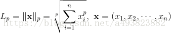
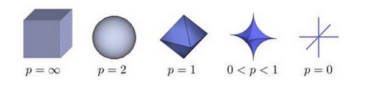
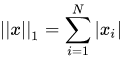
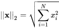

-----

| Title     | Math norm                                             |
| --------- | ----------------------------------------------------- |
| Created @ | `2019-08-05T06:44:26Z`                                |
| Updated @ | `2023-01-31T07:28:07Z`                                |
| Labels    | \`\`                                                  |
| Edit @    | [here](https://github.com/junxnone/aiwiki/issues/254) |

-----

# norm 范数

## Reference

  - [范数](https://blog.csdn.net/NCHFGFB/article/details/78498401)
  - [范数（norm）
    几种范数的简单介绍](https://blog.csdn.net/a493823882/article/details/80569888)
  - [np.linalg.norm(求范数)](https://blog.csdn.net/hqh131360239/article/details/79061535)
  - [L0、L1、L2范数在机器学习中的应用](https://www.jianshu.com/p/4bad38fe07e6)

## norm/范数

  - norm 范数

### L-P范数

**L-P范数不是一个范数，而是一组范数**

### L0 范数

  - L0范数指向量中非零元素的个数

### L1范数

  - 向量各个元素绝对值之和，Manhattan distance。

### L-2 范数 - (Euclid范数)

  - 欧几里得范数，常用计算向量长度
  - 即 `P = 2` , 向量元素绝对值的平方和再开方，matlab调用函数norm(x, 2)。

