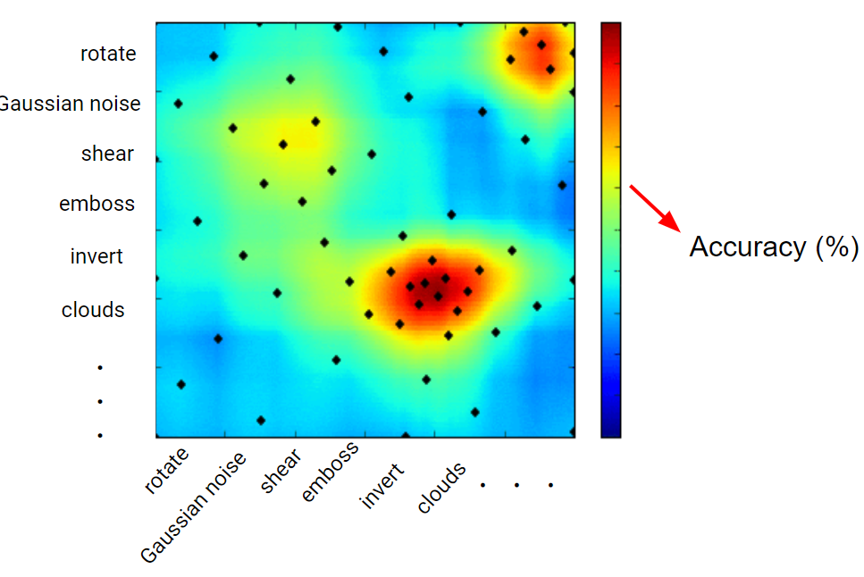

-----

| Title     | ML PreP DataAug AutoAugment                           |
| --------- | ----------------------------------------------------- |
| Created @ | `2020-07-10T05:17:03Z`                                |
| Updated @ | `2023-02-02T09:14:52Z`                                |
| Labels    | \`\`                                                  |
| Edit @    | [here](https://github.com/junxnone/aiwiki/issues/256) |

-----

# AutoAugment

## Reference

  - [paper - 2018 - AutoAugment: Learning Augmentation Policies from
    Data](https://arxiv.org/abs/1805.09501)
  - [PBA](https://github.com/huawei-noah/vega/blob/master/docs/cn/algorithms/pba.md)
  - [AutoAugment](https://github.com/DeepVoltaire/AutoAugment)
  - [Fast AutoAugment](https://github.com/kakaobrain/fast-autoaugment)
  - [DeepAugment](https://github.com/barisozmen/deepaugment)
  - [DeepAugment
    slides](https://docs.google.com/presentation/d/1_010gIxxEVjhtZLwCHPOGGuwtAgfSIcQbCVqDSaa2x0/edit?usp=sharing)

## Brief

  - Bayesian Optimization
  - CycleSR
  - PBA
  - RL

## Bayesian Optimization

