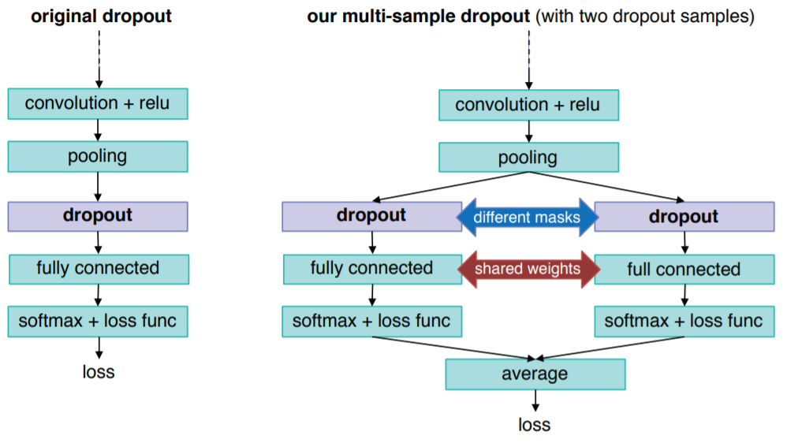

-----

| Title     | ML Op Dropout MS                                      |
| --------- | ----------------------------------------------------- |
| Created @ | `2020-03-23T01:35:35Z`                                |
| Updated @ | `2023-01-31T07:15:44Z`                                |
| Labels    | `index`                                               |
| Edit @    | [here](https://github.com/junxnone/aiwiki/issues/259) |

-----

# Multi-Sample Dropout

## Reference

  - [paper - 2019 -Multi-Sample Dropout for Accelerated Training and
    Better Generalization](https://arxiv.org/pdf/1905.09788.pdf)
  - [大幅减少训练迭代次数，提高泛化能力：IBM提出「新版Dropout」](https://www.sohu.com/a/319115531_129720)

## Brief

  - 加快训练速度
  - 提高泛化能力
  - 创建多个 dropout 样本
  - 平均所有样本的损失得到最终的损失
  - dropout 样本在大于 8 个时，再增加 dropout 样本数量不再能带来显著的收益

-----

