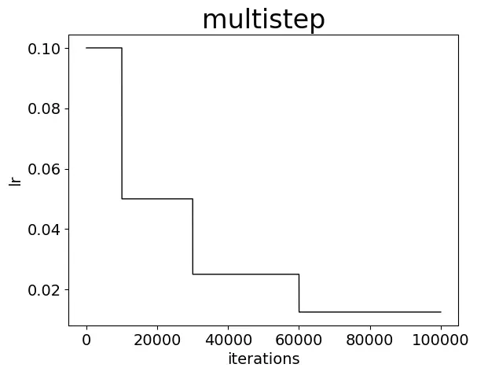

-----

| Title     | ML Arch LR                                            |
| --------- | ----------------------------------------------------- |
| Created @ | `2019-12-05T09:03:55Z`                                |
| Updated @ | `2023-02-02T08:54:16Z`                                |
| Labels    | \`\`                                                  |
| Edit @    | [here](https://github.com/junxnone/aiwiki/issues/265) |

-----

# Learning Rate 学习率

## Reference

  - [网络学习率变化策略](https://www.jianshu.com/p/67232264ffbd)
  - [如何选择最适合你的学习率变更策略](https://www.jianshu.com/p/1f943de39582)

## Brief

  - [Cyclical Learning Rate](/Cyclical_Learning_Rate)
  - [One Cycle Policy](/One_Cycle_Policy)
  - [LRFinder](/LRFinder)

## Learning Rate Policy

| LR Policy Name | Formula                                                            | Figure                                                       | Description                        |
| -------------- | ------------------------------------------------------------------ | ------------------------------------------------------------ | ---------------------------------- |
| step           | `new_lr = base_lr * gamma ^ iter`                                  |  |                                    |
| multistep      | \`\`                                                               |  | 采用非均匀降低策略，指定降低的step间隔，每次降低为原来的一定倍数 |
| fixed          | `new_lr = base_lr`                                                 |  |                                    |
| exp            | \`\`                                                               |  |                                    |
| inv            | `new_lr = base_lr * ( 1 +gamma * iter ) ^ (-power)`                |  |                                    |
| poly           | `new_lr = base_lr * ( 1 - iter / max_iter ) ^ power`               |  |                                    |
| signoid        | `new_lr = base_lr * ( 1 / ( 1 +exp(-gamma * ( iter - stepsize))))` |  |                                    |
