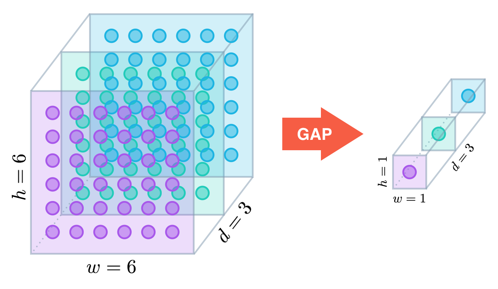
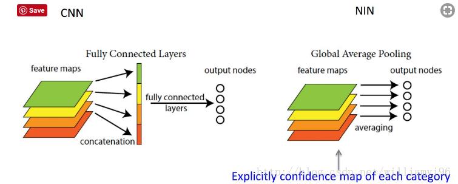
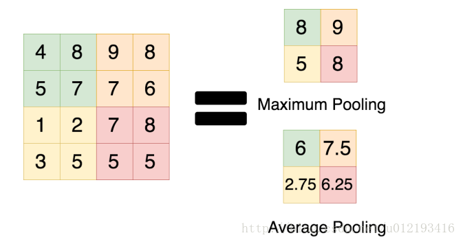
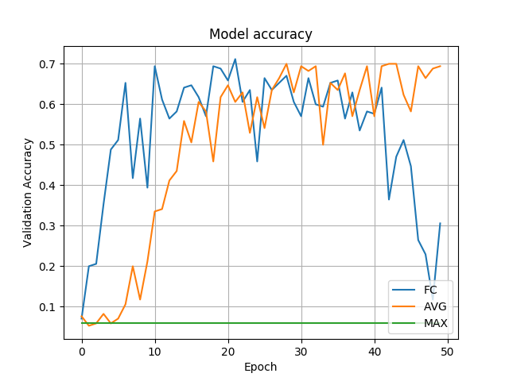
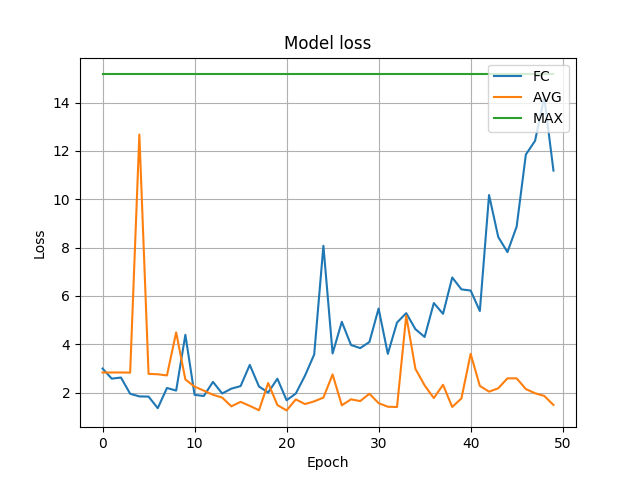
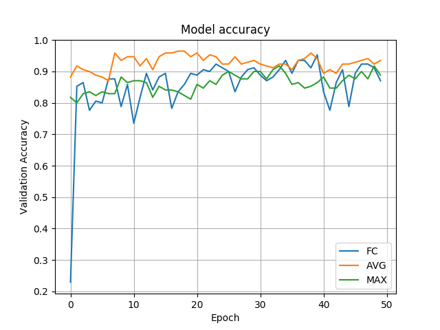
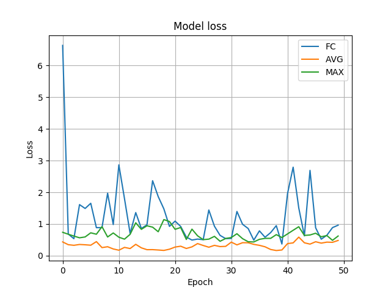

-----

| Title     | ML Op Pooling GAP                                     |
| --------- | ----------------------------------------------------- |
| Created @ | `2019-02-24T14:07:21Z`                                |
| Updated @ | `2023-01-31T06:46:17Z`                                |
| Labels    | \`\`                                                  |
| Edit @    | [here](https://github.com/junxnone/aiwiki/issues/267) |

-----

# Global Average Pooling

## Reference

  - [Global Average
    Pooling对全连接层的可替代性分析](https://blog.csdn.net/williamyi96/article/details/77530995)
  - [论文 - Network In Network](https://arxiv.org/abs/1312.4400)
  - [Global Average
    Pooling是否可以替代全连接层？](https://www.cnblogs.com/hutao722/p/10008581.html)
  - [图像分类中max-pooling和average-pooling之间的异同](https://blog.csdn.net/u012193416/article/details/79432668)

## Brief

  - GAP的思路就是将全连接层+dropout过程合二为一
  - 对整个网路在结构上做正则化防止过拟合。其直接剔除了全连接层中黑箱的特征，直接赋予了每个channel实际的内别意义。
  - GAP可以实现任意图像大小的输入
  - 使用GAP可能会造成收敛速度减慢。

## GAP的工作原理

> 假设卷积层的最后输出是h × w × d 的三维特征图，具体大小为6 × 6 × 3，经过GAP转换后，变成了大小为 1 × 1 × 3
> 的输出值，也就是每一层 h × w 会被平均化成一个值。

## AP vs MP

## GAP vs GMP vs FC

> GMP在本模型中表现太差，不值一提；而FC在前40次迭代时表现尚可，但到了40次后发生了剧烈变化，出现了过拟合现象（运行20次左右时的模型相对较好，但准确率不足70%，模型还是很差）；三者中表现最好的是GAP，无论从准确度还是损失率，表现都较为平稳，抗过拟合化效果明显（但最终的准确度70%，模型还是不行）。

| VGG19       |  |  |
| ----------- | ------------------------------------------------------------ | ------------------------------------------------------------ |
| InceptionV3 |  |  |
